# 23-06-26
## Uncertainty propagation state of the art in orbital mechanics

### Methods we know of for uncertainty propagation in orbital mechanics:
- Monte Carlo (MC) simulation
- Linearised Covariance (LinCov)
- Unscented Transform (UT)
- Polynomial Chaos Expansions (PCE)
- Gaussian Mixture Models (GMM)
- Adaptive Entropy-based Gaussian-mixture Information Synthesis (AEGIS)
- Distribution transport 
- State Transition tensor propagation (?)
- Multi-Fidelity (MF)

### Orbit Uncertainty Propagation in Space Situational Awareness and Conjunction Assessment-Justin Bos Executive Summary from NoteBookLM

As the density of space objects increases, the risk of collisions and the potential for the Kessler syndrome—a scenario where space debris prevents future access to orbit—becomes a critical concern for Space Situational Awareness (SSA). This document synthesizes research into orbit uncertainty propagation (UP) methods, specifically focusing on their application in Conjunction Assessment (CA).

The research identifies a fundamental challenge in SSA: long-term propagation through highly nonlinear dynamics often results in non-Gaussian uncertainties, which conventional linear methods cannot accurately characterize. After evaluating eight distinct UP methods across various orbital regimes (LEO, GEO, HEO, and Molniya), the following critical takeaways are identified:

* Multi-Fidelity (MF) Superiority: The MF method emerges as the most promising approach for balancing accuracy and speed. By correcting low-fidelity (LF) dynamics with a small set of high-fidelity (HF) "important samples," MF can achieve computational speed-ups of up to four orders of magnitude compared to traditional Monte Carlo (MC) methods.
* Method Suitability: Traditional methods like Linearised Covariance (LinCov) and Unscented Transform (UT) are only effective when final uncertainties remain Gaussian. For non-Gaussian outcomes—common in long propagations or elliptical orbits—Polynomial Chaos Expansions (PCE) and MF are the most robust.
* Conjunction Assessment Breakthrough: In realistic collision scenarios, the MF method maintained collision probability (P_C) within a 95% confidence interval when using as few as eight important samples, even when the underlying low-fidelity model was as simple as 2-body Keplerian dynamics.
* Operational Inefficiencies: Certain complex methods, such as Adaptive Entropy-based Gaussian-mixture Information Synthesis (AEGIS), were found to be too computationally inefficient for practical long-term propagation.

Analysis of Uncertainty Propagation (UP) Methods

Uncertainty propagation involves determining an object's state moments or associated probability density function (PDF) over time. The research evaluated eight methods against a 10⁵ sample Monte Carlo (MC) baseline.

Comparative Performance Summary

| Method                | Computational Efficiency | Accuracy in Non‑Gaussian PDF      | Best Use Case                     |
|:----------------------|:------------------------|:----------------------------------|:----------------------------------|
| Monte Carlo (MC)      | Very Low                | Very High (The “Truth”)           | Baseline for comparison           |
| LinCov                | Highest                 | Low                               | Short‑term, Gaussian cases        |
| UT                    | High                    | Medium                            | Gaussian final uncertainties     |
| Multi‑Fidelity (MF)   | Very High               | High                              | Long‑term, non‑Gaussian CA       |
| PCE                   | Medium                  | High                              | High non‑linearity                |
| GMM                   | Variable                | Low (struggles with tails)        | Representing non‑Gaussian PDFs    |
| AEGIS                 | Low                     | High                              | Adaptive, but impractical speed  |
| GMM_MF/UT             | Medium                  | Medium                            | Hybrid component propagation      |
Key Methodological Insights

* Linearised Covariance (LinCov): Faster than all other methods because it only propagates the mean vector and integrates the State Transition Matrix (STM). However, its assumption of linearity fails over long periods as uncertainties inevitably deform.
* Unscented Transform (UT): Avoids linearizing dynamics by using a discrete set of weighted "sigma points." While accurate for first and second moments, it is inherently limited to Gaussian distributions.
* Polynomial Chaos Expansions (PCE): A non-intrusive method that approximates the final solution using a series of polynomial functions. While accurate for nonlinear environments, it suffers from the "curse of dimensionality" as state-vector size increases.
* Adaptive Entropy-based Gaussian-mixture Information Synthesis (AEGIS): This method splits Gaussian Mixture Model (GMM) components online when nonlinear behavior exceeds a threshold (measured by differential entropy). The analysis concludes it is too slow for operational long-term use.

Multi-Fidelity (MF) Orbit Uncertainty Propagation

The Multi-Fidelity method is the central innovation examined for conjunction analysis. It leverages the speed of low-fidelity models while maintaining high-fidelity accuracy.

Functional Mechanics

1. Low-Fidelity Propagation: A large set of samples (e.g., 10,000) is propagated using simple dynamics (e.g., 2-body Keplerian).
2. Sample Selection: A small set of "important samples" (as few as 8) is selected using a pivoted Cholesky decomposition of the Gramian matrix of LF samples.
3. High-Fidelity Correction: Only the important samples are propagated using complex, high-fidelity dynamics (accounting for solar radiation, atmospheric drag, and 3rd body perturbations).
4. Approximation: A mapping is created to adjust the large LF sample set to match the characteristics of the HF important samples.

Performance in Conjunction Assessment

The research tested MF in high and low relative velocity encounters over 48-hour and 96-hour propagation windows.

* Efficiency: Using 2-body Keplerian dynamics as the low-fidelity model yielded a speed increase of 10,000\times.
* Fidelity: The collision probability calculated via MF remained consistent with the MC baseline provided that at least 8 important samples were utilized.

Impact of Orbital Scenarios on Propagation Accuracy

The study utilized five realistic satellite scenarios to test the limits of these methods:

* LEO (Velox C1, Oneweb-0416): Characterized by high atmospheric drag and rapid revolutions. MF and PCE performed optimally as non-Gaussianity increased over 50 revolutions.
* HEO/Molniya (Cosmos 2518, Spirale B): These highly elliptical orbits introduce extreme nonlinearity, especially near perigee. The "banana-shaped" deformation of the PDF in these cases makes LinCov and UT entirely unsuitable.
* GEO (Meteosat 12): Higher altitudes lead to more linear dynamics over short periods, but long-term solar radiation pressure eventually requires nonlinear propagation methods.

Conjunction Assessment (CA) and Collision Probability

The goal of UP in SSA is to calculate the probability of collision (P_C) between a primary and secondary object at the Time of Closest Approach (TCA).

Analytical vs. Numerical Methods

* Short-term Encounters: Defined by high relative velocity. Assumptions include constant velocity and constant uncertainty during the encounter. The 3D volume integral can be reduced to a 2D surface integral in the "conjunction plane."
* Long-term Encounters: Defined by low relative velocity. Assumptions for short-term encounters fail here; therefore, numerical MC or MF methods are required to integrate P_C over the duration of the encounter.

Critical Observations on P_C Calculation

* TCA Variations: There is a distinction between t_{TCA,mean} (closest approach of mean state vectors) and t_{TCA,true} (the actual minimum distance for each individual sample pair).
* Algorithm Efficiency: The research successfully employed a bisection method (based on NASA CARA team standards) to find the local minimum distance for sample pairs efficiently.
* Coordinate Systems: Converting Cartesian coordinates to Modified Equinoctial Elements (MEE) was found to reduce singularities and allowed 5 of the 6 orbital elements to evolve more linearly, improving GMM approximations.

Conclusions

The research concludes that the traditional trade-off between computational intensity and accuracy in Conjunction Assessment can be mitigated through Multi-Fidelity methods.

1. MF as a Replacement for MC: The Multi-Fidelity method can replace standard Monte Carlo simulations in CA, providing nearly identical results with a fraction of the computational cost.
2. Addressing Non-Gaussianity: Methods like PCE and MF are essential for long-term tracking where Gaussian assumptions lead to significant underestimation or overestimation of collision risks.
3. Future Application: The massive speed-up provided by MF (up to 4 orders of magnitude) allows for the tracking of a much larger catalog of space objects and enables earlier prediction of conjunctions, granting operators more time for mitigating maneuvers.


In order to classify the uncertainty propagation methods, we can use the following criteria:
- Accuracy: How well does the method capture the true uncertainty distribution, especially in non-Gaussian scenarios?
- Computational Efficiency: How quickly can the method provide results, particularly for large-scale simulations?

# 24-06-26

The **Moment Method** (or Method of Moments) is a statistical technique utilized in uncertainty propagation (UP) to estimate the evolution of a probability density function (PDF) by focusing on its statistical moments—primarily the mean and covariance. Within the hierarchy of UP methods, it serves as a computationally efficient bridge between low-fidelity linear approximations and high-fidelity, but expensive, sampling-based techniques like Monte Carlo (MC).

### Mathematical Framework and Methodology

The method relies on the assumption that if an input variable (or vector) is characterized by a Gaussian distribution, its first two moments are necessary and sufficient to describe its state.

*   **Taylor Series Expansion:** The core mechanism involves expanding the nonlinear system function $y = f(x)$ or the numerical flow map $\phi(t; x_0)$ into a Taylor series about the mean value of the inputs. 
*   **Explicit vs. Implicit Formulations:**
    *   **Explicit Moment Method:** Applied when a direct functional relationship $y = f(x)$ exists between input and output.
    *   **Implicit Moment Method:** Utilized in astrodynamics when only the governing differential equations $\dot{x} = f(x, t)$ are known. It requires a numerical integrator (e.g., RKF78) to define the solution flow $\phi$, which is then expanded.
*   **Multivariate Extension ($R^n$):** In a 6-dimensional orbital state, the method propagates the mean vector $\mu$ and the covariance matrix $\Sigma$. For a first-order approximation, the covariance propagates as $\Sigma_{y} = J \Sigma_{x} J^T$, where $J$ is the Jacobian matrix.

### Comparative Orders of Approximation

The accuracy of the Moment Method is strictly tied to the order of the Taylor expansion used:

*   **First-Order (M1):** 
    *   Assumes the system is locally linear.
    *   Propagates the mean as the function of the mean: $\mu_y = f(\mu_x)$.
    *   While fast, it fails to capture the "mean shift" caused by nonlinearities and performs poorly when the PDF becomes highly non-Gaussian.
*   **Second-Order (M2):**
    *   Incorporates the **Hessian matrix** ($H$) of the system dynamics.
    *   The mean is corrected by a term involving the trace of the Hessian and the covariance: $\mu_{y,i} \approx f_i(\mu_x) + \frac{1}{2} \text{tr}(H_i \Sigma_x)$.
    *   The covariance propagation includes additional terms to account for the "spreading" effect of curvature: $\Sigma_y \approx J \Sigma_x J^T + \frac{1}{2} \text{tr}(H_i \Sigma_x H_p \Sigma_x)$.
    *   Empirical results show that M2 consistently maintains lower error norms ($L_2$ and $L_\infty$) than M1, especially in nonlinear regimes like Highly Elliptical Orbits (HEO).

### Integration with Gaussian Mixture Models (GMM)

To handle the "loss of Gaussianity" typical in long-term orbital propagation, the Moment Method is often integrated into a **GMM framework**.

1.  **Decomposition:** The initial Gaussian uncertainty is split into $N$ smaller Gaussian components (kernels) using algorithms like the Horwood suboptimal algorithm.
2.  **Local Propagation:** Each individual component has a sufficiently small covariance to remain "locally Gaussian," allowing the Moment Method to propagate its first two moments accurately over longer durations.
3.  **Reconstruction:** The final non-Gaussian PDF is reconstructed by recombining the weighted sum of these propagated components.

### Algorithm for Multivariate Implicit GMM-Moment Propagation

The following flowchart outlines the computational algorithm for a multivariate system (e.g., orbital mechanics in $R^6$) using the implicit second-order moment method:

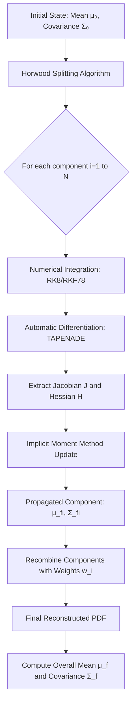

### Critical Strengths and Limitations

*   **Computational Efficiency:** The GMM-Moment method is significantly faster than Monte Carlo simulations. For a 3-day LEO propagation, it completed in seconds/minutes compared to the hours required for a $10^7$-sample MC run.
*   **Derivative Sensitivity:** Unlike the Unscented Transform (UT), which is sample-based, the Moment Method requires explicit derivative information (Jacobians and Hessians).
*   **Automatic Differentiation (AD):** To avoid the errors of finite differences, modern implementations use AD (e.g., TAPENADE) to obtain exact derivatives by applying the chain rule to the source code of the propagator.
*   **Differentiability Requirement:** The method assumes that the governing equations are continuous and differentiable, which may pose challenges in the presence of discrete events like shadow entries (SRP discontinuities).

# 25-06-26

## Comparison of Short-term vs. Long-term Encounters in Conjunction Assessment
| **Characteristic** | **Short-term Encounter** | **Long-term Encounter** |
| --- | --- | --- |
| **Orbit relation** | Large difference between the orbits of the two objects | Similar orbits (e.g., satellites in cluster or formation flights) |
| **Relative velocity** | High (several km/s) near closest approach | Low (few m/s) near closest approach |
| **Duration in encounter region** | Very short (a couple of seconds) | Long (on the order of an orbital period) |
| **Relative velocity behavior** | Constant during the encounter | Evolving during the encounter |
| **Relative trajectory** | Rectilinear (linear path) | Nonlinear trajectory |
| **Error covariance matrix** | Constant | Evolving with time |

## Outer Probability Measure (OPM) for Uncertainty Propagation

In the context of Jones’ paper, an **Outer Probability Measure (OPM)** is a way of representing uncertainty that goes beyond traditional probability distributions (PDFs). Here’s the essence:

---

### 🌐 Why OPMs are needed
- **PDFs** force you to describe uncertainty as if you know the exact distribution of errors.  
- But in **multi‑fidelity orbit propagation**, systematic errors (from using simplified models) can be bounded but not fully characterized.  
- Using a PDF here would be misleading — it would “over‑describe” the uncertainty.  
- **OPMs** provide a more flexible, less prescriptive framework.

---

### 🧩 What an OPM is
- An OPM is defined by a **possibility function** \(f(x)\).  
- Instead of saying “the probability of the satellite being at state \(x\) is 0.1,” it says “state \(x\) is possible to this degree.”  
- These values don’t need to sum to 1 (unlike probabilities). They just indicate relative credibility.  
- Mathematically, OPMs replace the strict additivity of probability measures with **subadditivity**:  
$$
P(A \cup B) \leq P(A) + P(B)
$$  
  This means the measure is looser, reflecting limited knowledge.

---

### 🔄 How OPMs are used in filtering
- In Bayesian filtering, PDFs evolve through transition kernels and likelihood functions.  
- With OPMs, the same structure is kept, but with **possibility functions** instead of PDFs:  
  - **Prediction step**: propagate the possibility function forward, including systematic error bounds.  
  - **Update step**: incorporate sensor measurements, again as possibility functions.  
- The result is a **possibility cloud** that reflects both random noise and systematic biases separately.

---

### 🚀 Intuitive analogy
Imagine you’re tracking a drone:
- A **PDF** forces you to shade the map with exact percentages, even if you don’t know them.  
- An **OPM** lets you say: “This region is possible, that region is less possible, beyond this boundary it’s impossible.”  
- As you get more radar pings, the possible region shrinks toward the true location.

---

### ✨ Takeaway
In Jones’ framework:
- OPMs are used to **represent systematic errors** from multi‑fidelity propagation without pretending to know their exact distribution.  
- They allow a **credibilistic filter** that combines random and systematic uncertainty in a principled way.  
- This avoids false confidence in collision risk assessments and makes orbit tracking more realistic.  

# 26-06-26

## Two types of uncertainties in orbit propagation

In uncertainty quantification, we usually distinguish **two fundamental types of uncertainty**:

---

### 1. **Aleatoric Uncertainty (Statistical/Random)**
- **Definition**: Comes from inherent randomness in the system or environment.  
- **Nature**: Irreducible — no matter how much data you collect, the randomness remains.  
- **Examples**:
  - Rolling a die: the outcome is inherently random.
  - Measurement noise in sensors.
  - Atmospheric turbulence affecting satellite trajectories.  
- **Modeling**: Often represented with probability distributions (e.g., Gaussian noise, Poisson processes).

---

### 2. **Epistemic Uncertainty (Systematic/Knowledge-based)**
- **Definition**: Arises from lack of knowledge, incomplete models, or limited data.  
- **Nature**: Reducible — can be decreased with better models, more experiments, or improved understanding.  
- **Examples**:
  - Unknown parameters in a physical model.
  - Simplifications in orbital dynamics equations.
  - Sparse observational data for a new satellite mission.  
- **Modeling**: Captured through intervals, Bayesian priors, or alternative model structures.

---

### 🧩 How They Interact
- In practice, both types coexist. For example, in orbital uncertainty propagation:
  - **Aleatoric**: Random perturbations in initial state due to sensor noise.
  - **Epistemic**: Uncertainty in drag coefficients or unmodeled forces.  
- A robust framework (like copula models, Gaussian processes, or outer probability measures) tries to **separate and quantify both contributions**.

---

### 📖 Context for Your Handbook
The *Handbook of Uncertainty Quantification* emphasizes this distinction because:
- **Aleatoric** uncertainty is about *variability in outcomes*.
- **Epistemic** uncertainty is about *lack of knowledge* of the system in question. For example, in orbital mechanics, 
Understanding which dominates helps decide whether to invest in **better data collection** (reducing epistemic) or **probabilistic modeling** (capturing aleatoric).

## Surrogate Models for Uncertainty Propagation

- The **original dynamics** (e.g., nonlinear orbital equations of motion) are often too expensive to evaluate repeatedly across a large uncertainty domain.  
- A **surrogate function** is trained or constructed to approximate the mapping from uncertain inputs (initial conditions, parameters) to outputs (state vectors, collision probability, etc.).  
- This surrogate is not the true dynamics but a computationally cheaper proxy — like a polynomial response surface, Gaussian process, or other regression-based model.  

Think of it as building a “shadow version” of the dynamics:  
- You sample the **parameter domain** (ranges or distributions of uncertain inputs).  
- Run the full dynamics solver at those sample points.  
- Fit a surrogate function that captures the input–output relationship.  
- Then, for uncertainty propagation, you evaluate the surrogate instead of re-running the full dynamics every time.  

This is why response surfaces are so powerful: they let you explore how uncertainty spreads through the system without the cost of brute-force simulation.  

In a sense, the taylor expansion in the Moment Method we learnt before is a **local surrogate**: it approximates the dynamics around the mean state using derivatives. Here is how it works:

- The **true flow map** $\Phi_{t_0}^t(x_0)$ exactly evolves the state from initial conditions under the full nonlinear orbital dynamics. But computing or differentiating it directly is intractable.
- By expanding $\Phi$ in a **Taylor series around the mean state**, you construct a polynomial approximation that captures how outputs depend on inputs locally.  
  - This polynomial is not the actual dynamics, but a **surrogate representation** of the input–output relationship.
- In uncertainty propagation, this surrogate plays the same role as a response surface: it allows you to approximate how uncertainty in initial conditions spreads through the system without solving the full nonlinear equations at every sample point.
- The **parameter domain** here is the region of initial conditions around which the Taylor expansion is valid. Within that domain, the surrogate (Taylor polynomial) mimics the flow map’s behavior.

So yes — the Taylor expansion surrogate is conceptually the same as a response surface: both are reduced-order approximations of the true dynamics, built to make uncertainty propagation tractable.  

👉 The subtlety is that in orbital mechanics, the Taylor expansion surrogate is derived analytically from the equations of motion, whereas other response surfaces (like Gaussian processes or radial basis functions) are often data-driven fits from sampled simulations. Both, however, serve the same purpose: **replace the full dynamics with a cheaper-to-evaluate approximation over the chosen parameter domain**.

For highly nonlinear systems or long-term propagation, a global surrogate (like a polynomial chaos expansion or Gaussian process) may be more effective.

The Taylor expansion surrogate in Suyog’s thesis is conceptually the same as a response surface, but derived analytically rather than fitted numerically. Let me lay out a clear comparison:

---

### 📊 Surrogate Models in Uncertainty Propagation

| Aspect | **Taylor Expansion Surrogate (Analytical)** | **Data-Driven Response Surface (Numerical)** |
|--------|---------------------------------------------|----------------------------------------------|
| **Construction** | Derived by expanding the flow function $\Phi(x_0,t)$ in a Taylor series around nominal initial conditions. | Built by sampling the parameter domain and fitting regression/interpolation models (polynomials, Gaussian processes, neural nets). |
| **Inputs** | Requires symbolic derivatives of the dynamics equations. | Requires simulation data at chosen sample points. |
| **Outputs** | Polynomial approximation of the state evolution, valid locally around expansion point. | Flexible approximation of input–output mapping, valid across sampled domain. |
| **Accuracy** | High near the expansion point; deteriorates as inputs move farther away. | Accuracy depends on sampling density and model choice; can capture global nonlinearities. |
| **Parameter Domain** | Defined by the neighborhood where the Taylor expansion remains valid. | Defined by the sampled region (ranges or distributions of uncertain inputs). |
| **Use in Uncertainty Propagation** | Propagates uncertainty analytically by pushing distributions through polynomial terms. | Propagates uncertainty numerically by evaluating surrogate across input samples. |

---

### 🔗 Key Insight
Both approaches are **surrogates**: they replace the full nonlinear dynamics with a cheaper-to-evaluate approximation.  
- The **Taylor expansion surrogate** is *equation-driven* (analytical).  
- The **response surface surrogate** is *data-driven* (empirical).  

Together, they highlight two complementary philosophies in uncertainty propagation:  
- **Analytical reduction** (Taylor series, polynomial chaos).  
- **Numerical approximation** (response surfaces, Gaussian mixture models, kriging).  

# 27-06-26
## Closed-Form Solutions to the Fokker-Planck Equation for Orbital Uncertainty Propagation (AI summary)

The **Fokker-Planck Equation (FPE)** is a partial differential equation that governs the time evolution of the probability density function (PDF) of a dynamical system subject to both deterministic forces and stochastic process noise. In the context of orbital mechanics and conjunction assessment, the FPE is the fundamental tool for transitioning from a point-estimate of a spacecraft's position to a complete statistical characterization of its possible states.

### 1. Mathematical and Physical Framework
The FPE describes how a probability cloud "flows" through state space while simultaneously "spreading" due to unmodeled perturbations.
*   **Advection-Diffusion Duality:** The equation is composed of two primary operators: the **drift (advection)** term, which moves the PDF along deterministic trajectories (like Keplerian motion), and the **diffusion** term, which accounts for stochastic forcing such as atmospheric drag fluctuations or thrust errors.
*   **The Governing Equation:** For a system $dX = f(X)dt + \sigma dW_t$, the PDF $p(x, t)$ evolves as:
$$
\frac{\partial p}{\partial t} = -\nabla \cdot (f p) + \frac{1}{2} \text{Tr}(\Sigma_0 \nabla^2 p)
$$

Where $f$ is the deterministic drift and $\Sigma_0$ is the diffusion tensor.
*   **The Curse of Dimensionality:** Traditional numerical solvers for the FPE rely on spatial grids. In a 6D orbital state, even a coarse grid of 50 points per axis requires approximately $10^{10}$ evaluations per time step, making grid-based FPE solutions computationally intractable for real-time space operations.

### 2. Taylor Map Diffusion: A Closed-Form Solution
The sources present a novel, grid-free framework called **Taylor Map Diffusion**, which solves the FPE by proving that an **exponential-of-quadratic-form ansatz** is structurally preserved under both nonlinear advection and additive diffusion.

*   **The Ansatz:** The solution is represented as $p(x, t) = N(t) \mu(x, t) \exp(-F(x, t)^T Q(t) F(x, t))$, where $F$ is a nonlinear Taylor map and $Q$ is a precision matrix.
*   **Quadratic Form Conservation:** Unlike Gaussian assumptions that fail as dynamics become nonlinear, this method proves that the "exponential-of-quadratic" structure holds even under strong nonlinearities. The nominal trajectory and State Transition Matrix (STM) are generalized into a full nonlinear Taylor map $F$.
*   **Separation of Shape and Concentration:** 
    *   **$F(x, t)$:** Governs the **shape** of the distribution, capturing non-Gaussian features like "banana-shaped" warpings and asymmetric tails.
    *   **$Q(t)$:** Governs the **concentration**, decreasing over time as process noise causes the distribution to broaden.
*   **Computational Efficiency:** Instead of solving a high-dimensional PDE or running millions of Monte Carlo samples, the method reduces the FPE to a compact system of **coupled Ordinary Differential Equations (ODEs)**. For a 4D planar orbit, this involves only 94 scalar ODEs; for a full 6D state, it requires 279 ODEs—both of which are "trivially fast" for modern integrators.

### 3. Algorithm: Augmented ODE Integration for FPE
The following flowchart details the "Taylor Diffusion" algorithm for propagating the FPE solution without grids or sampling:

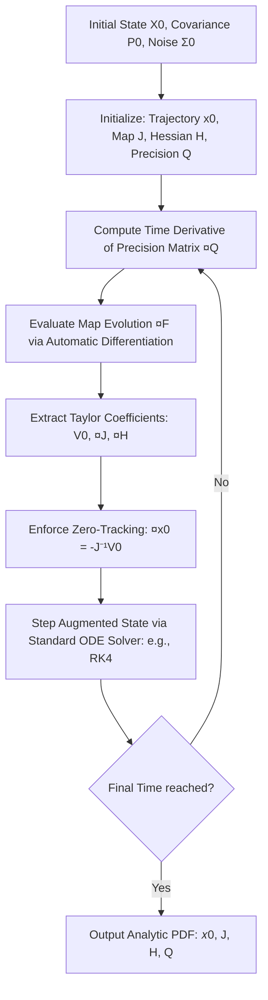

### 4. Significance in Conjunction Assessment
The ability to solve the FPE analytically provides a decisive advantage in predicting collision probabilities ($P_C$).
*   **Resolving the Tails:** Conjunction assessment decisions often hinge on $P_C$ values as low as $10^{-5}$. While Monte Carlo requires $10^6$ to $10^7$ samples to resolve these tails, the Taylor Map Diffusion method provides a closed-form expression that can be evaluated deep into the tails (e.g., $10\sigma$) at negligible cost.
*   **Process Noise Integration:** Unlike older methods like the Probability Transformation Method (PTM) which only handled deterministic motion (the Liouville equation), this framework rigorously incorporates stochastic diffusion from atmospheric drag or unmodeled perturbations.
*   **Validation Performance:** In tests involving an eccentric Keplerian orbit over 9.5 revolutions, the method faithfully reproduced non-Gaussian asymmetric tails and stochastic broadening, matching a 400,000-sample Monte Carlo benchmark while running in less than one second.

# 29-06-26

## Discuss Taylor Diffusion method in the larger context of Uncertainty propagation methods for space objects. Explain why a closed-form solution of the Fokker-Planck equation helps in this case.

In the evolving landscape of Space Domain Awareness (SDA), the **Taylor Map Diffusion (TMD)** framework represents a mathematical breakthrough that reconciles the high-fidelity accuracy of Monte Carlo methods with the computational efficiency of analytical approximations. By providing a closed-form solution to the **Fokker-Planck Equation (FPE)**, TMD addresses the long-standing "process noise gap" in non-intrusive orbital uncertainty propagation.

### 1. The Context: A Taxonomy of Uncertainty Propagation (UP) Methods
To appreciate Taylor Diffusion, one must locate it within the broader hierarchy of methods used to track spacecraft probability density functions (PDFs):

-   **Gaussian/Linearized Methods:** These rely on state transition matrices (STMs) for covariance propagation. While efficient, they systematically misrepresent the "tails" of the distribution, which are critical for conjunction assessment.
-   **Weak Approximation (Sampling) Methods:** **Monte Carlo (MC)** can capture any nonlinear PDF but requires $10^5$ to $10^7$ samples to resolve the $10^{-5}$ tail probabilities used in collision screening, making them too slow for operational timelines.
-   **Grid-Based FPE Solvers:** These attempt to solve the governing PDF partial differential equation (PDE) directly. However, they suffer from the **curse of dimensionality**; a 6D orbital state requires billions of evaluations per time step.
-   **Deterministic Spectral Methods (PTM/DA):** The **Probability Transformation Method (PTM)** and **Differential Algebra (DA)** propagate high-order Taylor maps to solve the **Liouville equation**. While elegant, these methods traditionally struggle to incorporate stochastic "process noise" (e.g., atmospheric drag fluctuations).
-   **Taylor Map Diffusion:** TMD bridges this gap by proving that a specific structural ansatz is preserved under both nonlinear deterministic advection and stochastic diffusion, providing a closed-form result that is grid-free and sampling-free.

### Theoretical Mechanics of the TMD Framework
The TMD method is built upon the **Quadratic Form Conservation Theorem**, which establishes that if a distribution starts with a specific structural form, it will maintain that form throughout its evolution.

-   **The Structural Ansatz:** The PDF is represented as $p(x, t) = N(t) \mu(x, t) \exp(-F(x, t)^T Q(t) F(x, t))$. This formulation separates the distribution into three primary components:
    -   **$F(x, t)$:** A nonlinear Taylor map that captures the **shape** of the distribution (curvatures, "banana-shapes," and asymmetries).
    -   **$Q(t)$:** A precision matrix (inverse of covariance) that captures the **concentration** and stochastic broadening.
    -   **$\mu(x, t)$:** A scalar field accounting for the **divergence** of non-conservative forces like drag.
-   **Augmented ODE System:** Instead of solving a high-dimensional PDE, TMD reduces the problem to a compact system of coupled Ordinary Differential Equations (ODEs). For a 6D state, this involves only **279 scalar ODEs**, which can be solved in less than a second on standard hardware.
-   **Automatic Differentiation (AD):** The implementation leverages AD (e.g., via JAX) to extract the necessary Jacobian and Hessian information from the orbital dynamics, eliminating the need for manual derivation of complex 6D force models.

### Algorithm: The Taylor Diffusion Propagator

```mermaid
graph TD
    A[Initial State X0, Covariance P0, Process Noise Σ0] --> B[Initialize: Trajectory x0, Map J, Hessian H, Precision Q]
    B --> C[Compute Precision Matrix Derivative ¤Q]
    C --> D[Extract Map Evolution Derivatives via Automatic Differentiation]
    D --> E[Identify Taylor Coefficients: V0, ¤J, ¤H]
    E --> F[Apply Zero-Tracking Condition: ¤x0 = -J⁻¹V0]
    F --> G[Integrate Augmented ODE System via RK4]
    G --> H{Final Time Reached?}
    H -- No --> C
    H -- Yes --> I[Output Analytic PDF: {x0, J, H, Q}]
    I --> J[Instantaneous Evaluation of Tail Probabilities]
```

### Why a Closed-Form FPE Solution is Critical
The derivation of a closed-form solution to the Fokker-Planck equation provides three decisive advantages for modern space operations:

-   **Resolving the "Decision-Relevant" Tails:** In conjunction assessment, the decision to maneuver often hinges on a collision probability of $10^{-5}$. Taylor Diffusion provides an analytical expression that remains **structurally consistent from the mode to the tails**, allowing for the evaluation of $5\sigma$ or $10\sigma$ deviations at negligible cost.
-   **Elimination of Sampling Noise:** Unlike Monte Carlo, which produces a "noisy" histogram of samples, TMD yields a smooth, continuous PDF. This stability is vital for optimization routines, such as collision avoidance maneuver planning, where gradient-based solvers require a smooth objective function.
-   **Computational Parity with Single-Trajectory Integration:** TMD requires a single integration of a finite ODE system. While this integration is slightly more expensive than a single deterministic trajectory, it is **orders of magnitude faster** than the $400,000$ trajectories needed to achieve the same fidelity in a Monte Carlo simulation.
-   **Structural Preservation under Noise:** TMD proves that nonlinear advection and additive diffusion can be "absorbed" into a smooth deformation of the underlying map. This allows the framework to handle non-Gaussian distortions (e.g., from the $1/r^2$ gravity nonlinearity) and stochastic broadening (e.g., from drag) simultaneously.


# 01-07-26

## Explain the State transition matrix in the context of Linearized covariance method of uncertainty propagation

In the mathematical architecture of orbital uncertainty propagation, the **State Transition Matrix (STM)**, denoted as $\Phi(t, t_0)$, serves as the fundamental linear operator within the **Linearised Covariance (LinCov)** framework. This method is grounded in the first-order truncation of a Taylor series expansion of the system's nonlinear dynamics about a nominal reference trajectory.

### The LinCov Framework: Reference Trajectories and Linearization
The LinCov method operates on the premise that if a reference trajectory $\mathbf{x}^*(t)$ is sufficiently proximal to the true trajectory $\mathbf{x}(t)$, the evolution of the state deviation $\Delta\mathbf{x}(t) = \mathbf{x}(t) - \mathbf{x}^*(t)$ can be characterized as a linear dynamical system.

*   **First-Order Truncation:** Given the nonlinear dynamics $\dot{\mathbf{x}} = \mathbf{f}(\mathbf{x}, t)$, the system is expanded into a Taylor series about the reference path, and all terms of second order or higher are neglected.
*   **The Variational Equation:** This simplification yields a linear differential equation for the state deviation: $\Delta\dot{\mathbf{x}}(t) \approx \mathbf{J}^*(t)\Delta\mathbf{x}(t)$, where $\mathbf{J}^*(t)$ is the **Jacobian matrix** (partial derivatives of the flow map) evaluated along the reference trajectory.
*   **Defining the STM:** The STM is formally defined as the solution to the matrix differential equation $\dot{\Phi}(t, t_0) = \mathbf{J}^*(t)\Phi(t, t_0)$, with the initial condition $\Phi(t_0, t_0) = \mathbf{I}$ (the identity matrix).
*   **Mapping Deviations:** Once integrated, the STM provides a linear mapping that translates an initial state deviation at epoch $t_0$ to a future epoch $t$: $\Delta\mathbf{x}(t) = \Phi(t, t_0)\Delta\mathbf{x}(t_0)$.

### Statistical Moment Propagation via the STM
The primary utility of the STM in Uncertainty Propagation (UP) is its ability to map the first two statistical moments—the mean and the covariance—through time without the need for expensive ensemble sampling.

*   **Mean Propagation:** The mean state vector $\mathbf{x}(t)$ is propagated linearly using the STM: $\mathbf{x}(t) = \Phi(t, t_0)\mathbf{x}(t_0)$.
*   **The Congruential Transform:** The covariance matrix $\mathbf{P}(t)$, representing the spread and orientation of the uncertainty, is updated via the congruential transformation: $\mathbf{P}(t) = \Phi(t, t_0)\mathbf{P}(t_0)\Phi(t, t_0)^T$.
*   **Gaussian Preservation:** A critical mathematical assumption of the STM-based approach is the **Gaussian Assumption**; it assumes that an initially Gaussian probability density function (PDF) remains Gaussian throughout the propagation horizon.
*   **Computational Primacy:** Because the method only requires the integration of a single nominal state vector and its associated variational equations, it is characterized as the fastest implemented UP method for real-time applications.

### Algorithmic Procedure for STM Propagation
The following flowchart delineates the procedural logic for executing uncertainty propagation using the LinCov/STM method:

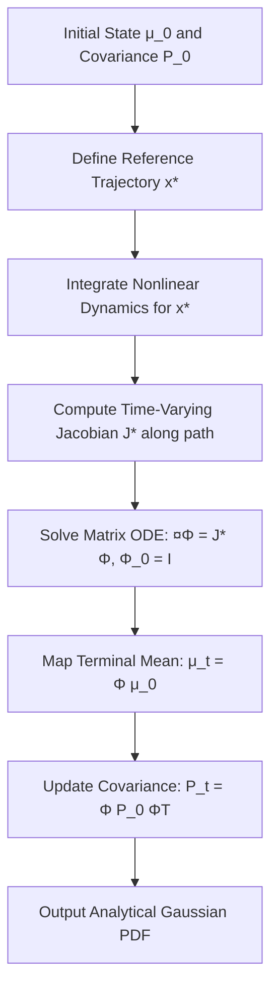

### PhD-Level Synthesis: Constraints and Utility
While the STM provides extreme computational efficiency, its reliance on first-order approximations introduces significant epistemic risks in highly nonlinear regimes.

*   **Nonlinearity Failure:** The accuracy of STM-based propagation decays rapidly as the propagation time increases or when applied to highly eccentric orbits (e.g., HEO), where the system's nonlinearity warps the uncertainty into non-Gaussian shapes like "banana" or "kidney" distributions.
*   **Inability to Capture Curvature:** Linear approximation methods are mathematically incapable of accounting for the curvature of the state space, leading to significant errors in the higher-order moments (skewness and kurtosis) of the PDF.
*   **Surprising Utility in Conjunction Assessment (CA):** Despite these theoretical shortcomings, studies have shown that LinCov can produce collision probabilities ($P_C$) nearly identical to Monte Carlo results in certain LEO scenarios. 
*   **Geometric Insight:** This robust performance suggests that for many conjunction geometries, capturing the "length," "width," and general location of the uncertainty spread is more critical for risk prediction than accurately modeling the non-Gaussian curvature.

# 02-07-26

## Discuss what these sources say about Multi-Fidelity (MF) Method, in the larger context of Efficiency-Optimized/Hybrid Methods.

In the hierarchy of uncertainty propagation (UP) methodologies, the **Multi-Fidelity (MF) Method** represents a data-adaptive, **efficiency-optimized** paradigm designed to reconcile the computational burden of high-fidelity (HF) orbital dynamics with the large-sample requirements of robust statistical characterization. MF methods bridge the gap between "weak" approximation sampling (Monte Carlo) and "strong" spectral expansions (Polynomial Chaos), utilizing a hierarchy of dynamical models to construct a surrogate of the propagated probability density function (PDF) at a fraction of the cost.

### 1. Theoretical Framework and Assumptions
The MF approach is predicated on the **structural similarity hypothesis**: the topological relationship between sample points evolved under computationally cheap low-fidelity (LF) dynamics is a sufficient proxy for their relationship under expensive HF dynamics.

*   **Model Hierarchy:** In astrodynamics, the LF model typically employs two-body Keplerian dynamics or $J_2$ perturbations, while the HF model incorporates high-degree gravity fields, atmospheric drag, and solar radiation pressure.
*   **Surrogate Basis:** A large ensemble of $m$ LF samples defines a basis for the space of propagated states. From this, a small subset $r$ of "important samples" (where $r \ll m$) is identified for HF evaluation.
*   **Correction Mapping:** The information gained from the $r$ HF evaluations is used to "lift" the remaining $m-r$ LF samples toward the HF truth using a stochastic collocation surrogate.

### 2. Mathematical Architecture
The MF surrogate seeks to approximate the HF realization of any sample point $\xi$ through a linear combination of the $r$ important HF realizations.

#### **The MF Surrogate Formula**
$$\hat{x}_H(\xi) = \sum_{\ell=1}^r c_\ell(\xi) x_H(\xi_\ell)$$
**Terms defined:**
*   $\hat{x}_H(\xi)$: The approximated HF state vector for a given input $\xi$.
*   $x_H(\xi_\ell)$: The exact HF state of the $\ell$-th "important sample".
*   $c_\ell(\xi)$: Expansion coefficients derived from the LF model to relate the general sample $\xi$ to the important nodes.
*   $r$: The rank of the surrogate (number of HF evaluations).

#### **Pivoted Cholesky Decomposition for Node Selection**
Identifying the $r$ nodes is an optimization problem solved via a **greedy algorithm** that maximizes the distance between the next selected node and the existing basis. This is implemented by solving the pivoted Cholesky decomposition of the Gramian matrix:
$$[X_L]^T G_L [X_L] = A^T C_h C_h^T A$$
**Terms defined:**
*   $X_L$: Matrix of LF propagated samples.
*   $G_L$: Gramian matrix, where $[G_L]_{i,j} = x_L(\xi_i) \cdot x_L(\xi_j)$.
*   $A$: Permutation/pivot matrix that identifies the indices of the important samples.
*   $C_h$: Lower triangular Cholesky factor.

### 3. Algorithmic Implementation of MF UP
The following flowchart delineates the procedural logic of the bi-fidelity uncertainty propagation framework:

```mermaid
graph TD
    A[Generate Initial Ensemble Ξ: N samples] --> B[Propagate all N samples via LF dynamics: X_L]
    B --> C[Compute Gramian G_L and apply Pivoted Cholesky]
    C --> D[Identify r Important Samples and Coefficients c_m]
    D --> E[Estimate LF Surrogate: X_tilde_L]
    E --> F{Is max|X_tilde_L - X_L| < ε_lf?}
    F -- No --> G[Increase r = r + 1]
    G --> D
    F -- Yes --> H[Propagate subset r via HF dynamics: X_H]
    H --> I[Apply Coefficients c_m to correct all N points]
    I --> J[Reconstruct HF Surrogate Distribution]
```

### 4. Hybrid and Efficiency-Optimized Frameworks
The sources highlight several advanced hybridizations that leverage MF's scalability:

*   **GMM-MF (Gaussian Mixture Multi-Fidelity):** Instead of propagating a single massive ensemble, a non-Gaussian PDF is split into $J$ Gaussian components. Each component's sigma points are propagated using MF, reducing the computational load of Gaussian Sum Filters by approximately 80% compared to standard Unscented Transform (UT) methods.
*   **Tri-Fidelity Hierarchies:** A medium-fidelity model is introduced to compute the expansion coefficients $c_\ell$. This refinement can reduce Root-Mean-Square (RMS) errors by a factor of two compared to bi-fidelity models while still minimizing HF evaluations.
*   **Credibilistic MF (OPM-MF):** Because the surrogate introduces systematic (epistemic) error rather than random error, recent frameworks use **Outer Probability Measures (OPMs)** and possibility functions $f(x)$ to bound these errors. This provides a "less over-descriptive" representation of uncertainty for establishing custody of newly detected objects.

### 5. Performance and Conjunction Assessment Significance
*   **Computational Speedup:** MF achieves a speedup of up to **four orders of magnitude** ($10^4$) compared to brute-force Monte Carlo for high-fidelity LEO propagation.
*   **Handling Non-Gaussianity:** Unlike linear methods, MF captures "banana-shaped" warpings and asymmetric tails. In conjunction assessment, as few as **8 important samples** allow MF to produce collision probabilities ($P_C$) that fall within the 95% confidence interval of a full MC simulation.
*   **Dimensionality custom:** To avoid limits on $r$ based on state size ($n=6$), researchers use the **state trajectory** (state at multiple time points) to increase the effective dimension of the Quantity of Interest (QoI) vector, enabling a more accurate basis.

## Explain the pivoted Cholesky decomposition for node selection in Multi-Fidelity uncertainty propagation

In the architecture of **Multi-Fidelity (MF) Uncertainty Propagation**, the **pivoted Cholesky decomposition** serves as the mathematical engine for the "greedy" selection of **important samples** (nodes). This approach identifies a small subset of points from a large low-fidelity (LF) ensemble that are most representative of the state space, ensuring that high-fidelity (HF) evaluations are spent where they provide the most information.

### 1. The Objective: Information Maximization
The goal of node selection is to find a set of random inputs $\underline{\Xi} = \{\underline{\xi}_1, \dots, \underline{\xi}_r\}$ such that the span of their low-fidelity realizations, $\mathcal{X}_L(\underline{\Xi})$, provides the best possible approximation of the full ensemble $X_L(\Xi)$.

*   **Greedy Selection Logic:** The algorithm iteratively picks the next node $\xi_k$ by maximizing the distance between that sample and the space spanned by the previously selected nodes.
*   **Intractability:** Solving this optimization problem directly via $\text{arg max dist}(\mathbf{x}(\xi), \mathcal{X}(\underline{\Xi}_{k-1}))$ is computationally expensive (intractable) for high-dimensional state spaces.
*   **The Cholesky Proxy:** The pivoted Cholesky decomposition provides an efficient linear algebra substitute to this geometric search by operating on the **Gramian matrix** of the low-fidelity samples.

### 2. Mathematical Architecture
The method leverages the relationship between the inner products of the propagated samples to identify the "rank" or "important" directions of the uncertainty volume.

#### **The Decomposition Formula**
The decomposition is defined as:
$$[X_L]^T G_L [X_L] = A^T C_h C_h^T A$$

**Terms defined:**
*   $X_L$: The matrix of low-fidelity propagated samples ($n \times m$).
*   $G_L$: The Gramian matrix where $[G_L]_{i,j} = x_L(\xi_i) \cdot x_L(\xi_j)$. It captures the similarity/redundancy between all sample pairs.
*   $A$: A **pivot matrix** (permutation matrix) that reorders the samples based on their importance.
*   $C_h$: A lower triangular Cholesky factor ($m \times r$).

#### **Weight Update and Orthogonalization**
During the decomposition, the algorithm maintains a vector of "weights" $w_\ell$ representing the norm of each sample. At each step:
1.  The sample with the largest remaining weight (the most unique point) is selected and "pivoted" to the front.
2.  The weights of all other samples are updated by subtracting their projection onto the newly selected node:
    $$w_t = w_t - C_{h(t,n)}^2$$
    This step effectively "deflates" the importance of samples that are redundant with the current basis.

### 3. Algorithm: Node Selection via Pivoted Cholesky
The following flowchart details the procedural logic for identifying $r$ important samples from $N$ low-fidelity evaluations:

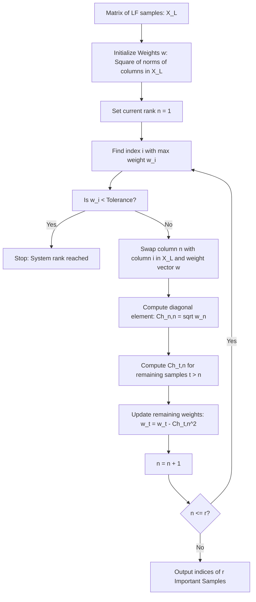

### 4. Computational Significance for Astrodynamics
Using pivoted Cholesky for node selection provides several advantages over standard Monte Carlo or Unscented Transform (UT) approaches:

*   **Dimensionality Expansion:** Standard node selection is limited by the state size ($n=6$). To use more nodes ($r > 6$), MF methods include the **state trajectory** (position and velocity at multiple times) in the vector $X_L$ to provide a richer basis for the decomposition.
*   **Efficiency Gains:** Because the decomposition identifies the most informative nodes based on cheap LF models (like 2-body Keplerian dynamics), it allows for a speed-up of up to **4 orders of magnitude** ($10,000\times$) compared to brute-force Monte Carlo while maintaining accurate collision probabilities.
*   **Systematic Error Management:** The rank $r$ is determined adaptively by checking if the surrogate approximated LF ensemble matches the true LF ensemble within a tolerance $\epsilon_{lf}$. If the error is too high, the rank is increased by one, and another node is selected via the pivot matrix.
*   **Surrogate Basis:** Once the $r$ nodes are selected, the Cholesky factor $C_h$ is used to solve for expansion coefficients $c_m$, which are then applied to the high-fidelity realizations to "lift" the remaining ensemble to HF accuracy.

# 03-07-26

## Explain the need to use a state trajectory vector instead of a single state vector in the context of Multi-Fidelity uncertainty propagation for orbit propagation

### 📘 Explanation of Section 3.2: *Multi-Fidelity Orbit Uncertainty Propagation*

Section 3.2 of the paper introduces a **key refinement** to the multi-fidelity stochastic collocation method, specifically tailored for orbit uncertainty propagation. Here’s a clear breakdown:

---

#### Core Problem
- In orbit-state propagation, the state vector typically has **6 dimensions** (position and velocity).
- The stochastic collocation method requires the number of important samples \( r \) to be **less than or equal to the state dimension \( n \)**.
- With only 6 dimensions, the number of high-fidelity samples is too small, leading to **poor surrogate accuracy**.

---

#### 💡 Proposed Solution
- The authors **expand the state vector** by including the **trajectory over multiple time points**, not just the state at a single epoch.
- Instead of:
  $$
  x(\xi) = \begin{bmatrix} r(t,\xi), v(t,\xi) \end{bmatrix}
  $$

  they redefine it as:
  $$
  x(\xi) = \big[ r(t_1), v(t_1), r(t_2), v(t_2), \dots, r(t_T), v(t_T) \big]^T
  $$
  where \( T \) is the number of time instances considered.

- This **longer trajectory-based state vector** increases \( n \), allowing more important samples to be identified and improving surrogate accuracy.

---

#### 📊 Justification
- In **Space Situational Awareness (SSA)**, analysts often need the **propagated PDF over a time interval**, not just at one instant.
- For example:
  - **Sensor tasking** requires knowing when an object will be visible over time.
  - **Collision risk analysis** depends on uncertainty evolution across an orbital arc.

Thus, including multiple time points in the surrogate is not only mathematically beneficial but also **operationally relevant**.

---

#### ⚙️ Computational Trade-off
- Expanding the state vector increases the **size of the surrogate** and requires propagation up to \( T \) time points.
- However, the **net computational cost is still reduced** compared to brute-force high-fidelity propagation of all samples.
- The method balances:
  - **Efficiency** (fewer high-fidelity runs),
  - **Accuracy** (better surrogate representation),
  - **Practicality** (results useful for SSA applications).

---

### 📝 In Simple Terms
Section 3.2 says:  
Instead of only looking at the orbit state at one moment, we stretch the state vector to include the whole trajectory across multiple time steps. This trick gives the surrogate model more “room” to capture dynamics accurately, while still saving computation compared to running everything in high fidelity. It’s both a mathematical fix and a practical improvement for real-world space monitoring tasks. 

# 04-07-26

## Unscented transfrom (UT) uncertainty propagation method
In the rigorous taxonomy of orbital uncertainty quantification, the **Unscented Transform (UT)** represents a pivotal **deterministic sampling method** that bridges the gap between computationally cheap linear approximations and prohibitively expensive brute-force stochastic simulations. Unlike the Monte Carlo (MC) method, which relies on random realizations, the UT operates on the foundational intuition that it is mathematically easier to approximate a probability distribution than it is to approximate an arbitrary nonlinear function or transformation.

### 1. Theoretical Context: Deterministic vs. Random Sampling
Within the landscape of sampling-based methodologies, the UT occupies a unique niche defined by "moderate fidelity" and high efficiency.

*   **Sigma Point Paradigm:** While MC requires $10^5$ to $10^7$ random samples to achieve statistical convergence, the UT utilizes a minimal, carefully selected set of weighted **sigma points** that precisely capture the initial mean and covariance of a distribution.
*   **Black-Box Dynamics:** Like MC, the UT is non-intrusive; it treats the system dynamics as a "black box," passing the discrete sigma points through the actual nonlinear equations of motion without requiring the derivation of Jacobians or Hessians.
*   **Gaussian Constraint:** A critical limitation noted in the sources is that the standard UT is primarily constrained by **Gaussian assumptions**. It nonlinearly propagates the first and second moments but may fail to naturally represent the "banana-shaped" non-Gaussian warpings that emerge during long-term orbital propagation.

### 2. Mathematical Architecture of the UT
The UT approximates an $n$-dimensional random variable $\mathbf{x}$ using $2n+1$ sigma points. The mathematical selection and weight assignment are governed by the following formulations:

#### **Sigma Point Selection**
$$\chi_0 = \bar{\mathbf{x}}$$
$$\chi_i = \bar{\mathbf{x}} + \left( \sqrt{(n + \kappa) \mathbf{P}} \right)_i, \quad i = 1, \dots, n$$
$$\chi_{i+n} = \bar{\mathbf{x}} - \left( \sqrt{(n + \kappa) \mathbf{P}} \right)_i, \quad i = 1, \dots, n$$

#### **Weight Allocation**
$$W_0 = \frac{\kappa}{n + \kappa}$$
$$W_i = \frac{1}{2(n + \kappa)}, \quad i = 1, \dots, 2n$$

**Terms Defined:**
*   $\bar{\mathbf{x}}$: The mean state vector.
*   $\mathbf{P}$: The state covariance matrix.
*   $\left( \sqrt{\cdot} \right)_i$: The $i$-th column of the matrix square root (typically calculated via **Cholesky decomposition**).
*   $\kappa$: A scaling/tuning parameter, often set such that $n + \kappa = 3$ for Gaussian distributions to minimize higher-order errors.

#### **Statistical Reconstruction**
After passing each $\chi_i$ through the nonlinear dynamics $\mathbf{f}(\cdot)$, the terminal mean ($\hat{\mathbf{x}}$) and covariance ($\hat{\mathbf{P}}$) are reconstructed:
$$\hat{\mathbf{x}} = \sum_{i=0}^{2n} W_i \chi_i$$
$$\hat{\mathbf{P}} = \sum_{i=0}^{2n} W_i (\chi_i - \hat{\mathbf{x}})(\chi_i - \hat{\mathbf{x}})^T$$

### 3. Algorithm: The Unscented Filter (UKF) Logic
The following flowchart delineates the procedural execution of the UT within a predictive filtering framework, such as the Unscented Kalman Filter:

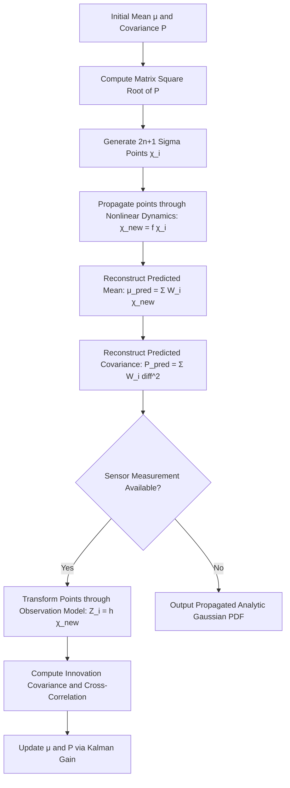

### 4. Comparative Performance and Hybrid Integration
The sources highlight the UT's performance relative to other "State-of-the-Art" methods:

*   **UT vs. Linearised Covariance (LinCov):** The UT is consistently more accurate than LinCov because it captures more of the distribution's tails and accounts for higher-order nonlinear effects that first-order Taylor expansions ignore.
*   **UT vs. Monte Carlo:** The UT is significantly faster than MC, requiring only 13 points for a standard 6D orbital state compared to the millions needed for MC to reach similar statistical convergence.
*   **Gaussian Mixture Model (GMM) Integration:** To overcome the Gaussian limitation, the UT is frequently used to propagate the individual kernels of a **GMM (GMM_UT)**. This allows the framework to represent non-Gaussian "banana" shapes by treating them as a sum of many small Gaussians, each handled by the UT.
*   **AEGIS Framework:** In the **Adaptive Entropy-based Gaussian-mixture Information Synthesis (AEGIS)** method, the UT is employed to calculate "nonlinear entropy". By comparing this to the linear entropy from LinCov, the system can detect when the dynamics have become too nonlinear and trigger a component split.
*   **Multi-Fidelity (MF) Advantage:** While the UT is an efficient "middle-ground," the sources characterize Multi-Fidelity (MF) as superior for high-consequence non-Gaussian cases, as MF uses large-scale low-fidelity sampling corrected by high-fidelity samples to capture complex shapes that the UT's single-Gaussian assumption cannot.

# 09-07-26

## Discuss what these sources say about Polynomial Chaos Expansions (PCE), in the larger context of Expansion and Surrogate Methods.

In the rigorous hierarchy of uncertainty propagation (UP) methodologies, **Polynomial Chaos Expansions (PCE)** represent a powerful class of **non-intrusive spectral techniques**. Situated within the broader category of **Expansion and Surrogate Methods**, PCE bridges the gap between local Taylor-series-based approximations (like Linearized Covariance or State Transition Tensors) and brute-force stochastic simulations (Monte Carlo) by constructing a global functional representation of a system’s stochastic response.

### Theoretical Classification and Role
Within the methodological landscape, PCE is distinguished by its ability to map input uncertainties to output responses using a "black-box" approach that does not require alterations to existing high-fidelity solvers.

*   **Beyond Linearization:** Unlike Linearized Covariance (LinCov), which relies on first-order Taylor expansions and assumes Gaussian distributions, PCE represents inputs and outputs using a series of approximations that capture **higher moments** of the probability density function (PDF), allowing it to represent non-Gaussian shapes.

*   **Surrogate Modeling Paradigm:** PCE functions as a data-driven mathematical emulator, replacing expensive physical orbital propagators with a computationally cheap polynomial surrogate.

*   **Spectral Accuracy:** For systems where the output depends smoothly on the input parameters, PCE can achieve **exponential convergence** rates, far exceeding the $\mathcal{O}(1/\sqrt{N})$ convergence of standard Monte Carlo (MC).

### Mathematical Foundations of PCE
The PCE models a square-measurable stochastic output vector $\mathbf{X}$ as a linear combination of multivariate polynomials that are orthogonal with respect to the joint PDF of the input uncertainties $\xi$.

#### **The PCE Surrogate Formula**
The stochastic output at a future time $t$ is approximated by the finite series expansion:
$$\hat{\mathbf{X}}(t, \xi) \approx \sum_{j=0}^{P} c_j(t) \Psi_j(\xi)$$

**Terms Defined:**

*   $\hat{\mathbf{X}}(t, \xi)$: The approximated Quantity of Interest (QoI) vector (e.g., the terminal orbital state).

*   $\xi$: A vector of independent standard random variables representing input uncertainties.

*   $\Psi_j(\xi)$: Multivariate orthonormal basis functions, typically formed as the product of univariate polynomials.

*   $c_j(t)$: Deterministic spectral coefficients (weights) determined at the epoch of interest.

*   $P$: The number of terms in the expansion, determined by the polynomial order $p$ and input dimension $d$.

#### **Expansion Order and the Curse of Dimensionality**
The total number of coefficients $P$ required for a given order $p$ and dimension $d$ is calculated as:
$$P+1 = \frac{(p+d)!}{p!d!}$$

This factorial growth highlights the primary limitation of classical PCE: the **curse of dimensionality**, where high-dimensional problems (e.g., $d > 10$) become computationally demanding due to the rapid growth of expansion terms.

#### **Orthonormality and Moment Matching**
The basis functions are chosen to satisfy the orthogonality condition relative to the input PDF, $\rho(\xi)$:
$$\langle \Psi_\alpha, \Psi_\beta \rangle = \int_{\Gamma} \Psi_\alpha(\xi) \Psi_\beta(\xi) \rho(\xi) d\xi = \delta_{\alpha\beta}$$
where $\delta_{\alpha\beta}$ is the Kronecker delta. This property allows for the **analytical evaluation of statistical moments** directly from the spectral coefficients without additional sampling:

*   **Mean:** $\mu = c_0$.

*   **Variance:** $\sigma^2 = \sum_{j=1}^P c_j^2 \|\Psi_j\|^2$.

---

### Procedural Logic: Non-Intrusive PCE Workflow
In astrodynamics, the non-intrusive approach is favored because it treats the high-fidelity orbit propagator as a "black box".

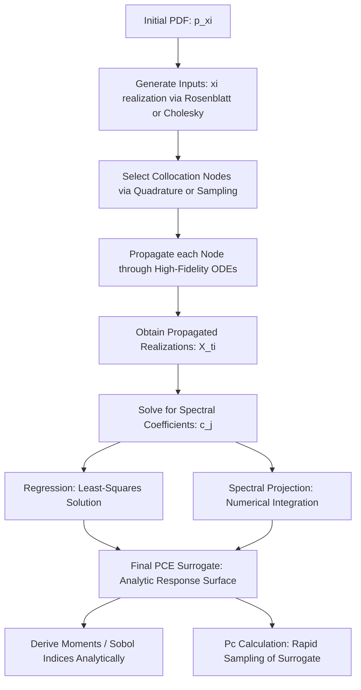

### Variations of Expansion and Surrogate Methods
To address specific limitations—such as non-standard distributions, discontinuities, or high dimensionality—the sources identify several key variations of the PCE method.

*   **Generalized Polynomial Chaos (gPC):**
    Built upon the **Wiener-Askey scheme**, gPC matches specific polynomial families to standard input distributions to ensure optimal convergence. For example, **Hermite polynomials** are optimal for Gaussian inputs, while **Legendre polynomials** are used for uniform inputs.

*   **Arbitrary Polynomial Chaos (APC):**
    A **data-driven approach** that circumvents the need for a presumed parametric distribution. APC constructs an orthogonal basis using only a finite number of moments calculated directly from raw sampling data (e.g., from an admissible region in orbit determination).

*   **Sparse PCE and Compressive Sensing:**
    To combat the curse of dimensionality, modern frameworks exploit the **sparsity-of-effects principle**—the idea that systems are dominated by low-order interactions. Solvers such as **Orthogonal Matching Pursuit (OMP)**, **Least Angle Regression (LARS)**, or $l_1$-regularized **Compressive Sensing** identify only the most significant coefficients, allowing for accurate surrogates using significantly fewer function evaluations than terms in the full basis.

*   **Multi-Element PCE (ME-PCE):**
    For systems with sharp gradients, discontinuities, or long-term integration errors, global polynomials often fail. ME-PCE utilizes **domain decomposition**, splitting the random input space into smaller sub-regions (elements) and fitting local PCE surrogates to each.

*   **Hybrid Meta-Modeling (PC-Kriging):**
    **Polynomial Chaos-Kriging (PCK)** combines the global trend capture of PCE with the localized interpolation accuracy of **Kriging** (Gaussian Process Regression). In this architecture, a sparse PCE represents the global system behavior while Kriging interpolates the localized high-frequency residuals.

*   **Multi-Fidelity (MF) Extensions:**
    Multi-Fidelity PCE incorporates information from a hierarchy of models. It uses a low-fidelity model (e.g., 2-body dynamics) as a foundation and a lower-order PCE to resolve the **model discrepancy** (additive or multiplicative) from a limited set of high-fidelity evaluations.

### Summary of Strengths and Limitations
| Feature | PCE Strength | Methodological Limitation |
| :--- | :--- | :--- |
| **Statistical Analysis** | Moments and **Sobol Indices** (sensitivity) are computed analytically. | Requires square-measurable/finite variance stochastic solutions. |
| **Computational Efficiency** | Massive speed-up relative to MC; can resolve collision risk with <300 evaluations vs. $10^5$ MC trials. | Significantly slower than linear approximations or the Multi-Fidelity method. |
| **Modeling Flexibility** | Non-intrusive; treats complex dynamics as a black box. | Standard global versions struggle with discontinuities or steep local variations. |

# 10-07-26
## Discuss what these sources say about Gaussian Mixture Models (GMM) framework and its combinations with other uncertainty propagation methods, in the larger context of uncertainty propagation in orbital mechanics.

In the rigorous taxonomy of orbital uncertainty quantification (UQ), **Gaussian Mixture Models (GMM)** serve as a versatile **non-parametric framework** that bridges the computational efficiency of linear methods with the topological complexity of non-Gaussian orbital mechanics. The foundational principle of the GMM framework is the "universal approximator" property, which asserts that any arbitrary probability density function (PDF) can be represented with sufficient accuracy as a weighted sum of multiple Gaussian kernels.

### 1. Mathematical Architecture of the GMM Framework
The GMM framework represents a complex, non-Gaussian state $\mathbf{x}$ as a linear combination of $N_g$ multivariate Gaussian components.

#### **The Joint GMM PDF**
$$
p(\mathbf{x}, t) = \sum_{i=1}^{N_g} \alpha_i \mathcal{N}(\mathbf{x}; \mathbf{\mu}_i(t), \mathbf{P}_i(t))
$$

**Terms Defined:**
*   $p(\mathbf{x}, t)$: The total approximated non-Gaussian probability density at time $t$.
*   $N_g$: The number of Gaussian components (mixands) in the ensemble.
*   $\alpha_i$: The scalar weight of the $i$-th component, satisfying $\sum \alpha_i = 1$ and $\alpha_i > 0$.
*   $\mathcal{N}(\mathbf{x}; \boldsymbol{\mu}_i, \mathbf{P}_i)$: The $i$-th multivariate Gaussian kernel defined by its mean $\boldsymbol{\mu}_i$ and covariance $\mathbf{P}_i$.

#### **Statistical Moment Reconstruction**
The global mean ($\bar{\mathbf{x}}$) and covariance ($\mathbf{P}_{tot}$) of the mixture are synthesized from the individual component statistics:
$$
\bar{\mathbf{x}} = \sum_{i=1}^{N_g} \alpha_i \mathbf{\mu}_i
$$
$$
\mathbf{P}_{tot} = \sum_{i=1}^{N_g} \alpha_i (\mathbf{P}_i + \mathbf{\mu}_i \mathbf{\mu}_i^T) - \bar{\mathbf{x}} \bar{\mathbf{x}}^T
$$

---

### 2. Algorithmic Methodology: The GMM-UP Lifecycle
The implementation of a GMM for uncertainty propagation follows a structured four-stage procedure.

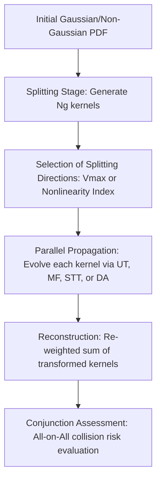

*   **Splitting Stage:** The initial distribution is partitioned into $N_g$ components using splitting libraries (e.g., Horwood suboptimal or DeMars $L_2$-optimal).
*   **Propagation Flexibility:** A core advantage of the GMM is its **method-agnostic nature**; once split, individual kernels are evolved using any Gaussian-assumed technique.
*   **Reconstruction Stage:** The transformed kernels are summed to capture the non-Gaussian "banana-shaped" distributions typical of long-term LEO propagation.

---

### 3. Variations and Hybrid Architectures
The GMM framework is frequently combined with other UP methods to optimize the speed-accuracy Pareto front.

#### **GMM-UT (Unscented Transform)**
The most common implementation, where each kernel's statistics are propagated via $2n+1$ sigma points.
*   **Advantage:** Captures higher-order nonlinear effects for each mixand, significantly outperforming single-run linearization.
*   **Limitation:** Computationally expensive for large mixtures, as total evaluations scale as $N_g \times (2n+1)$.

#### **GMM-MF (Multi-Fidelity)**
A high-efficiency hybrid where the Multi-Fidelity method propagates the sigma points of the GMM kernels.
*   **Methodology:** Uses low-fidelity dynamics (e.g., J2-only) to propagate many samples, corrected by a tiny subset of high-fidelity evaluations.
*   **Performance:** Achieves accuracy similar to GMM-UT but with an **80% reduction in computation time**.

#### **GMM-STT (State Transition Tensor)**
Pairs the GMM with semi-analytical STT propagation.
*   **Methodology:** Kernels are evolved using high-order Taylor expansions of the flow.
*   **PhD-Level Context:** Effectively mitigates the divergence of STTs in high-uncertainty regions by keeping the individual kernel covariances "small" and within the radius of convergence.

#### **GMM-DA (Differential Algebra)**
Integrates GMMs with high-order Taylor polynomials generated automatically via DA.
*   **Advantage:** Self-adaptive to any regular nonlinear system without requiring manual derivation of derivatives.
*   **Variant (DA-LOADS):** Uses a **Nonlinearity Index (NLI)** to trigger adaptive splitting only when the Taylor expansion's truncation error exceeds a threshold.

---

### 4. Adaptive Refinement and Management Strategies
To maintain uncertainty realism during long propagations, the GMM must be adaptively refined.

*   **AEGIS (Adaptive Entropy-based GMM Information Synthesis):**
    *   This framework monitors the difference between **linear entropy** (via LinCov) and **nonlinear entropy** (via UT).

    *   When the normalized difference exceeds $\epsilon_{ent}$, the component is split online to restore local linearity.

    *   **Limitation:** Suffers from **exponential component growth**, which can lead to "out-of-memory" errors in 
    long-term LEO scenarios.

*   **Directional Splitting:** To combat the "curse of dimensionality," GMM splitting is often restricted to the eigenvector corresponding to the maximum eigenvalue ($V_{max}$) or directions maximizing a nonlinearity metric.

*   **Coordinate Frame Synergy:** Pairing GMMs with **Modified Equinoctial Elements (MEqOE)** is highly efficient, as uncertainty in MEqOE is dominated by a single dimension (true longitude), requiring fewer kernels than Cartesian space.

### 5. Implementation Limitations in Orbital SSA
Despite its robustness, the sources highlight critical drawbacks:
*   **The "Centred Collection" Effect:** In Cartesian frames, individual GMM components can end up clumping toward the center of the distribution at terminal time, failing to capture the thin "tails" of the true non-Gaussian distribution.

*   **Combinatoric Growth:** The number of components in a batch GMM can scale factorially with the number of measurements ($N_{\nu,0} \times \dots \times N_{\nu,L}$), necessitating aggressive pruning and merging techniques.

*   **Tail Sensitivity:** While GMMs improve upon single Gaussians, they may still require an intractable number of kernels to accurately resolve the $10^{-5}$ or $10^{-6}$ tail probabilities required for actionable conjunction screening.


## Discuss what these sources say about State Transition Tensors (STT), in the larger context of Expansion and Surrogate Methods.

In the rigorous taxonomy of orbital uncertainty quantification (UQ), **State Transition Tensors (STT)** represent a high-fidelity **semi-analytic expansion method**. Situated between first-order linear approximations (LinCov) and non-intrusive surrogates (PCE), STTs facilitate the nonlinear propagation of uncertainties by applying higher-order Taylor series expansions to the deviation of a system's state from a nominal trajectory.

### 1. Mathematical Architecture of STTs
The STT framework models the flow of a nonlinear dynamical system $\dot{\mathbf{x}} = \mathbf{f}(\mathbf{x}, t)$ by expanding the solution in terms of initial state deviations.

#### **The High-Order Taylor Map**
The state deviation $\delta x_i$ at a future time $t$ is approximated as:
$$
\delta x_i(t) \approx \sum_{p=1}^P \frac{1}{p!} \phi_{i, k_1 \dots k_p}(t, t_0) \delta x_{0, k_1} \dots \delta x_{0, k_p}
$$
**Terms Defined:**

*   $\delta x_i(t)$: The $i$-th component of the state deviation at the final time.

*   $\delta x_{0, k_p}$: The $k_p$-th component of the initial state deviation.

*   $P$: The highest order of the Taylor expansion (typically $P=2$ or $P=3$).

*   $\phi_{i, k_1 \dots k_p}$: The $p$-th order **State Transition Tensor**, representing the $p$-th partial derivative of the flow with respect to initial conditions.

#### **Differential Equations for Tensor Propagation**
The STTs themselves are time-varying and are obtained by numerically integrating their corresponding ordinary differential equations (ODEs) alongside the nominal trajectory:
$$\dot{\phi}_{i, a} = A_{i, \alpha} \phi_{\alpha, a}$$
$$\dot{\phi}_{i, ab} = A_{i, \alpha} \phi_{\alpha, ab} + A_{i, \alpha \beta} \phi_{\alpha, a} \phi_{\beta, b}$$

**Terms Defined:**

*   $\dot{\phi}_{i, a}$: The time derivative of the first-order tensor (the State Transition Matrix, STM).

*   $A_{i, k_1 \dots k_p}$: The $p$-th partial derivative of the dynamics vector field $\mathbf{f}$ evaluated along the reference trajectory: $A_{i, k_1 \dots k_p} = \frac{\partial^p f_i}{\partial x_{k_1} \dots \partial x_{k_p}}$.

---

### 2. Methodology: Moment Propagation via Algebraic Mapping
Unlike sampling methods that propagate individual points, STT-based UQ maps the initial statistical moments directly to the terminal state through simple algebraic operations.

1.  **Reference Integration:** Solve the ODEs for the nominal state $\mathbf{x}(t)$ and the tensors $\phi$ up to order $P$.
2.  **Initial Moment Characterization:** Compute the raw moments of the initial PDF (e.g., using the moment-generating function for a Gaussian or uniform distribution).
3.  **Statistical Mapping:** Use the Taylor expansion and the linearity of the expectation operator to compute the terminal mean ($\hat{\mu}$) and covariance ($\hat{\mathbf{P}}$):
    $$\delta \mu_i(t) \approx \sum_{p=1}^P \frac{1}{p!} \phi_{i, k_1 \dots k_p} \mathbb{E}[\delta x_{0, k_1} \dots \delta x_{0, k_p}]$$
4.  **Gaussian Moment Property:** If the initial distribution is Gaussian, higher-order moments are analytically linked to the covariance via **Isserlis' Theorem** (or Wick's formula), allowing for precise reconstruction of non-Gaussian terminal shapes using only the initial mean and covariance.

---

### 3. Variations and Algorithmic Enhancements
To overcome the "curse of dimensionality" and the high computational cost of calculating factorial-order partial derivatives, several advanced STT variants have been developed.

*   **Directional State Transition Tensors (DSTT):** Reduces complexity by aligning the STT terms only with the most sensitive directions (eigenvectors of the Cauchy-Green tensor) while ignoring stable directions. This can reduce the number of integrated variables from $n^3$ to approximately $n + n^2 + nm^2$.

*   **Time-varying Directional STT (TDSTT):** Improves upon the DSTT by integrating the eigenvalue-eigenvector pairs over time, allowing uncertainty analysis at any historical point rather than just a predefined final epoch.

*   **Distribution Transport (DT):** Organizes polynomial coefficients into a vector form to facilitate parallel calculation using linear algebra libraries and integral correction methods, achieving speed-ups of up to 60 times over conventional STT implementations.

*   **Reduced STT (RSTT):** Assumes two-body dynamics dominate and retains only the secular terms to decrease the integration burden for high-order approximations.

---

### 4. Algorithm: The STT Uncertainty Pipeline
The following flowchart delineates the procedural execution of an STT-based uncertainty propagation campaign.

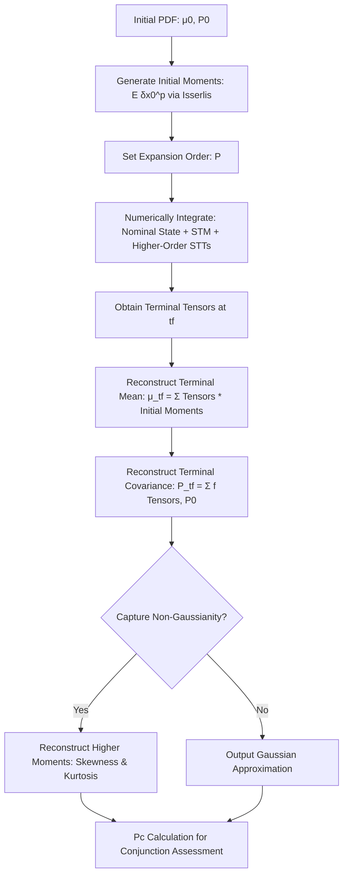

---

### 5. Comparative Analysis in Expansion and Surrogate Methods
Within the broader category of surrogate methods, STTs are defined by distinct trade-offs regarding differentiability and dimensionality.

| Feature | State Transition Tensors (STT) | Differential Algebra (DA) | Polynomial Chaos (PCE) |
| :--- | :--- | :--- | :--- |
| **Expansion Type** | Semi-Analytic Taylor Series | Automated Taylor Polynomials | Non-Intrusive Spectral Basis |
| **Dynamics Requirement** | Continuous & Differentiable | Continuous & Differentiable | Black-Box (Non-Differentiable) |
| **Input Dependence** | Distribution Agnostic | Distribution Agnostic | Distribution Matched (Wiener-Askey) |
| **Complexity Growth** | Exponential/Factorial with Order | Controlled via Automated Eval | Factorial (Curse of Dimensionality) |
| **Main Advantage** | Analytic moment propagation | Automated derivative extraction | Exponential convergence for smooth systems |

The primary takeaway is that STTs provide a **local higher-order approximation** of the flow manifold. While they accurately capture the "banana-shaped" warping caused by $1/r^2$ gravitational nonlinearities, they are strictly limited to the **radius of convergence** of the Taylor expansion. If the initial uncertainty is too large, the expansion fails, necessitating hybrid methods such as **GMM-STT**, which partition the state space into smaller, locally linear Gaussian kernels.

## Discuss what these sources say about Differential Algebra (DA), in the larger context of Expansion and Surrogate Methods.

In the rigorous hierarchy of uncertainty propagation (UP), **Differential Algebra (DA)** represents a high-fidelity **semi-analytic expansion method**. Situated within the broader category of **Polynomial and Expansion Methods**, DA provides a computational framework to evaluate the nonlinear flow of dynamical systems by substituting the classical algebra of real numbers with a new algebra of **Taylor polynomials**. Unlike non-intrusive surrogate methods (like PCE), DA allows for the automatic computation of higher-order derivatives of the system's flow with respect to initial conditions and parameters.

### 1. Mathematical Foundations of DA
The fundamental principle of DA is to represent any $k$-differentiable function as its Taylor expansion up to a specified order. This is formalized through the definition of the **$nDv$ algebra**, often denoted as $kDn$ in literature.

*   **The Algebra $kDn$:** This algebra consists of equivalence classes of functions that share the same Taylor polynomial up to order $k$ in $n$ variables centered at $x_0$.

*   **Coefficient Cardinality:** The maximum number of coefficients $N_{coeff}$ required to represent a polynomial of order $k$ in $n$ variables is given by:
    $$
    N_{coeff} = \frac{(n + k)!}{n!k!}
    $$

    For instance, a 10th-order expansion in 6 dimensions (10D6) requires 8,008 coefficients.

*   **The Taylor Map:** The output of a DA-based numerical integration is a high-order multidimensional Taylor map, $\mathcal{T}_{x_0}^{(k)}$, which relates initial perturbations $\delta x_0$ to the future state $x(t)$:
    $$x(t) = \mathcal{T}_{x_0}^{(k)}(\delta x_0) = \sum_{|\alpha| \le k} c_{\alpha}(t) \delta x_0^{\alpha}$$

    **Terms Defined:**

    *   $x(t)$: The state vector at time $t$.

    *   $k$: The expansion order.

    *   $\alpha$: A multi-index $(\alpha_1, \dots, \alpha_n)$ where $\alpha_i \in \mathbb{N} \cup \{0\}$.

    *   $c_{\alpha}(t)$: Time-varying polynomial coefficients representing partial derivatives.

    *   $\delta x_0$: The initial state deviation vector.

---

### 2. Operational Methodology: High-Order Flow Expansion
The DA methodology facilitates nonlinear UP by propagating a "neighborhood" of states rather than a single point.

1.  **DA Initialization:** The initial state $x_0$ is initialized as a DA variable $[x_0] = \bar{x}_0 + \delta x_0$, where $\bar{x}_0$ is the nominal mean and $\delta x_0$ represents first-order variations.

2.  **Polymorphic Integration:** The governing ordinary differential equations (ODEs), $\dot{x} = f(x, t)$, are integrated using standard schemes (e.g., Runge-Kutta) where every real-number operation is replaced by its adjoint operation in the space of Taylor polynomials.

3.  **Map Extraction:** The result is the $k$-th order Taylor expansion of the flow $\phi(t; x_0, \alpha)$. This map is analytic and can be used for near-instantaneous evaluations of displaced initial conditions.

4.  **Statistical Mapping:** Terminal moments are computed by applying the expectation operator $\mathbb{E}[\cdot]$ to the resulting Taylor map.
    *   **Terminal Mean:** $\mu_i(t) = \sum_{|\alpha| \le k} c_{\alpha}(t) \mathbb{E}[\delta x_0^{\alpha}]$.
    *   **Terminal Covariance:** $P_{ij}(t) = \mathbb{E}[x_i(t)x_j(t)] - \mu_i(t)\mu_j(t)$, which involves algebraic operations on the coefficients and initial moments.

---

### 3. Variations and Algorithmic Enhancements
To overcome the limitations of local expansions and computational growth, several advanced variants of the DA framework exist.

*   **Automatic Domain Splitting (ADS/LOADS):** In highly nonlinear regimes, a single Taylor expansion may fail to maintain accuracy over the entire uncertainty volume. ADS monitors the truncation error (e.g., the magnitude of terms of order $k+1$) and adaptively subdivides the uncertainty domain into smaller sub-regions when error thresholds are exceeded.
*   **DA-based Monte Carlo (DAMC):** Instead of thousands of expensive numerical integrations, DAMC samples from the initial PDF and evaluates the samples using the DA-derived Taylor map. This typically achieves a 10-fold reduction in computation time for order $k=3$.
*   **Hybrid GMM-DA:** The initial uncertainty is split into a **Gaussian Mixture Model (GMM)**, and each kernel is nonlinearly propagated via a high-order DA map. This approach is self-adaptive and avoids manual derivation of high-order derivatives.
*   **DA-LOADS Pruning:** Utilizes polynomial bounding techniques to discard regions of the state manifold that do not intersect with observations during initial orbit determination (IOD).

---

### 4. Algorithmic Implementation Flowcharts

#### **Standard DA Uncertainty Propagation**
```mermaid
graph TD
    A[Initial PDF: Mean μ0, Covariance P0] --> B[Initialize DA State: x_0 = μ0 + δx0]
    B --> C[Select Integration Scheme: e.g., RK45]
    C --> D[Propagate via DA Arithmetic: Substitute real ops with polynomial ops]
    D --> E[Obtain Terminal Taylor Map: T_tf]
    E --> F{Analysis Type?}
    F -- Analytic Moments --> G[Evaluate E[T_tf] and Covariance via Moment Mapping]
    F -- Monte Carlo --> H[Sample δx0 and Evaluate T_tf point-wise]
    G --> I[Output Post-Propagation Statistics]
    H --> I
```

#### **DA with Automatic Domain Splitting (ADS)**
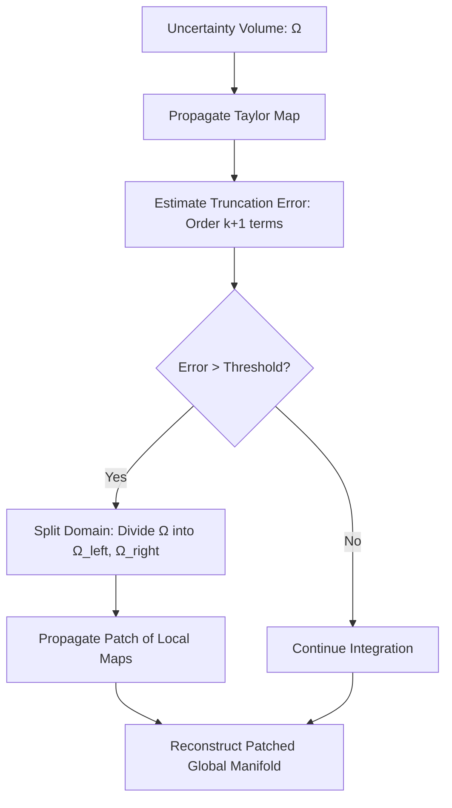

---

### 5. PhD-Level Synthesis: DA in the Expansion Taxonomy
Within the broader context of Expansion and Surrogate methods, DA is distinguished by its **intrusive nature** and **problem independence**.

*   **DA vs. State Transition Tensors (STT):** STTs require the manual derivation and integration of complex high-order variational equations, which becomes prohibitively complex for high-fidelity models. DA automates this process by overloading the integrator's basic operations, making it essentially ODE-independent.

*   **DA vs. Polynomial Chaos (PCE):** PCE is a **non-intrusive** "black-box" spectral technique that characterizes uncertainty using a sum of orthogonal polynomials of random variables. In contrast, DA focuses on the Taylor expansion of the state and requires the system dynamics to be continuous and differentiable ($C^{k+1}$).

*   **Coordinate Frame Dependency:** Unlike methods restricted to specific coordinates to minimize nonlinearity, DA-based methods are largely unaffected by coordinate selection (e.g., Cartesian vs. Element space) because they can adjust expansion orders to maintain accuracy.

*   **The Curse of Dimensionality:** Like all expansion methods, DA suffers from factorial growth in terms ($N_{coeff}$) as order $k$ increases. Modern extensions like **Distribution Transport (DT)** attempt to mitigate this by organizing coefficients into vectors for parallel computation.

## Discuss what these sources say about closed-form solutions to the Fokker-Planck Equations in the larger context of uncertainty propagation

In the mathematical landscape of uncertainty quantification (UQ), the **Fokker-Planck Equation (FPE)**, also known as the Fokker-Planck-Kolmogorov Equation (FPKE), is the fundamental partial differential equation (PDE) governing the smooth evolution of a probability density function (PDF) through nonlinear dynamics. While the FPE provides an "ideal" description of uncertainty, its exact analytical or closed-form solutions are notoriously elusive for nonlinear systems, leading to what is frequently termed the "curse of dimensionality".

### 1. The Mathematical Architecture of the FPE
For a nonlinear dynamical system driven by zero-mean Gaussian white noise, the evolution of the state PDF, $p(\mathbf{x}, t)$, is defined by the following second-order, linear parabolic PDE:

$$\frac{\partial p(\mathbf{x}, t)}{\partial t} = -\sum_{i=1}^{n} \frac{\partial}{\partial x_i} \left[ f_i(\mathbf{x}, t) p(\mathbf{x}, t) \right] + \frac{1}{2} \sum_{i=1}^{n} \sum_{j=1}^{n} \frac{\partial^2}{\partial x_i \partial x_j} \left[ (LQL^T)_{ij} p(\mathbf{x}, t) \right]$$

**Terms Defined:**

*   $p(\mathbf{x}, t)$: The joint probability density function of the state.

*   $f_i(\mathbf{x}, t)$: The $i$-th component of the deterministic **drift term**, capturing the deviation of the mean.

*   $L(\mathbf{x}, t)$: The noise mapping matrix.

*   $Q$: The power spectral density of the process noise.

*   $(LQL^T)_{ij}$: The **diffusion term**, accounting for the spread of the PDF due to stochastic forcing.

---

### 2. The Traditional Closed-Form Baseline: Linear-Gaussian Systems
The "Linear-Gaussian" case is one of the few regimes where the FPE admits an exact, analytical solution.

*   **Gaussian Preservation:** If the dynamics are linear ($\dot{\mathbf{x}} = \mathbf{A}\mathbf{x}$) and the initial PDF is Gaussian, the solution remains Gaussian for all time.

*   **Analytical Mapping:** The PDF is fully characterized by its mean ($\mathbf{x}_0$) and covariance ($\mathbf{P}$), which evolve via:
    $$
    \dot{\mathbf{x}}_0 = \mathbf{A}\mathbf{x}_0
    $$
    $$
    \dot{\mathbf{P}} = \mathbf{A}\mathbf{P} + \mathbf{P}\mathbf{A}^T + \mathbf{G}\mathbf{Q}\mathbf{G}^T
    $$

*   **Significance:** This recovers the standard Kalman filter propagation and serves as the benchmark for UQ realism.


### 3. State-of-the-Art: Taylor Map Diffusion
A significant breakthrough in the sources is the development of **Taylor Map Diffusion**, which offers a closed-form, grid-free solution to the FPE under nonlinear advection and additive diffusion.

#### **The Exponential-of-Quadratic-Form Ansatz**
The method proves that a specific structural form of the PDF is preserved over time:
$$
p(\mathbf{x}, t) = \frac{1}{\mathcal{N}(t)} \exp \left( -\frac{1}{2} F(\mathbf{x}, t)^T Q(t) F(\mathbf{x}, t) + \mu(\mathbf{x}, t) \right)
$$

**Terms Defined:**

*   $F(\mathbf{x}, t)$: A smooth, invertible nonlinear **Taylor map** (generalized STM).

*   $Q(t)$: The **precision matrix** (inverse covariance).

*   $\mu(\mathbf{x}, t)$: A scalar field accounting for the divergence of the dynamics.

#### **Algorithmic Methodology: Structural Preservation**
Unlike grid-based methods that discretize state space, this method propagates the PDF parameters via a compact system of ODEs.

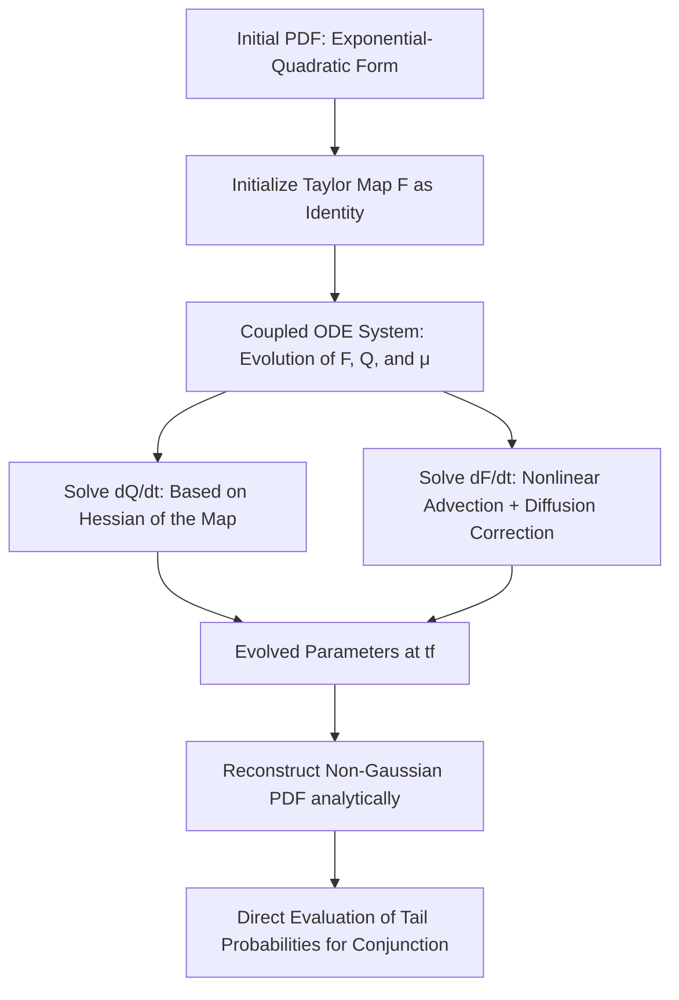


### 4. Variations and Special Case Solutions
Beyond general time-varying systems, specific closed-form solutions exist for restricted classes of problems:

*   **The Liouville Equation (Diffusionless Limit):** In the absence of process noise ($Q=0$), the FPE reduces to the Liouville equation. For Hamiltonian systems, the PDF remains constant along trajectories ($dp/dt = 0$), implying the probability is an **integral invariant**.

*   **Stationary Solutions for Nonlinear Oscillators:** Analytical stationary solutions ($t \to \infty$) exist for specific systems like the Duffing and Quintic oscillators. These solutions are proportional to the exponent of the **Hamiltonian** ($H$):
    $$
    p(\mathbf{x}, \infty) \propto \exp \left( -\frac{2\eta}{Q} H \right)
    $$

    where $\eta$ is damping and $Q$ is noise strength.

*   **Method of Characteristics:** The FPE can be solved along specific trajectories by integrating the divergence of the vector field:
    $$
    p(\mathbf{x}_t) = p(\mathbf{x}_0) \exp \left( -\int_{0}^{t}\nabla \cdot \mathbf{f}(\mathbf{x}(\tau), \tau) d\tau \right)
    $$

    This provides discrete probability values at any sample point without a full spatial solver.


### 5. PhD-Level Comparison and Context
| Feature | Grid-Based Solvers | Taylor Map Diffusion | Monte Carlo |
| :--- | :--- | :--- | :--- |
| **Solution Type** | Numerical Discretization | **Closed-Form ODE** | Statistical Ensemble |
| **Complexity** | $50^6 \approx 10^{10}$ per step | **94 to 279 equations** | $10^5$ to $10^7$ runs |
| **Tail Modeling** | Poor (interpolation errors) | **Analytical in Tails** | Prohibitive for $10^{-5}$ |
| **Accuracy** | Function of Grid Size | **Function of Taylor Order** | $O(1/\sqrt{N})$ |

**Key Synthesis:** The transition toward closed-form solutions like Taylor Map Diffusion represents a paradigm shift. By generalizing the State Transition Matrix (STM) into high-order nonlinear Taylor maps, researchers can now capture "banana-shaped" distributions and asymmetric tails self-consistently with a single trajectory's worth of computation. This effectively bypasses the curse of dimensionality while maintaining the mathematical rigor of the Fokker-Planck framework.

# 11-07-26
## Discuss what these sources say about Multi-Fidelity (MF) Methods, in the larger context of Uncertainty Propagation Methods

Nonlinear uncertainty propagation (UP) is a cornerstone of modern Space Domain Awareness (SDA), essential for tasks such as conjunction analysis, sensor tasking, and maneuver planning. Historically, the field has been bifurcated into computationally efficient but local linear methods (e.g., Linear Covariance analysis) and robust but prohibitively expensive sample-based methods (e.g., Monte Carlo simulations). Multi-Fidelity (MF) methods have emerged as a hybrid paradigm, leveraging a hierarchy of dynamical models—coupling low-fidelity (LF) surrogates for speed with high-fidelity (HF) models for accuracy—to provide a tractable solution for large-scale space object catalogs.

### Theoretical Framework

The fundamental premise of MF methods is that a lower-fidelity model can provide a sufficient basis for the space of propagated samples, which is then corrected by a small subset of higher-fidelity realizations. This approach is particularly effective in astrodynamics because the "main problem" (two-body dynamics plus $J_2$ perturbations) captures the bulk of orbital motion, while HF perturbations (higher-order gravity, atmospheric drag, solar radiation pressure) act as refinements.

#### Method 1: Stochastic Collocation (SC) Multi-Fidelity
Developed by @JONES2019406, this non-intrusive method uses a large ensemble of LF samples to identify a subset of "important" samples for HF propagation.

*   **Initial Ensemble:** A set of $m$ random inputs $\Xi = \{\xi_i\}_{i=1}^m$ is generated from the initial probability density function (PDF).

*   **LF Basis Construction:** The entire ensemble is propagated using an LF model (e.g., SGP4 or two-body dynamics) to define a subspace $X_L(\Xi) \subseteq \mathcal{X}$.

*   **Important Sample Selection:** Identifying the $r$ nodes is an optimization problem solved via a **greedy algorithm** that maximizes the distance between the next selected node and the existing basis. This is implemented by solving the pivoted Cholesky decomposition of the Gramian matrix:
    $$
    [X_L]^T G_L [X_L] = A^T C_h C_h^T A
    $$ {#eq-mf-pivoted-cholesky-decomp}

    **Terms defined:**

    *   $X_L$: Matrix of LF propagated samples.

    *   $G_L$: Gramian matrix, where $[G_L]_{i,j} = x_L(\xi_i) \cdot x_L(\xi_j)$ ($x_L(\xi)$ is the LF propagated state vector for sample $\xi$).

    *   $A$: Permutation/pivot matrix that identifies the indices of the important samples.

    *   $C_h$: Lower triangular Cholesky factor.

    See @sec-appendix-pivoted-cholesky for a detailed derivation of the pivoted Cholesky algorithm and its application to MF uncertainty propagation.

*  **$c_\ell(\xi)$ Coefficient Computation:** The expansion coefficients $c_\ell(\xi)$ in @eq-mf-surrogate are computed by solving the linear system:
    $$
    \mathbf{C_h C_h}^T \mathbf{c}(\mathbf{\xi}) = \mathbf{g}
    $$

    where $g_i = x_L(\xi) \cdot x_L(\xi_i)$ for $i = 1, \ldots, r$. 

    These coefficients effectively map the LF realization of a general sample $\xi$ to the HF space defined by the $r$ important samples via @eq-mf-surrogate.


*   **HF Correction:** The $r$ samples are propagated through the HF model, and a surrogate is built using the LF-derived coefficients:
    $$
    \hat{x}_H(\xi) = \sum_{l=1}^r c_\ell(\xi)x_H(\xi_\ell^*)
    $$ {#eq-mf-surrogate}

    **Terms defined:**

    *   $\hat{x}_H(\xi)$: The approximated HF state vector for a given input $\xi$.

    *   $x_H(\xi_\ell)$: The exact HF state of the $\ell$-th "important sample".

    *   $c_\ell(\xi)$: Expansion coefficients derived from the LF model to relate the general sample $\xi$ to the important nodes.

    *   $r$: The rank of the surrogate (number of HF evaluations).

@eq-mf-surrogate is what is referred to as the "low-rank" **stochastic collocation surrogate**. The coefficients $c_\ell(\xi)$ are computed by solving a linear system derived from the LF model, ensuring that the surrogate accurately captures the HF dynamics while minimizing the number of expensive HF evaluations.

##### **Algorithmic Flowchart**

```mermaid
graph TD
    A[Start: Initial PDF p(x0)] --> B[Generate random inputs ensemble Xi with size m]
    B --> C[Propagate ensemble to tf using LF model]
    C --> D[Construct matrix of LF samples XL]
    D --> E[Compute Pivoted Cholesky Decomposition of XL Gramian]
    E --> F[Select r important samples Xi* from pivot matrix A]
    F --> G[Propagate only Xi* samples to tf using HF model]
    G --> H[Compute surrogate coefficients c_l using LF basis L]
    H --> I[Reconstruct/Correct entire HF ensemble using c_l and HF realizations]
    I --> J[Result: Refined Propagated PDF p(xf)]
    J --> K[Stop]
```


#### Method 2: Differential Algebra (DA) and Adaptive GMM Multi-Fidelity

Developed by Fossà et al., this method combines the local accuracy of Taylor expansions with the global flexibility of Gaussian Mixture Models (GMMs).

*   **Initialization:** The initial PDF is represented as a GMM where each kernel is initialized in the DA framework as a Taylor polynomial.

*   **Adaptive Splitting (LOADS):** The Low-Order Automatic Domain Splitting (LOADS) algorithm monitors a DA-based nonlinearity index ($NLI$) during LF propagation. If the $NLI$ exceeds a threshold $\epsilon_\nu$, the polynomial is split into child kernels to maintain quasi-linearity.

*   **LF Propagation:** Statistics are mapped through the LF dynamics (e.g., SGP4) via polynomial evaluation.

*   **HF Rectification:** The constant part (center) of each Taylor expansion is propagated point-wise in HF dynamics. The accuracy is restored by re-centering the LF nilpotent part around the HF trajectory:
    $$
    [x_{MF}^{(l)}(t_f)] = \mu_{HF}^{(l)}(t_f) + \{[x_{LF}^{(l)}(t_f)] - \bar{x}_{LF}^{(l)}(t_f)\}
    $$

    where $[x_{MF}^{(l)}]$ is the MF polynomial, $\mu_{HF}^{(l)}$ is the HF-propagated mean, and the term in braces is the LF nilpotent (varying) part.

##### **Algorithmic Flowchart**

The following flowchart illustrates the standard bi-fidelity UP process as described in the sources:

```mermaid
graph TD
    A[Start: Initial PDF p(x0)] --> B[Initialize DA variables or Particles]
    B --> C[LF Propagation: Map uncertainty through cheap model]
    C --> D{Nonlinearity Check?}
    D -- Yes --> E[LOADS/AEGIS: Split domains/kernels]
    E --> C
    D -- No --> F[Identify Important Samples/Kernel Means]
    F --> G[HF Propagation: Point-wise propagation of select points]
    G --> H[Polynomial/Surrogate Correction: Re-center or Re-weight]
    H --> I[Result: Refined Propagated PDF p(xf)]
    I --> J[Stop]
```

### Variations and Advanced Implementations

The current methodologies exhibit several sophisticated variations designed to address specific SDA challenges:

*   **GMM-MF (Gaussian Mixture Multi-Fidelity):** (from @JONES2019406) The GMM-MF framework combines the **Gaussian Mixture Model (GMM)** with **stochastic collocation MF method** to handle non-Gaussian distributions. The GMM decomposes the initial uncertainty into multiple Gaussian kernels. Then sigma points ($\zeta$) are deterministically generated for each kernel, which correspond to random inputs $\xi$ that are then propagated through multi-fidelity stochastic collocation. This allows for accurate propagation of non-Gaussian distributions while maintaining computational efficiency.


*   **Tri-Fidelity Models:** (from @JONES2019406) This extension introduces a medium-fidelity (MF) model. LF is used to identify important samples, MF is used to calculate the expansion coefficients $c$, and HF provides the final collocation points, further optimizing the accuracy-to-cost ratio.

*   **Stochastic Acceleration Propagation (PLASMA):** (from @fossa2024propagation) To account for poorly modeled forces (process noise), the PLASMA algorithm propagates polynomial approximations of the moments of the PDF through stochastic differential equations (SDEs). In an MF framework, the initial uncertainty is handled by GMM-DA, while the process noise moments are propagated independently and merged *a posteriori*.

*   **Analytical vs. Semianalytical Coupling:**
    *   *Analytical LF:* Uses closed-form solutions like SGP4 or $J_2$-perturbed Lagrangian coefficients for near-instantaneous mapping.

    *   *Semianalytical LF:* Uses mean element theories (e.g., DSST, STELA) where short-period variations are removed. This allows larger integration steps while maintaining better fidelity than purely analytical models.

*   **Credibilistic Filtering:** (from @2019amosconfE14J) Because the surrogate introduces systematic (epistemic) error rather than random error, recent frameworks use **Outer Probability Measures (OPMs)** and possibility functions $f(x)$ to bound these errors. This provides a "less over-descriptive" representation of uncertainty for establishing custody of newly detected objects.


### Comparative Performance Context

In the broader context of UP methods, MF techniques are positioned as the optimal trade-off for non-Gaussian regimes.

*   **Accuracy:** MF methods achieve RMSE values in the order of meters, significantly outperforming LF models which may drift by hundreds of kilometers over a 5-day propagation window.

*   **Computational Efficiency:** MF methods are demonstrated to be 15 to 20 times faster than HF-only DA methods and up to four orders of magnitude faster than full HF Monte Carlo simulations.

*   **Scalability:** For high-dimensional problems, the number of GMM kernels required can grow significantly, but MF methods mitigate this by allowing coordinate transformations (e.g., Alternate Equinoctial Elements) that maintain quasi-linearity, thereby limiting splits and reducing the number of HF evaluations required.

*   **Practical Application:** In conjunction analysis, MF 
methods calculate collision probabilities ($P_C$) within 5% of the MC baseline while requiring only a fraction of the time, proving their feasibility for operational catalog maintenance.


## Provide algorithmic flowchart for stochastic collocation multi-fidelity uncertainty propagation

The Stochastic Collocation (SC) Multi-Fidelity method, primarily developed in this context by Jones and Weisman, leverages a non-intrusive paradigm to correct a large ensemble of low-fidelity (LF) orbital realizations using a sparse subset of high-fidelity (HF) evaluations. This approach is particularly robust for non-Gaussian regimes where linear methods fail and standard Monte Carlo (MC) is too expensive.

### Algorithmic Methodology of SC Multi-Fidelity

The method operates on the fundamental assumption that a low-fidelity model (e.g., two-body dynamics with $J_2$) provides an adequate basis for the space of propagated samples, which can then be corrected by a small subset of higher-fidelity realizations.

#### 1. Ensemble Generation and Low-Fidelity Propagation
*   **Input Initialization:** An ensemble of $m$ random inputs $\Xi = \{\xi_i\}_{i=1}^m$ is generated based on the initial probability density function (PDF) $p(x_0)$. 
*   **LF Mapping:** The entire ensemble is propagated through the LF dynamics model to the target epoch $t_f$, creating a matrix of LF propagated samples $X_L(\Xi) \in \mathbb{R}^{n \times m}$.
*   **Trajectory Augmentation:** To ensure the system has enough degrees of freedom to identify a sufficient number of important samples, the state vector is often augmented by including position and velocity at multiple time steps $t_i$ throughout the trajectory.

#### 2. Identification of Important Samples
*   **Greedy Selection:** A subset of $r \ll m$ "important" samples $\Xi^* = \{\xi_l^*\}_{l=1}^r$ is identified.
*   **Pivoted Cholesky Decomposition:** The selection uses a pivoted Cholesky decomposition of the Gramian matrix $G_L$ of the LF samples to rank the points that best span the subspace of realizations:
    $$(X_L)^T G_L X_L = A^T L L^T A$$
    where $A$ is a pivot matrix that orders the samples and $L$ is the lower-triangular matrix used to compute coefficients.
*   **Rank Determination:** The rank $r$ is autonomously determined by increasing it until the LF surrogate $\hat{X}_L$ satisfies a predefined tolerance $\epsilon$ against the true LF ensemble $X_L$.

#### 3. High-Fidelity Correction and Surrogate Re-centering
*   **HF Evaluation:** Only the $r$ selected important samples are propagated through the expensive HF model.
*   **Surrogate Reconstruction:** The final high-fidelity approximation $\hat{x}_H(\xi)$ for any sample $\xi$ in the original ensemble is constructed using the LF-derived expansion coefficients $c_l(\xi)$:
    $$\hat{x}_H(\xi) = \sum_{l=1}^r c_l(\xi)x_H(\xi_l^*)$$
    where $c_l$ are determined via $L L^T c = g$ and $x_H(\xi_l^*)$ are the point-wise HF results.

### SC Multi-Fidelity Algorithmic Flowchart

The following flowchart outlines the logic for the bi-fidelity uncertainty propagation process as described in the sources.

```mermaid
graph TD
    A[Start: Initial PDF p(x0)] --> B[Generate random inputs ensemble Xi with size m]
    B --> C[Propagate ensemble to tf using LF model]
    C --> D[Construct matrix of LF samples XL]
    D --> E[Compute Pivoted Cholesky Decomposition of XL Gramian]
    E --> F[Select r important samples Xi* from pivot matrix A]
    F --> G[Propagate only Xi* samples to tf using HF model]
    G --> H[Compute surrogate coefficients c_l using LF basis L]
    H --> I[Reconstruct/Correct entire HF ensemble using c_l and HF realizations]
    I --> J[Result: Refined Propagated PDF p(xf)]
    J --> K[Stop]
```

### Variations and Extended Implementations

The sources identify several key variations that enhance the efficiency or applicability of the core SC method:

*   **Tri-Fidelity Extension:** A medium-fidelity model is introduced. The LF model identifies important samples, the medium-fidelity model is used to compute the coefficients $c$, and the HF model provides the final collocation points, further optimizing the cost-to-accuracy ratio.
*   **Gaussian Mixture Model (GMM) Integration:** Instead of raw particles, the SC Multi-Fidelity method can be used to propagate the sigma points of a GMM. This reduces the runtime for the unscented transform by avoiding HF propagation for all sigma points across every kernel.
*   **Multi-Fidelity Filtering (Bernoulli/Credibilistic):** The SC method has been integrated into Sequential Monte Carlo (SMC) filters, such as the Bernoulli filter, to reduce the computational cost of the prediction step by a factor of 12. Furthermore, credibilistic filters use cross-validation to bound the systematic errors introduced by the MF surrogate, accounting for epistemic uncertainty.
*   **Incremental Long-Term Propagation:** Variations use shorter HF propagation arcs to correct longer LF arcs, leveraging correlations between uncertainties over multiple orbital revolutions to predict long-term density evolution.

## Discuss what these sources say about Gaussian Mixture Models (GMM) framework and its combinations with other uncertainty propagation methods, in the larger context of uncertainty propagation in orbital mechanics.

Gaussian Mixture Models (GMMs) provide a non-parametric framework for approximating complex, non-Gaussian probability density functions (PDFs) that arise when initial state uncertainties are propagated through the highly nonlinear dynamics of orbital mechanics. While standard tools like the Extended Kalman Filter (EKF) assume Gaussianity and often fail to maintain uncertainty consistency over long durations, GMMs decompose a large uncertainty volume into smaller "kernels" that remain within the linear region of the dynamical solution flow for a significantly longer period.

### 1. Mathematical Representation and Fundamental Premise

The GMM framework is supported by the **Universal Approximation Theorem**, which states that any continuous PDF can be represented as a weighted sum of Gaussian distributions, converging uniformly as the number of components $L$ increases.

The non-Gaussian PDF of a state vector $\mathbf{x}$ is defined as:
$$
p(\mathbf{x}) = \sum_{i=1}^{L} \alpha_i \mathbfcal{N}(\mathbf{x}; \hat{\mathbf{x}}_i, \mathbf{P}_i)
$$

**Terms Defined:**
*   $p(\mathbf{x})$: The total non-Gaussian probability density function of the state.

*   $L$: The total number of Gaussian mixture elements (GMEs).

*   $\alpha_i$: The scalar weight of the $i$-th component, where $0 \le \alpha_i \le 1$ and $\sum_{i=1}^{L} \alpha_i = 1$.

*   $\mathbfcal{N}(\cdot)$: The individual Gaussian PDF, defined as:
$$
\mathbfcal{N}(\mathbf{x}; \hat{\mathbf{x}}_i, \mathbf{P}_i) = \frac{1}{\sqrt{(2\pi)^n |\mathbf{P}_i|}} \exp \left( -\frac{1}{2} (\mathbf{x} - \hat{\mathbf{x}}_i)^T \mathbf{P}_i^{-1} (\mathbf{x} - \hat{\mathbf{x}}_i) \right)
$$

*   $\hat{\mathbf{x}}_i$: The mean state vector of the $i$-th Gaussian component.

*   $\mathbf{P}_i$: The covariance matrix of the $i$-th Gaussian component.

### 2. General Methodology for GMM Propagation

The propagation of uncertainty via GMMs typically follows a three-stage "split-propagate-recombine" paradigm.

*   **Initial Splitting:** An initial Gaussian distribution (often from Orbit Determination) is replaced by $L$ components. This is frequently done using "splitting libraries"—pre-computed weights and means that approximate a standard normal distribution—which are then shifted and scaled to match the target covariance.

*   **Coordinate Selection:** Splitting in Cartesian space is often inefficient because nonlinearity acts in all six dimensions. Instead, curvilinear coordinates (e.g., Equinoctial or Delaunay elements) are used, as nonlinearity is primarily restricted to the mean longitude direction, allowing for a 1D split that avoids the "curse of dimensionality".

*   **Component-wise Propagation:** Each component $(\hat{\mathbf{x}}_i, \mathbf{P}_i)$ is evolved independently through the nonlinear dynamics using a chosen propagation method.

*   **Recombination:** At the target epoch, the weighted sum of components provides the final non-Gaussian PDF for tasks like Conjunction Assessment (CA).

### 3. Algorithm: Hybrid GMM Uncertainty Propagation

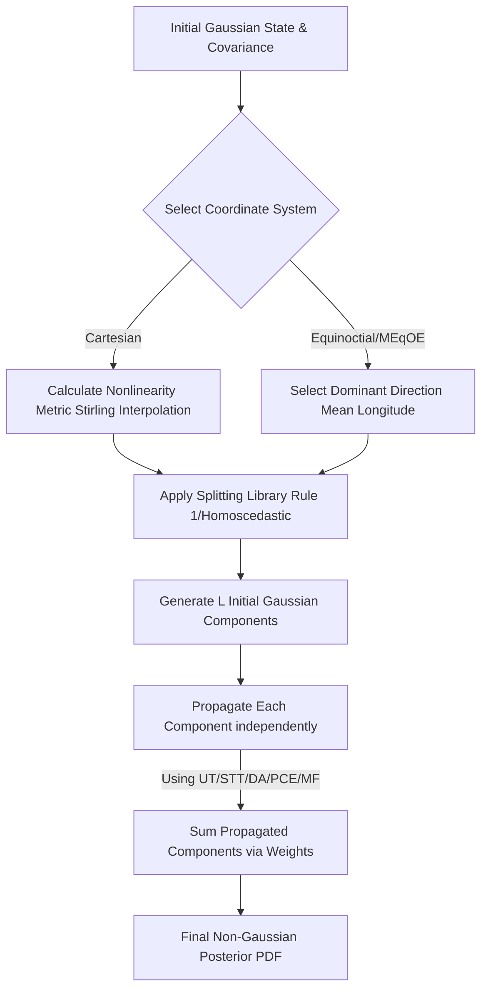

### 4. Hybrid Combinations with Other Methods

The GMM framework is highly versatile and is frequently combined with other OUP methods to balance accuracy and efficiency.

#### 4.1 GMM-STT (State Transition Tensors)
This hybrid uses State Transition Tensors to capture higher-order Taylor series terms of the solution flow.

*   **Methodology:** Instead of solving 42 ODEs per component, STTs reformulate the solution flow as a matrix function valid over all components.

*   **Benefit:** Components are propagated simultaneously with a one-time computation per epoch, making it more efficient than individual propagation for $L > 7$ components.

#### 4.2 GMM-DA (Differential Algebra)
GMM-DA leverages Differential Algebra to automatically compute high-order Taylor expansions of the flow without manual derivation of variational equations.
*   **Methodology:** DA supplies the Taylor expansion of the solution flow up to an arbitrary order $k$. All initial GMEs are evaluated through this single polynomial map.
*   **Benefit:** It is self-adaptive to any regular nonlinear system and significantly reduces computation time compared to MC since adding GMEs only requires efficient polynomial evaluation.

#### 4.3 GMM-PCE (Polynomial Chaos Expansions)
This approach is analogous to **hp-refinement** in Finite Element Methods.
*   **Methodology:** Splitting (h-refinement) reduces the domain of approximation for each component, allowing for lower-order polynomials (p-refinement) to be used effectively.

*   **Benefit:** It reduces the factorial growth of PCE terms in high-dimensional states while maintaining the ability to capture full shapes of non-Gaussian distributions.

#### 4.4 GMM-MF (Multi-Fidelity)
Multi-fidelity propagation uses a low-fidelity (LF) propagator for the bulk of components and a high-fidelity (HF) propagator for a small subset of "important samples".
*   **Methodology:** A correction basis is built from the HF samples to map the LF-propagated GMM components to their approximated HF states.
*   **Benefit:** It achieves improved PDF consistency at a fraction of the HF computation cost.

### 5. Advanced Variations on the GMM Method

#### 5.1 Adaptive GMMs (AEGIS and MDAES)
The **Adaptive Entropy-based Gaussian-mixture Information Synthesis (AEGIS)** method does not rely on a fixed number of components.
*   **Mechanism:** It monitors component nonlinearity by comparing the linear evolution of its differential entropy against a nonlinear estimate (e.g., via UKF).

*   **Trigger:** If the entropy deviation exceeds a threshold, the component is split online to maintain linearity.

*   **Variation:** **MDAES** combines initial multi-directional splitting with AEGIS to prevent correlation buildup in highly deformed distributions.

#### 5.2 Multidirectional GMM (MGMM)
Standard GMMs often split along a single axis. **MGMMs** recursively apply splitting libraries along multiple directions to form a regular grid in probability space.

*   **Nonlinearity Metric:** Directions are ranked using a second-order divided difference (Stirling’s interpolation) to identify where splits provide the most accuracy gain.
$$
\phi = \frac{f(\mathbf{m} + h\sigma \mathbf{a}) + f(\mathbf{m} - h\sigma \mathbf{a}) - 2f(\mathbf{m})}{2h^2}
$$

*   **Term Definitions:** $\mathbf{a}$ is the splitting unit vector and $h = \sqrt{3}$ is the recommended step size.

#### 5.3 Gaussian Mixture Batch Processor (GMBP)
Applied to **Initial Orbit Determination (IOD)**, the GMBP translates a batch of noisy measurements into a GMM-based PDF using Bayes' rule.
*   **Methodology:** It disperses linearization errors across an ensemble of Gaussian components, allowing for accurate reconstruction of "crescent-shaped" posteriors common in cislunar tracking.

### 6. Component Management: Merging and Reduction
To maintain computational tractability, GMMs require mechanisms to combine redundant components.
*   **Runnalls' Algorithm:** Merges components based on minimizing the **Kullback-Leibler (KL) discrimination** measure.
*   **GMRC (Reduction via Clustering):** Uses optimized mixture reduction to find a minimal representation that captures the distribution's modes.
*   **Information Loss:** Merging is a "tricky" process because it can discard accumulated nonlinearities held in the component sigma points. Merging thresholding often leverages the mixture entropy upper bound to find the minimum number of components required to preserve information.

## GMM-STT 

The Gaussian Mixture Model (GMM) framework addresses the fundamental limitation of standard linear uncertainty propagation: the inevitable evolution of initial Gaussian state uncertainties into non-Gaussian probability density functions (PDFs) under nonlinear orbital dynamics. Within this context, the **GMM-STT** approach (Gaussian Mixture Model – State Transition Tensors) represents a highly efficient semi-analytical hybrid method designed to achieve uncertainty consistency while mitigating the computational "curse of dimensionality" associated with traditional GMM propagation.

### 1. Theoretical Foundation of GMM-STT

The GMM-STT method leverages the **Universal Approximation Theorem**, which asserts that any continuous PDF can be represented as a weighted sum of Gaussian distributions, converging uniformly as the number of components $L$ increases.

$$p(\mathbf{x}) = \sum_{i=1}^{L} \alpha_i p_g(\mathbf{x}; \hat{\mathbf{x}}_i, \mathbf{P}_i)$$

**Term Definitions:**
*   $p(\mathbf{x})$: The approximated non-Gaussian PDF.
*   $L$: The number of Gaussian mixture elements (GMEs).
*   $\alpha_i$: The weight of the $i$-th component ($0 \le \alpha_i \le 1$, $\sum \alpha_i = 1$).
*   $p_g(\cdot)$: The individual Gaussian kernel with mean $\hat{\mathbf{x}}_i$ and covariance $\mathbf{P}_i$.

In standard GMM propagation, each component's mean and covariance are evolved independently, often using numerical integration of the variational equations (State Transition Matrix or STM) for each kernel. For a 6D state, this requires solving 42 ordinary differential equations (ODEs) per component, leading to a computational complexity of $O(Lk^2)$, where $k$ is the state dimension. GMM-STT overcomes this by using higher-order Taylor series expansions (the tensors) to map the entire distribution simultaneously.

### 2. Methodology: Simultaneous Propagation via STTs

The core innovation of the GMM-STT approach is regarding Gaussian distributions as a function space to express PDFs in closed form over time. Instead of separate ODE integrations for each mean and covariance, the STT solution flow is reformulated as a matrix function valid over all Gaussian components.

*   **Initial Reference State:** A nominal trajectory $\mathbf{x}^*(t)$ is propagated from an initial reference point.
*   **Tensor Computation:** State Transition Tensors (STTs) of order $m$ are computed along this nominal trajectory. These tensors represent the higher-order partial derivatives of the solution flow with respect to initial conditions.
*   **Component Mapping:** Each GME $(\hat{\mathbf{x}}_{0,i}, \mathbf{P}_{0,i})$ is mapped from the initial epoch $t_0$ to the final epoch $t$ using algebraic polynomial evaluations rather than numerical integration.

#### Mathematical Formulation of STT Mappings
The state deviation $\delta \mathbf{x}_i(t)$ for the $i$-th component is expressed using Einstein summation notation:

$$\delta \hat{x}_{i}^k(t) \approx \sum_{p=1}^{m} \frac{1}{p!} \Phi^k_{j_1...j_p}(t, t_0) \delta \hat{x}_{0,i}^{j_1} ... \delta \hat{x}_{0,i}^{j_p}$$

**Term Definitions:**
*   $\delta \hat{x}_{i}^k(t)$: The $k$-th component of the propagated mean deviation for GME $i$.
*   $\Phi^k_{j_1...j_p}$: The $p$-th order State Transition Tensor.
*   $m$: The expansion order (typically $m=2$ is sufficient for most orbital problems).
*   $\delta \hat{x}_{0,i}^{j}$: The initial deviation of the $i$-th component mean from the nominal trajectory.

The propagated covariance $\mathbf{P}_i(t)$ is similarly mapped using the tensors, incorporating higher-order moments of the distribution (up to the $2m$-th order) to maintain statistical consistency.

### 3. Algorithm: GMM-STT Workflow

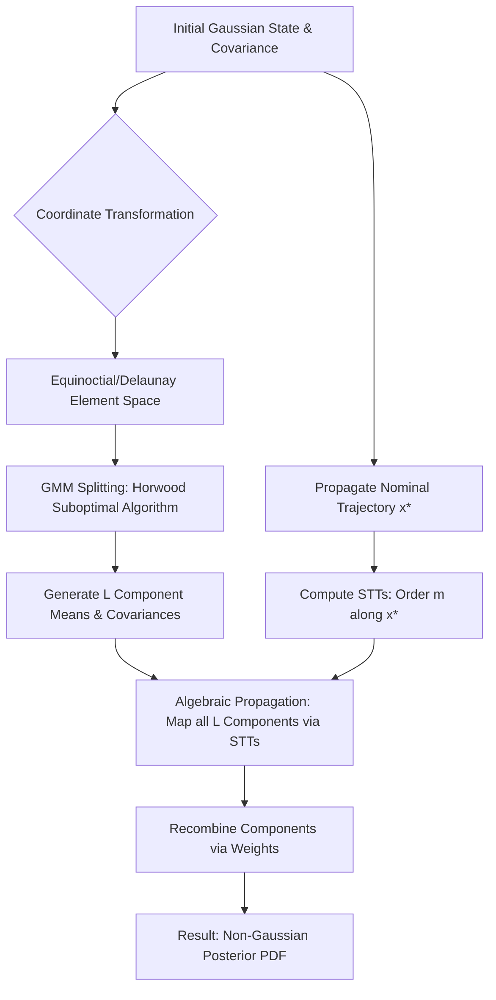

### 4. Variations and Hybrid Combinations

The literature expands the basic GMM-STT framework into several specialized configurations to handle specific dynamical challenges.

*   **GMM-STT-SDS (Simplified Dynamic Systems):** Combines GMMs and STTs with a Simplified Dynamic System (SDS) derived via Deprit-Lie averaging. This method propagates mean elements (which evolve nearly linearly) and applies analytical short-period variations at the beginning and end. It provides extreme speed for near-Earth conjunction analysis, accounting for $J_2$ and Solar Radiation Pressure (SRP).
*   **Transitive GMM-STT:** Developed for relative motion involving abrupt state jumps (e.g., impulsive maneuvers). It derives transitive tensors that connect segmented trajectories, allowing for the direct propagation of uncertainties through orbital maneuvers.
*   **GMM-DA (Differential Algebra):** A generic alternative where the high-order Taylor polynomials are computed automatically by the DA framework without manual derivation of variational equations. Like GMM-STT, it evaluates all GMEs through a single polynomial map, making the addition of components computationally "cheap".
*   **GMM-PCE (Polynomial Chaos Expansions):** Analogous to **hp-refinement** in Finite Element Methods. GMM splitting (h-refinement) reduces the domain of each component, allowing for lower-order PCEs (p-refinement) to capture the distribution shape, factorially reducing the required number of terms compared to global PCE.

### 5. Performance and Efficiency Analysis

The GMM-STT method offers a clear computational advantage when the number of mixture components is high.

*   **Computational Scaling:** While individual propagation scales as $O(Lk^2)$, GMM-STT scales as $O(k^{m+1})$, where the cost is independent of $L$ after the initial tensor computation.
*   **Efficiency Threshold:** For a second-order expansion ($m=2$) in position/velocity space ($k=6$), STT propagation requires solving 258 ODE components. This becomes more efficient than individual kernel propagation (42 ODEs per kernel) once the GMM exceeds **seven components** ($L > 7$).
*   **Accuracy:** In Conjunction Assessment (CA) studies, GMM-STT results converge to Monte Carlo truth within 95% confidence intervals using approximately 100 components. It produces the most accurate results among Gaussian-based methods with only a factor of $\sim 4$ increase in runtime over a single linear propagation.
*   **Limitation:** Accuracy is dependent on the validity of the Taylor series expansion. In highly nonlinear regimes (e.g., cislunar space), the "region of convergence" for the tensors may be limited, necessitating the use of curvilinear coordinates or more components to ensure each kernel remains within the linear/quadratic flow of the tensors.

## GMM-Moment Method

In the hierarchy of orbital uncertainty propagation (OUP) methods, the **GMM-Moment Method** represents a semi-analytical framework designed to mitigate the computational "curse of dimensionality" while maintaining statistical consistency for non-Gaussian probability density functions (PDFs). This method decomposes a large, non-Gaussian uncertainty volume into a weighted sum of Gaussian mixture elements (GMEs) and evolves their statistical moments—specifically mean and covariance—through the nonlinear dynamics using either first-order or second-order Taylor series expansions.

### 1. Theoretical Foundation and PDF Representation

The GMM-Moment method operates on the principle that any continuous PDF can be represented as a sum of Gaussian components, which, if "small" enough, will remain approximately Gaussian for a longer duration under nonlinear flow.

The total PDF is approximated as:
$$p(\mathbf{x}) \approx \sum_{i=1}^{L} \alpha_i \mathcal{N}(\mathbf{x}; \boldsymbol{\mu}_i, \mathbf{C}_i)$$

**Term Definitions:**
*   $p(\mathbf{x})$: The approximated non-Gaussian PDF.
*   $L$: The total number of Gaussian components.
*   $\alpha_i$: The scalar weight of the $i$-th component, where $\sum \alpha_i = 1$.
*   $\boldsymbol{\mu}_i$: The mean state vector of the $i$-th Gaussian component.
*   $\mathbf{C}_i$: The covariance matrix of the $i$-th Gaussian component.

### 2. Methodology of GMM-Moment Propagation

The methodology follows a three-stage pipeline: **Splitting**, **Component-wise Propagation**, and **Recombination**.

*   **Initial Splitting (Horwood Suboptimal Algorithm):** The initial Gaussian distribution (typically Cartesian or Equinoctial) is decomposed into $L$ components. The algorithm minimizes the $L_2$ norm of the error between the original Gaussian and the new mixture, often refining the distribution along the direction of maximum nonlinearity.
*   **Propagation (Method of Moments):** Each component is propagated independently. The "Moment" aspect of the name refers to the use of Taylor series expansions of the dynamics to update the component statistics.
    *   **M1 (First-Order):** Equivalent to a localized Extended Kalman Filter (EKF) update for each mean and covariance.
    *   **M2 (Second-Order):** Incorporates the Hessian (second-order variational derivatives) to capture the effects of nonlinearity on the mean and covariance growth.
*   **Recombination:** The final non-Gaussian PDF is reconstructed at the target epoch as the weighted sum of the propagated components.

### 3. Mathematical Formulations for Moment Updates

For an initial state component $(\boldsymbol{\mu}_{0,i}, \mathbf{C}_{0,i})$, the terminal moments $(\boldsymbol{\mu}_{f,i}, \mathbf{C}_{f,i})$ at time $t_f$ are computed through the solution flow $\phi$:

#### First-Order (M1) Updates:
$$\boldsymbol{\mu}_{f,i} = \phi(t_f; \boldsymbol{\mu}_{0,i})$$
$$\mathbf{C}_{f,i} = \mathbf{J}_i \mathbf{C}_{0,i} \mathbf{J}_i^T$$

**Term Definitions:**
*   $\phi(\cdot)$: The nonlinear solution flow (integration of the ODEs).
*   $\mathbf{J}_i$: The Jacobian matrix $\frac{\partial \phi}{\partial \mathbf{x}_0}$ evaluated at the component mean $\boldsymbol{\mu}_{0,i}$.

#### Second-Order (M2) Updates:
$$\mu_{f,i}^k \approx \phi^k(\boldsymbol{\mu}_{0,i}) + \frac{1}{2} \text{tr}\left( \mathbf{H}_i^k \mathbf{C}_{0,i} \right)$$
$$\mathbf{C}_{f,i} \approx \mathbf{J}_i \mathbf{C}_{0,i} \mathbf{J}_i^T + \frac{1}{2} \sum_{a,b,c,d} H_{i, ab}^k H_{i, cd}^k (C_{0,i})_{ac} (C_{0,i})_{bd}$$

**Term Definitions:**
*   $\mu_{f,i}^k$: The $k$-th element of the final mean vector for component $i$.
*   $\mathbf{H}_i^k$: The Hessian matrix $\frac{\partial^2 \phi^k}{\partial \mathbf{x}_0^2}$ for the $k$-th state component.
*   $\text{tr}(\cdot)$: The trace operator.

### 4. Algorithm Flowchart: GMM-Moment Workflow

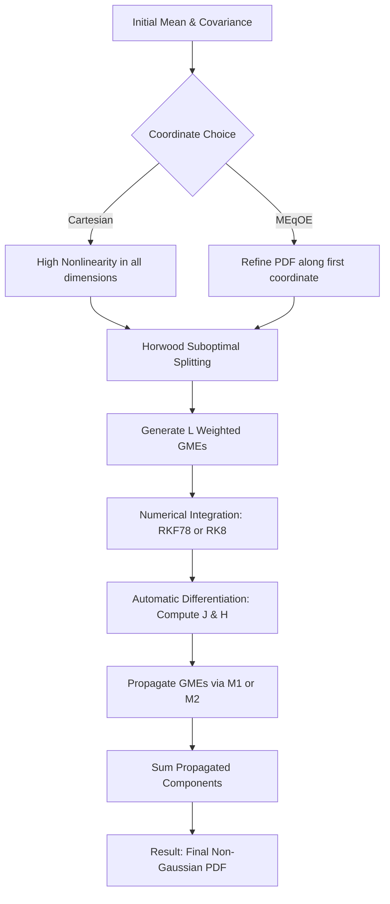

### 5. Variations on the GMM-Moment Method

The sources highlight several variations that adapt the GMM-Moment framework to different dynamical regimes and computational constraints.

*   **Explicit vs. Implicit Moment Method:**
    *   **Explicit:** Used when an analytical mapping function $\mathbf{y} = f(\mathbf{x})$ is available. It utilizes the Taylor expansion of the function directly.
    *   **Implicit:** Used for orbital dynamics where the mapping is the result of numerical integration of ODEs. It requires higher-order integrators (like RK8) and automatic differentiation to obtain the necessary derivatives of the flow.
*   **Coordinate Frame Variations (MEqOE vs. ECI):**
    *   Splitting in Cartesian (ECI) space suffers from the curse of dimensionality because nonlinearity acts on all six dimensions, requiring many directions for refinement.
    *   Utilizing **Modified Equinoctial Orbital Elements (MEqOE)** allows for the growth of non-Gaussianity to be concentrated in a single dimension (mean longitude), enabling efficient 1D splitting that provides superior results for long propagations.
*   **GMM-STT Hybrid:**
    *   A significant variation where, instead of propagating components independently, the solution flow is reformulated as a matrix function valid over all components. This reduces the number of required ODE integrations from $O(Lk^2)$ to $O(k^{m+1})$, becoming more efficient than individual kernel propagation once the mixture exceeds seven components ($L > 7$).
*   **GMM-DA (Differential Algebra):**
    *   Integrates GMM with Differential Algebra to compute the Taylor expansion of the flow to an arbitrary order $k$ automatically. This allows all GMEs to be evaluated through a single polynomial map, making the addition of components computationally "cheap" after the initial polynomial is computed.
*   **GMM-PCE (Polynomial Chaos Expansions):**
    *   Analogous to **hp-refinement** in Finite Element Methods. GMM splitting (h-refinement) reduces the domain of each component, allowing for lower-order PCEs (p-refinement) to capture the distribution shape efficiently in high-dimensional states.

### 6. Summary of Performance and Efficiency

The GMM-Moment method is proven to be significantly faster than Monte Carlo (MC) simulations while capturing non-Gaussian features (skewness and kurtosis) that standard filters ignore. In test scenarios, a second-order GMM-Moment method with 100 components captured mean and covariance statistics with sufficient accuracy in seconds, whereas MC required thousands of seconds for similar convergence. However, its effectiveness is highly dependent on the splitting direction and the validity of the Taylor series expansion for each kernel.


## GMM-Multi-Fidelity (GMM-MF) Framework

The **Gaussian Mixture Model – Multi-Fidelity (GMM-MF)** method represents a hybrid approach to orbital uncertainty propagation (OUP) that integrates the non-parametric flexibility of Gaussian mixtures with the computational efficiency of multi-fidelity surrogate modeling. Within the broader GMM framework, which approximates complex non-Gaussian probability density functions (PDFs) as a weighted sum of Gaussian "kernels," GMM-MF specifically addresses the bottleneck of propagating large numbers of components through high-fidelity (HF) dynamical models.

### 1. Theoretical Foundation and PDF Representation

The GMM-MF method is predicated on the **Universal Approximation Theorem**, which asserts that any continuous PDF can be represented as a uniformly converging sum of Gaussian mixture elements (GMEs).

$$p(\mathbf{x}) = \sum_{j=1}^{J} w_j p_g(\mathbf{x}; \mathbf{m}_j, \mathbf{P}_j)$$

**Term Definitions:**
*   $p(\mathbf{x})$: The approximated non-Gaussian PDF of the state vector $\mathbf{x}$.
*   $J$: The total number of GMEs.
*   $w_j$: The scalar weight of the $j$-th component, where $w_j \ge 0$ and $\sum w_j = 1$.
*   $p_g(\cdot)$: The multivariate Gaussian PDF.
*   $\mathbf{m}_j$: The mean state vector of the $j$-th GME.
*   $\mathbf{P}_j$: The covariance matrix of the $j$-th GME.

Standard GMM methods typically propagate each component using the **Unscented Transform (UT)**, which requires $2n + 1$ sigma point evaluations per component (where $n$ is the state dimension). For $J$ components, this results in $J(2n + 1)$ function evaluations, which becomes computationally prohibitive when using HF force models.

### 2. GMM-MF Methodology

The GMM-MF method overcomes this cost by using a **Multi-Fidelity surrogate** based on stochastic collocation to propagate the sigma points of the entire mixture.

*   **Initial Splitting:** The initial Gaussian distribution (e.g., from orbit determination) is split into $J$ components using pre-computed libraries (e.g., Horwood's suboptimal algorithm or Vittaldev's 39-element library).
*   **Ensemble Generation:** The $J(2n + 1)$ sigma points from all mixture components are combined into a single ensemble of sample points $\Xi$.
*   **Low-Fidelity (LF) Propagation:** The entire ensemble is propagated using a computationally cheap LF model (e.g., SGP4 or 2-body Keplerian dynamics).
*   **Important Sample Selection:** A small subset $r$ of "important samples" is identified from the LF ensemble using a **pivoted Cholesky decomposition** of the Gramian matrix $\mathbf{G}^L$.
*   **High-Fidelity (HF) Correction:** Only the $r$ important samples are propagated through the HF model. A data-derived correction is then applied to the remaining LF samples to approximate their HF states.
*   **Recombination:** The corrected sigma points are used to reconstruct the mean and covariance for each GME, and the final non-Gaussian PDF is formed via the weighted sum.

#### Mathematical Formulation of the MF Correction
The HF state $\hat{\mathbf{x}}^H(\xi)$ for a sample $\xi$ is estimated using an expansion of the HF important samples $\mathbf{x}^H(\xi_\ell)$:

$$\hat{\mathbf{x}}^H(\xi) \approx \sum_{\ell=1}^{r} c_\ell(\xi) \mathbf{x}^H(\xi_\ell)$$

**Term Definitions:**
*   $\hat{\mathbf{x}}^H(\xi)$: The approximated HF state vector.
*   $r$: The rank of the surrogate (number of important samples).
*   $c_\ell(\xi)$: Coefficients derived from the LF samples.
*   $\mathbf{x}^H(\xi_\ell)$: The state of the $\ell$-th important sample propagated via HF dynamics.

### 3. Algorithm: GMM-MF Uncertainty Propagation

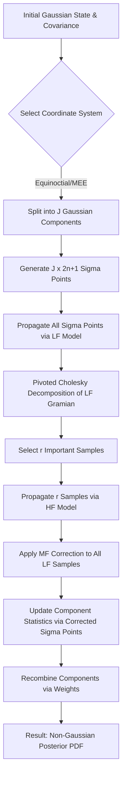

### 4. Variations and Hybrid Comparisons

The GMM-MF method is part of a larger ecosystem of GMM-based OUP techniques, each offering different trade-offs in accuracy and complexity.

*   **GMM-STT (State Transition Tensors):** A semi-analytical variation where components are propagated simultaneously through a single high-order Taylor series expansion (the STT). Unlike GMM-MF, which requires a set of HF sample evaluations, GMM-STT is independent of the number of components $J$ once the tensor is computed.
*   **GMM-PCE (Polynomial Chaos Expansions):** This represents an **hp-refinement** method. GMM splitting (h-refinement) reduces the domain of each component, allowing for lower-order polynomials (p-refinement) to be used effectively, which reduces the factorial growth of PCE terms in high dimensions.
*   **GMM-DA (Differential Algebra):** Similar to GMM-STT, GMM-DA computes a high-order Taylor expansion of the flow automatically. All GMEs are evaluated through this single polynomial map, making the addition of components computationally "cheap" after the initial polynomial is computed.
*   **AEGIS (Adaptive Entropy-based GMM):** Unlike GMM-MF, which uses a fixed number of components, AEGIS monitors nonlinearity via differential entropy and splits components online. Studies show AEGIS is often more computationally expensive than GMM-MF because it relies entirely on HF evaluations for its UKF-based component updates.

### 5. Performance and Efficiency Discussion

Experimental results demonstrate that GMM-MF provides a significant advantage for long-term propagation and complex conjunction analysis:

*   **Computational Speed-up:** GMM-MF can decrease computation time by approximately **80%** compared to standard GMM-UT methods, with only a marginal change (less than 20%) in accuracy metrics like the $NL_2$ distance.
*   **Conjunction Assessment (CA):** In CA scenarios, GMM-MF can produce collision probabilities identical to Monte Carlo (MC) baselines with speed gains of up to **four orders of magnitude**.
*   **Accuracy:** The method excels at capturing the non-Gaussian "crescent" shapes that arise in orbital dynamics, which standard linear methods and the UKF fail to describe. However, its accuracy is highly dependent on the **LF tolerance ($\epsilon_{lf}$)**; a lower tolerance increases the number of important samples $r$, improving fidelity at a slight cost to efficiency.


## GMM-DA 

The combination of **Differential Algebra (DA)** and **Gaussian Mixture Models (GMM)**, often termed the **DA-GMM** framework, addresses a critical gap in orbital uncertainty propagation: the need to capture highly non-Gaussian probability density functions (PDFs) without the prohibitive computational cost of Monte Carlo (MC) simulations or the manual complexity of deriving high-order State Transition Tensors (STT). 

In this framework, GMMs provide the non-parametric flexibility to approximate arbitrary PDFs, while DA serves as a high-order numerical engine to propagate each Gaussian mixture element (GME) through nonlinear dynamics with extreme precision.

### 1. Mathematical Representation and Theoretical Premise

The GMM-DA method is predicated on the **Universal Approximation Theorem**, which asserts that a weighted sum of Gaussian kernels can approximate any continuous PDF to an arbitrary level of accuracy as the number of components $N$ increases.

#### 1.1 Gaussian Mixture Model (GMM)
The total PDF of the state vector $\mathbf{x}$ is represented as:
$$p(\mathbf{x}) = \sum_{i=1}^{N} \omega_i p_g(\mathbf{x}; \boldsymbol{\mu}_i, \mathbf{P}_i)$$

**Term Definitions:**
*   $p(\mathbf{x})$: The approximated non-Gaussian posterior PDF.
*   $N$: The total number of Gaussian mixture elements (GMEs).
*   $\omega_i$: The scalar weight of the $i$-th component ($0 < \omega_i \le 1$, $\sum \omega_i = 1$).
*   $p_g(\cdot)$: The individual Gaussian PDF.
*   $\boldsymbol{\mu}_i, \mathbf{P}_i$: The mean state vector and covariance matrix of the $i$-th GME.

#### 1.2 Differential Algebra (DA) Expansion
DA replaces classical real algebra with an algebra of Taylor polynomials. A nonlinear function $\mathbf{y} = f(\mathbf{x})$ is expanded about a reference $\mathbf{\bar{x}}$:
$$[\mathbf{y}] = f([\mathbf{x}]) = \mathcal{T}^k_{\mathbf{y}}(\delta\mathbf{x}) = \sum_{|\mathbf{p}| \le k} \mathbf{c}_{\mathbf{p}} \cdot \delta\mathbf{x}_1^{p_1} \dots \delta\mathbf{x}_n^{p_n}$$

**Term Definitions:**
*   $\mathcal{T}^k_{\mathbf{y}}$: The $k$-th order Taylor polynomial of the solution flow.
*   $\delta\mathbf{x}$: The initial state deviation from the reference trajectory.
*   $\mathbf{c}_{\mathbf{p}}$: Taylor coefficients computed automatically via the DA framework.
*   $k$: The arbitrary order of the expansion.

### 2. GMM-DA Methodology

The core innovation of GMM-DA is that the high-order Taylor expansion of the solution flow is computed **only once**. All individual GMEs are then evaluated through this single polynomial map, turning the propagation of thousands of components into a series of efficient algebraic evaluations.

#### 2.1 Initialization and DA Mapping
*   **DA Setup:** The initial reference point $\mathbf{\bar{x}}(t_0)$ is initialized as a DA variable. The ODEs are integrated using DA-based operations to supply the Taylor expansion $\mathcal{T}^k_{\mathbf{x}(t_f)}$ of the final state with respect to the initial deviations.
*   **Initial Splitting:** The initial Gaussian uncertainty is split into $N$ GMEs. This is typically done using a sampling algorithm or a pre-computed library (e.g., Horwood's suboptimal algorithm) to ensure the mixture matches the original distribution.

#### 2.2 Component Propagation via Expectation
Each GME $(\boldsymbol{\mu}_i, \mathbf{P}_i)$ is shifted into the DA map. The final mean and covariance of each GME are extracted using the expectation operator on the polynomial:
$$\boldsymbol{\mu}_i(t_f) = E\{[\mathbf{x}(t_f)]\}$$
$$\mathbf{P}_i(t_f) = E\{([\mathbf{x}(t_f)] - \boldsymbol{\mu}_i(t_f))([\mathbf{x}(t_f)] - \boldsymbol{\mu}_i(t_f))^T\}$$

This reduction to Isserlis’ formula allows the calculation of high-order statistics directly from the monomial expectations of the Gaussian distribution.

### 3. Algorithm: GMM-DA Uncertainty Propagation

```mermaid
graph TD
    A[Initial State Mean & Covariance] --> B[Initialize DA Variable around Reference State]
    B --> C[Compute high-order Taylor Map T^k via DA-ODE integration]
    A --> D[Split Initial Gaussian into N GMEs]
    D --> E[For each GME: Shift GME mean into Taylor Map]
    C --> E
    E --> F[Evaluate Monomial Expectations via Isserlis' Formula]
    F --> G[Extract Propagated Mean & Covariance for each GME]
    G --> H[Recombine GMEs via Weights]
    H --> I[Final Non-Gaussian Posterior PDF]
```

### 4. Variations and Comparative Advantages

The sources highlight GMM-DA as part of a hierarchy of hybrid OUP methods, noting several distinct variations and advantages over its peers.

*   **Versus GMM-STT:** While both methods use Taylor expansions, GMM-DA is **self-adaptive**. It automatically generates the required high-order partial derivatives through the DA software environment, whereas GMM-STT requires the manual derivation and integration of high-order variational equations for every new dynamical model.
*   **Splitting Scales ($s$):** A key variation in implementation is the splitting scale. 
    *   **High $s$ (Small Kernels):** Reduces truncation errors of individual GMEs but may result in an uneven/vibrating PDF if the sampling is sparse.
    *   **Low $s$ (Large Kernels):** Yields a smoother PDF but increases the truncation error during the propagation of each element.
*   **Numerical Versatility:** The framework can handle both analytical maps (e.g., Keplerian motion) and numerical integration of complex ODEs (e.g., $J_2$ perturbed motion or nonlinear relative motion) without changing the underlying algorithm.

### 5. Discussion on Efficiency and Accuracy

*   **Computational Scaling:** The bulk of the computation is spent on the initial calculation of the high-order state transition polynomial. Once this map exists, increasing the number of GMEs (e.g., from 1,000 to 5,000) only adds a negligible amount of time required for polynomial evaluation.
*   **Precision:** Increasing the DA expansion order (e.g., from 2nd to 4th order) allows the GMM-DA result to converge toward MC truth. For $J_2$ perturbed orbits, GMM-DA effectively captures the "banana-shaped" or "crescent-shaped" deformations that a single mean/covariance filter would ignore.
*   **Limitations:** The accuracy of the Taylor polynomial degrades at the tails of the distribution if the kernels are too far from the original reference point. However, because the probability density in these tail regions is typically low, the impact on overall PDF accuracy is often minimal.


## GMM: Initial Gaussian Mixture Splitting

The splitting of an initial Gaussian probability density function (PDF) into a Gaussian Mixture Model (GMM) is a critical preprocessing step in nonlinear orbital uncertainty propagation (OUP). The objective is to decompose a large uncertainty volume, which would otherwise violate the linearity assumptions of standard filters, into a weighted sum of smaller Gaussian "kernels" or elements that reside within the linear region of the dynamical solution flow for a longer duration.

### 1. Mathematical Representation of the Split
A continuous PDF $p(\mathbf{x})$ is approximated by a finite sum of $L$ weighted Gaussian components:
$$p(\mathbf{x}) \approx \sum_{i=1}^{L} \alpha_i p_g(\mathbf{x}; \hat{\mathbf{x}}_i, \mathbf{P}_i)$$

**Term Definitions:**
*   $\alpha_i$: Scalar weight of the $i$-th component ($0 \le \alpha_i \le 1$, $\sum \alpha_i = 1$).
*   $\hat{\mathbf{x}}_i$: Mean state vector of the $i$-th Gaussian component.
*   $\mathbf{P}_i$: Covariance matrix of the $i$-th Gaussian component.
*   $p_g(\cdot)$: The multivariate Gaussian PDF.

### 2. Univariate Splitting Library Methodology
Most splitting methodologies begin by defining a **univariate splitting library**, which is a GMM that approximates a 1D standard normal distribution $\mathcal{N}(0, 1)$.

*   **Optimization Criterion:** Libraries are typically generated by solving a constrained nonlinear optimization problem to minimize a distance metric between the true Gaussian and the mixture. Common metrics include the $L_2$ distance, the Kullback-Leibler Divergence (KLD), or the Beta divergence.
*   **Homoscedasticity:** To reduce the parameter space, most libraries assume homoscedastic splitting, where all $L$ components share the same variance $\sigma^2$.
*   **Splitting Rules:** The component variance is often set as a function of the number of elements. Vittaldev & Russell defined "Rule 1" as $\sigma^2 = 1/L$.
*   **Library Size:** Libraries have been archived for various sizes, ranging from 3 or 5 elements up to 39 elements.

### 3. Multivariate Directional Splitting
To apply a 1D library to an $n$-dimensional state, a **splitting direction** $\mathbf{a}$ must be selected. The multivariate means and covariances are then computed based on this direction.

#### 3.1 Mathematical Mapping to Multivariate Space
Given an initial mean $\mathbf{m}$ and covariance $\mathbf{P}$ with square-root factor $\mathbf{S}$ (where $\mathbf{P} = \mathbf{SS}^T$), the $i$-th component parameters are:
$$\hat{\mathbf{x}}_i = \mathbf{m} + \mu_i \mathbf{S} \hat{\mathbf{a}}^*$$
$$\mathbf{P}_i = \mathbf{S} \left( \mathbf{I} + (\sigma_i^2 - 1) \hat{\mathbf{a}}^* (\hat{\mathbf{a}}^*)^T \right) \mathbf{S}^T$$

**Term Definitions:**
*   $\mu_i, \sigma_i$: Mean and standard deviation from the 1D library.
*   $\hat{\mathbf{a}}^*$: The unit vector direction expressed in the square-root frame, $\hat{\mathbf{a}}^* = \frac{\mathbf{S}^{-1}\mathbf{a}}{||\mathbf{S}^{-1}\mathbf{a}||}$.

#### 3.2 Selection of Splitting Direction
Accuracy is highly sensitive to the chosen direction. Common selection methodologies include:
*   **Spectral Directions:** Splitting along the eigenvector associated with the largest eigenvalue of the covariance matrix (direction of maximum uncertainty).
*   **Nonlinearity Metrics:** Ranking directions using a second-order divided difference (Stirling's interpolation) to identify where nonlinear effects are most pronounced:
$$\phi = \frac{f(\mathbf{m} + h\sigma \mathbf{\hat{a}}) + f(\mathbf{m} - h\sigma \mathbf{\hat{a}}) - 2f(\mathbf{m})}{2h^2}$$
*   **Coordinate-Based:** In Equinoctial elements, nonlinearity is often restricted to a single dimension (mean longitude or anomaly), allowing for an efficient 1D split that avoids the curse of dimensionality.

### 4. Algorithm Flowchart: Initial GMM Splitting

```mermaid
graph TD
    A[Initial State Mean & Covariance] --> B{Choose Coordinate System}
    B -- Cartesian --> C[Calculate Nonlinearity Metric Stirling Interpolation]
    B -- Equinoctial/MEE --> D[Focus on Radial/Mean Longitude Component]
    C --> E[Rank Directions by Sensitivity]
    D --> E
    E --> F[Select Splitting Library Size & Rule]
    F --> G[Perform Multivariate Mapping along Selected Direction]
    G --> H[Final Initial GMM Components]
```

### 5. Variations in Splitting Methodology

#### 5.1 Static vs. Adaptive Splitting
*   **Static Splitting:** The number of components is fixed at the initial epoch. This is common in the **Multidirectional GMM (MGMM)** approach, where a regular grid is formed by recursively applying the splitting library along multiple nonlinear directions.
*   **Adaptive Splitting (AEGIS/AGM):** Splits are triggered online when a nonlinearity threshold is reached. The **Adaptive Entropy-based GMM (AEGIS)** monitors the deviation between linear and nonlinear differential entropy estimates to trigger splits.

#### 5.2 Horwood Suboptimal Algorithm
This variation minimizes the $L_2$ norm of the error specifically for multivariate Gaussians. It adopts a state representation aligned with the dynamics (e.g., Modified Equinoctial Elements) to refine the PDF along only one coordinate, thereby reducing computational costs.

#### 5.3 Variance-Preserving Splitting
While homoscedastic libraries often discard skewness, variance-preserving libraries are optimized under the constraint of matching the first two moments of the original distribution exactly. This ensures that the global mean and covariance of the mixture are identical to the original Gaussian before any nonlinear propagation occurs.

#### 5.4 Multidirectional GMM (MGMM)
Instead of a single axis, MGMM applies splitting recursively as a tensor product across multiple influential spectral directions. To maintain tractability, a **minimum weight threshold ($\epsilon$)** can be used to prune components in the tails of the distribution that contribute little to the final accuracy.