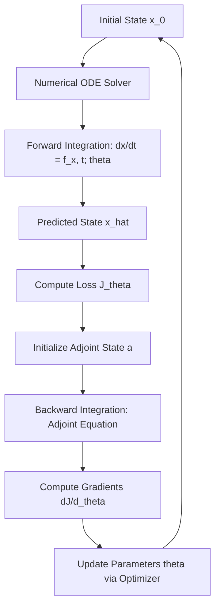

Neural Ordinary Differential Equations (Neural ODEs) represent a significant departure from discrete-layered architectures by interpreting the evolution of a system's state as a continuous-time process governed by a neural network-parameterized vector field. This framework bridges the gap between traditional dynamical systems theory and deep learning, enabling the construction of "infinitely deep" models that respect continuous physics.

### I. Mathematical Foundation and Formation

Neural ODEs are formed by defining the time derivative of a system’s state as a parametric function represented by a neural network.

*   **Governing Vector Field**:
    The system is defined by an autonomous ODE:
    $$
    \frac{d\mathbf{x}}{dt} = \mathbf{f}(\mathbf{x}, t; \theta)
    $$

    *   $\mathbf{x} \in \mathbb{R}^n$: The state 
    vector of the system.
    
    *   $t$: The continuous time variable.
    
    *   $\theta$: The set of trainable weights and biases characterizing the neural network.
    
    *   $\mathbf{f}$: The vector field (right-hand side of the ODE) parameterized by the network.

*   **State Prediction through Integration**:
    The state at a future time $t_1$ is obtained by integrating the learned vector field from an initial condition $\mathbf{x}(t_0)$:
    $$
    \hat{\mathbf{y}}_i = \mathbf{x}(t_0) + \int_{t_0}^{t_1} \mathbf{f}(\mathbf{x}(t), t; \theta) dt
    $$
    In practice, this integration is performed using numerical solvers such as the Dormand-Prince 4(5) algorithm or high-order Taylor methods.

### II. Training Methodology: The Adjoint Sensitivity Method

The primary methodology for training Neural ODEs involves computing gradients of a loss function $J$ with respect to $\theta$ without storing intermediate activations of the solver, which circumvents memory bottlenecks.

1.  **Forward Pass**: The system is integrated forward from $t_0$ to $t_1$ to compute the predicted state and the associated loss.

2.  **Backward Pass (Adjoint Method)**: To compute sensitivities, an augmented system is integrated backward in time:
    $$
    \frac{d\mathbf{a}}{dt} = -\mathbf{a}^T \frac{\partial \mathbf{f}}{\partial \mathbf{x}}
    $$
    
    *   $\mathbf{a} = \frac{\partial L}{\partial \mathbf{x}}$: The "adjoint" state, representing the gradient of the loss with respect to the hidden state.

3.  **Parameter Update**: Gradients with respect to $\theta$ are calculated simultaneously during the backward integration, allowing updates via stochastic gradient descent or AdamW.

**Flowchart of Neural ODE Training Process:**

### III. Motivation Behind Data-Driven Dynamics Discovery

The drive toward building dynamical models using machine learning is motivated by critical challenges in science and engineering:

*   **Universal Approximation**: Theoretically, any ordinary differential equation can be represented by a neural model, allowing researchers to capture highly nonlinear and chaotic dynamics that traditional models may miss.

*   **Handling Unmodeled Effects**: In complex physical systems, such as turbulent shear flows or comet landing trajectories, first-principles derivations often fail to account for hidden dynamics. Data-driven methods can "discover" these governing laws directly from observations.

*   **Irregular Sampling**: Continuous-time models offer greater versatility than discrete models because they can naturally handle training data with varying temporal spacing.

*   **Memory Efficiency**: By using the adjoint sensitivity method, researchers can train extremely deep representations (equivalent to infinite layers) with constant memory cost, which is crucial for high-dimensional scientific computing.

### IV. Variations on the Neural ODE Framework

Beyond the basic formulation, several specialized variations have emerged to address specific modeling needs:

*   **Hamiltonian Neural Networks (HNNs)**: Motivated by the need to respect exact conservation laws, HNNs learn a scalar Hamiltonian function $\mathcal{H}(\mathbf{q}, \mathbf{p})$ representing total energy. The dynamics are derived using a "symplectic gradient":
    $$
    \frac{d\mathbf{q}}{dt} = \frac{\partial \mathcal{H}}{\partial \mathbf{p}}, \quad \frac{d\mathbf{p}}{dt} = -\frac{\partial \mathcal{H}}{\partial \mathbf{q}}
    $$

    *   $\mathbf{q}$: Position coordinates.
    
    *   $\mathbf{p}$: Momentum coordinates.
    This ensures that the model learns to exactly conserve quantities like energy, preventing numerical drift in long-term simulations.

*   **Projected Koopman Operators**: Recent research highlights that Extended Dynamic Mode Decomposition with Dictionary Learning (EDMD-DL) is equivalent to a Neural ODE when a state-space projection step is included at each timestep. This projection converts linear dynamics in an observable space back into the nonlinear state space.

*   **High-Order Flow Expansions (ETTs)**: To move away from "black-box" systems, researchers introduce **Event Transition Tensors (ETTs)** to provide a rigorous mathematical description of Neural ODE dynamics on event manifolds.
    
    *   **Methodology**: This involves computing high-order Taylor expansions of the flow $\Phi(t; \mathbf{x}_0, \theta)$ to characterize sensitivities and propagate uncertainties without relying on expensive Monte Carlo simulations.
    
    *   **Formula**:
        $$
        \Phi_j(t; \mathbf{x}_0, \theta) \approx \mathcal{P}^k_{\Phi_j}(\delta\mathbf{x}_0, \delta\theta)
        $$

        *   $\mathcal{P}^k$: A multivariate Taylor polynomial of order $k$.
        
        *   $\delta\mathbf{x}_0$: Perturbations in initial conditions.
    This approach is used for system certification and explainability in safety-critical applications like autonomous landing and drone racing.
