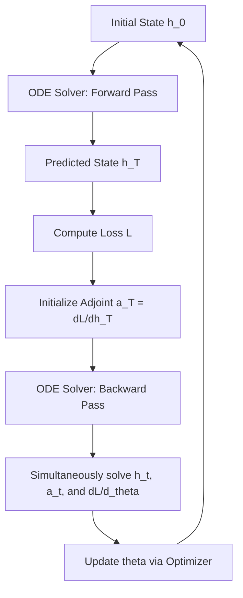

Neural Ordinary Differential Equations (Neural ODEs) represent a paradigm shift in deep learning where discrete sequences of hidden layers are replaced by a continuous-depth vector field parameterized by a neural network. This framework interprets the transformation of a system's state as the solution to an initial value problem (IVP), bridging the gap between classical dynamical systems and modern machine learning.

### I. Mathematical Foundation and Formation

Neural ODEs are formed by defining the time derivative of a hidden state $\mathbf{h}(t)$ as a parametric function $f$ represented by a neural network.

*   **Governing Equation**:
    $$\frac{d\mathbf{h}(t)}{dt} = f(\mathbf{h}(t), t, \theta)$$
*   $\mathbf{h}(t) \in \mathbb{R}^D$: The state or hidden representation at time $t$.
    *   $t$: The continuous depth or time variable.
    *   $\theta$: The trainable weights and biases of the neural network.
    *   $f$: The vector field parameterized by the network that defines the dynamics.

*   **State Evolution through Integration**:
    To compute the output at "depth" or time $T$, the system integrates the learned dynamics from an initial condition $\mathbf{h}(0)$:
    $$\mathbf{h}(T) = \mathbf{h}(0) + \int_{0}^{T} f(\mathbf{h}(t), t, \theta) \, dt$$
    In practice, this is evaluated using black-box numerical ODE solvers (e.g., Dormand-Prince or implicit Adams methods), which adapt their evaluation strategy based on a user-specified error tolerance.

### II. Training Methodology: The Adjoint Sensitivity Method

The critical challenge in training Neural ODEs is computing gradients of a loss function $L$ with respect to the network parameters $\theta$ through an ODE solver. To avoid the high memory cost of backpropagating through the solver's internal operations, researchers utilize the **Adjoint Sensitivity Method**.

1.  **Adjoint State Definition**: The "adjoint" $\mathbf{a}(t) = \frac{\partial L}{\partial \mathbf{h}(t)}$ represents how the gradient of the loss depends on the hidden state at each instant.
2.  **Adjoint Dynamics**: The adjoint state follows its own differential equation, solved backward in time:
    $$\frac{d\mathbf{a}(t)}{dt} = -\mathbf{a}(t)^T \frac{\partial f(\mathbf{h}(t), t, \theta)}{\partial \mathbf{h}}$$
3.  **Parameter Gradient Computation**: The gradient with respect to the parameters is computed as an integral of the product of the adjoint state and the sensitivity of the vector field:
    $$\frac{dL}{d\theta} = \int_{t_1}^{t_0} \mathbf{a}(t)^T \frac{\partial f(\mathbf{h}(t), t, \theta)}{\partial \theta} \, dt$$

**Flowchart: Neural ODE Training via Adjoint Sensitivity**

### III. Motivation Behind Data-Driven Dynamics Building

Researchers are motivated to use Neural ODEs to build dynamical models for several theoretical and practical reasons:

*   **Continuous vs. Discrete Time**: Physical laws are inherently continuous. Neural ODEs naturally represent continuous physics, whereas traditional discrete models (like ResNets) are Euler discretizations of a continuous process.
*   **Memory Efficiency**: By using the adjoint method, Neural ODEs can be trained with **constant memory cost** $O(1)$ relative to the depth of the model, bypassing the memory bottleneck of storing intermediate activations.
*   **Irregularly Sampled Data**: Unlike Recurrent Neural Networks (RNNs) that require fixed intervals, Neural ODEs can naturally incorporate data arriving at arbitrary times because the underlying dynamics are defined on a continuous timeline.
*   **Universal Approximation**: The universal approximation property of neural networks suggests that any continuous ordinary differential equation can, in principle, be learned from data.
*   **Physics Priors**: Neural ODEs provide a shell that can be constrained with physical priors (e.g., Hamiltonian mechanics) to ensure models respect conservation laws rather than drifting due to numerical errors.

### IV. Variations on the Neural ODE Method

The flexibility of the Neural ODE framework has led to several sophisticated variations:

*   **Hamiltonian Neural Networks (HNNs)**:
    Motivated by the need to respect exact conservation laws, HNNs do not learn the vector field $f$ directly. Instead, they learn a scalar **Hamiltonian** $\mathcal{H}(\mathbf{q}, \mathbf{p})$, representing total energy.
    *   **Formula**: $\dot{\mathbf{q}} = \frac{\partial \mathcal{H}}{\partial \mathbf{p}}, \quad \dot{\mathbf{p}} = -\frac{\partial \mathcal{H}}{\partial \mathbf{q}}$.
    *   **Advantage**: This ensures exact conservation of energy-like quantities and perfect time reversibility.

*   **Projected Koopman Operators**:
    Research indicates that Extended Dynamic Mode Decomposition with Dictionary Learning (EDMD-DL) is equivalent to a Neural ODE when combined with a state-space projection step.
*   **Mechanism**: The state $\mathbf{x}$ is lifted to a high-dimensional feature space $\Psi(\mathbf{x})$, evolved linearly, and then projected back to the state space $\mathbf{x} = P\Psi$. This introduces a nonlinearity that results in a vector field $f(\mathbf{x}) = P \mathbf{L}^T \Psi(\mathbf{x})$, where $\mathbf{L}$ is the Koopman generator.

*   **High-Order Flow Expansions (Event Transition Tensors)**:
    To address the "black-box" nature of Neural ODEs in safety-critical applications (e.g., spacecraft landing), researchers use **Event Transition Tensors (ETTs)**.
    *   **Methodology**: ETTs are high-order multivariate Taylor expansions of the Neural ODE flow computed on differentiable event manifolds.
    *   **Application**: They allow for analytical uncertainty propagation and certification of neurocontrolled systems without relying on expensive Monte Carlo simulations.

*   **Continuous Normalizing Flows (CNF)**:
    These are generative models where the change in log probability follows a differential equation involving the trace of the Jacobian.
    *   **Formula**: $\frac{\partial \log p(\mathbf{z}(t))}{\partial t} = -\text{tr}\left( \frac{df}{d\mathbf{z}(t)} \right)$.
    *   **Benefit**: This simplifies the expensive log-determinant computation found in standard discrete flows to a linear trace operation.