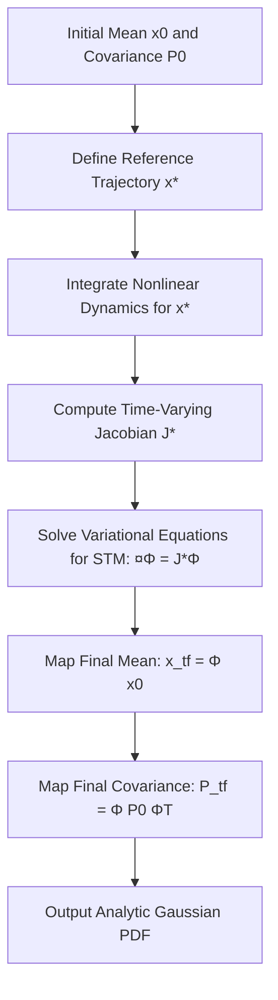
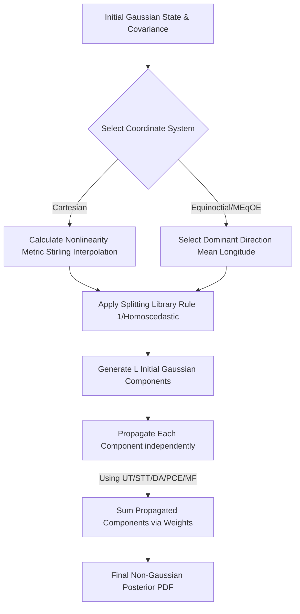
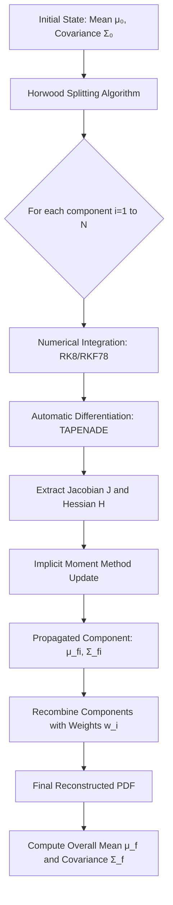
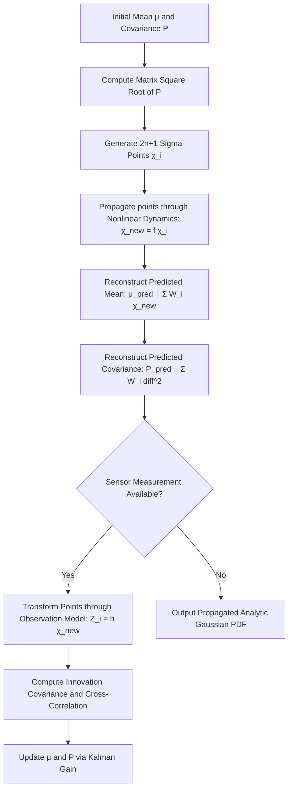
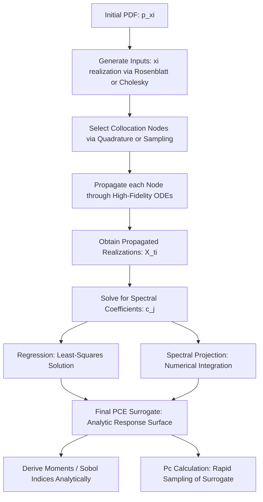
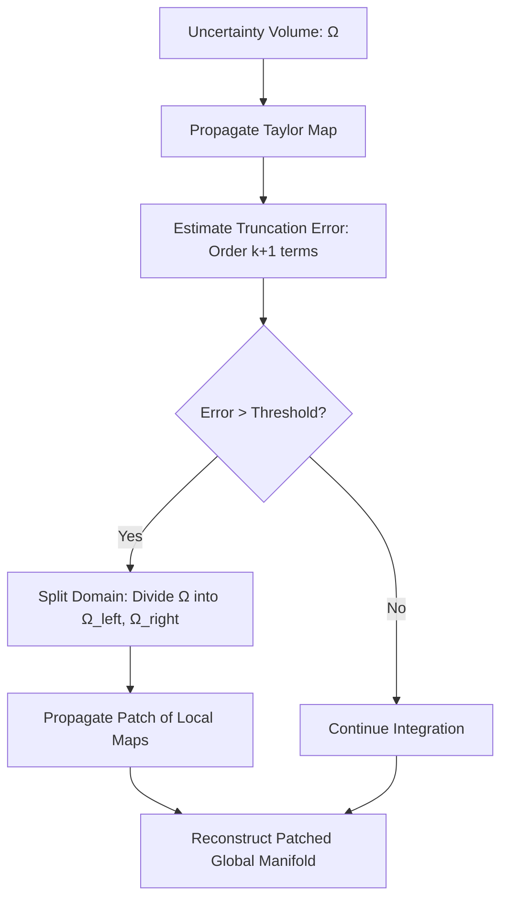
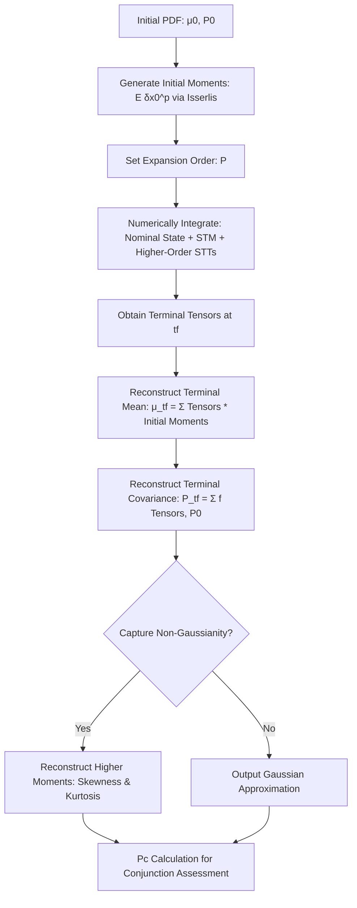
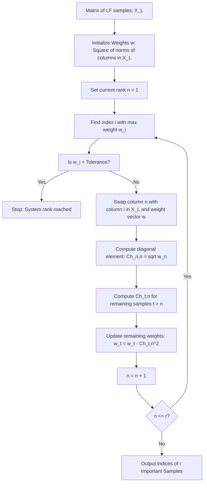

# Introduction
In the contemporary landscape of Space Domain Awareness (SDA) and Space Situational Awareness (SSA), the precise characterization of orbital state uncertainty is not merely a mathematical exercise but a requirement for the preservation of the orbital environment. As the population of resident space objects (RSOs) grows exponentially, the risk of catastrophic collisions—such as the 2009 Iridium-Cosmos event—escalates, potentially precipitating the "Kessler Syndrome", according to which, as the density of objects in orbit increases, the likelihood of collisions grows, leading to a cascading chain reaction where each collision generates new debris. This self-perpetuating process could eventually render certain orbits unusable for satellites and spacecraft, posing a severe threat to both current and future space operations.

Uncertainty Propagation (UP) serves as the mathematical engine for several mission-critical tasks:

*   **Conjunction Assessment (CA):** Predicting the probability of collision ($P_C$) between two objects by propagating their state uncertainties to the time of closest approach (TCA).

*   **Object Custody:** Establishing and maintaining the identity and tracking of newly detected objects through Bayesian filtering.

*   **Sensor Tasking:** Optimizing the use of limited ground-based radars and optical sensors by predicting where an object’s probability mass will be at future epochs.

*   **Maneuver Planning:** Assessing the necessity and efficacy of collision avoidance maneuvers (CAMs) under non-Gaussian uncertainty regimes.

## Problem Formulation of Uncertainty Propagation

The stochastic uncertainty propagation problem is defined on a probability space $(\mathcal{S}, \Sigma, \mathcal{P})$ where $\mathcal{S}$ is the sample space, $\Sigma$ is the σ-algebra, and $\mathcal{P}$ is the probability measure. 

:::{.column-margin}
- **Sample Space ($\mathcal{S}$)**: The set of all possible outcomes of a random experiment.  
  *Example*: For a coin toss, $\mathcal{S} = \{\text{Heads}, \text{Tails}\}$.

- **σ-Algebra ($\Sigma$ )**: A collection of subsets of the sample space that includes $\mathcal{S}$ and is closed under complements and countable unions. These subsets are the “events” we can assign probabilities to.  
  *Example*: For a die roll, $\Sigma$ might include sets like $\{1,2,3\}$, $\{4,5,6\}$, $\mathcal{S}$, and $\emptyset$.

- **Probability Measure ($\mathcal{P}$)**: A function that assigns a number between 0 and 1 to each event in the σ-algebra, satisfying:  
  
  - $\mathcal{P}(\mathcal{S}) = 1$  
  
  - If events are disjoint, $\mathcal{P}(\bigcup_i A_i) = \sum_i \mathcal{P}(A_i)$. *Example*: For a fair die, $\mathcal{P}(\{2\}) = \tfrac{1}{6}$.
:::

The random input vector $\mathbf{\xi} \in \mathbb{R}^d$ is defined on $(\mathcal{S}, \Sigma, \mathcal{P})$ and consists of $d$ independent random inputs that characterize the stochastic system. These inputs are drawn from a probability distribution defined over the space $\Gamma^d \subset \mathbb{R}^d$, which is the support of the random variables. The support space $\Gamma^d$ depends on the problem; for example, $\Gamma^d = [0,1]^d$ for $d$-dimensional uniform random variables in the range $[0,1]$.

The uncertainty propagation problem seeks to generate a solution to a stochastic ordinary differential equation:

$$
\mathcal{A}(t, \mathbf{\xi}; \mathbf{x}) = 0, 
\quad (t, \mathbf{\xi}) \in [0, t_f] \times \Gamma^d, 
\quad \mathcal{P}\text{-a.s. in } \mathcal{S}
$$ {#eq-stochastic-ode}

where $t \in [0, t_f]$ is the time variable, $\mathbf{x} \in \mathbb{R}^n$ is a vector of Quantities of Interest (QoIs), and $\mathcal{A}$ is the stochastic ODE operator that defines the flow of $\mathbf{x}$ to $t$ as a function of $\mathbf{\xi}$. A solution to the uncertainty propagation problem quantifies the effects of random inputs $\mathbf{\xi}$ on the random QoIs $\mathbf{x}$ as a function of time $t$ and the random inputs $\boldsymbol{\xi}$.

The random inputs $\boldsymbol{\xi}$ may include initial state uncertainties, force-modeling errors, and environmental perturbations.

## Taxonomy of Orbital Uncertainties
The literature categorize the non-deterministic inputs into two distinct mathematical and physical frameworks:

*   **Aleatory Uncertainty (Random):**

    *   **Definition:** Characterizes the inherent, irreducible randomness within the physical system.

    *   **Examples:** Sensor measurement noise from ground-based radars or optical telescopes, and fluctuations 
    in atmospheric density that affect drag in a stochastic manner.

    *   **Modeling:** Almost universally represented using precise probability distributions (PDFs).

*   **Epistemic Uncertainty (Systematic):**
    *   **Definition:** Arises from a lack of knowledge or limited information about the system's physics or model parameters.

    *   **Examples:** Modeling inadequacies such as truncated gravity field harmonics (e.g., using a 2x2 vs. 70x70 model), unknown area-to-mass ratios for solar radiation pressure, and errors introduced by using fast surrogate models (metamodels) instead of high-fidelity propagators.

    *   **Modeling:** While often forced into a PDF-based representation, recent research suggests using Outer Probability Measures (OPMs) and credibilistic filtering to bound these errors without over-characterizing them [@2019amosconfE14J].


## The Fokker-Planck Equation 
The **Fokker-Planck Equation** (FPE) is the fundamental partial differential equation (PDE) governing the time evolution of the PDF of a dynamical system subject to both deterministic forces and stochastic process noise. 

*   **Role in UP:** It describes how a probability cloud "flows" and "spreads" through state space. The equation consists of a **drift term** (representing deterministic motion like Keplerian flow) and a **diffusion term** (representing the broadening of the PDF due to stochastic forcing).

*   **Mathematical Expression:** For a state vector $\mathbf{x}$, the FPE is given by:
    $$
    \frac{\partial p(\mathbf{x}, t)}{\partial t} = -\nabla \cdot (\mathbf{f} p) + \frac{1}{2} \text{Tr}(\mathbf{\Sigma} \nabla^2 p)
    $$ {#eq-fokker-planck}
    
    where $\mathbf{f}$ is the deterministic flow vector, $\mathbf{\Sigma}$ is the diffusion tensor, and $p(\mathbf{x}, t)$ is the PDF at time $t$.

*   **The Computational Challenge in astrodynamics:** Direct numerical solutions to the FPE are generally intractable in astrodynamics due to the **"curse of dimensionality"**; a 6D orbital state requires spatial grids that grow exponentially, necessitating the use of the state-of-the-art approximation methods discussed in this report.


## Foundational Assumptions in Orbital Uncertainty Propagation
To make the complex dynamics of orbital motion computationally tractable, researchers generally operate under a standardized set of mathematical and physical assumptions:

*   **Point Mass Dynamics:** For most conjunction scenarios, space objects are approximated as point masses, although this assumption may be relaxed for large structures like the International Space Station (ISS).

*   **State Representation:** In orbital mechanics, the QoIs is typically represented by the orbital state vector $\mathbf{x} = [\mathbf{r}, \mathbf{v}]^T \in \mathbb{R}^6$, representing position and velocity in an inertial frame (e.g., ECI) or a specialized coordinate set like Modified Equinoctial Orbital Elements (MEqOE).

*   **Initial State Quantification:** It is assumed that an initial state $\mathbf{x}_0$ is known at epoch $t_0$, accompanied by a multivariate Probability Density Function (PDF), often initially modeled as Gaussian $N(\boldsymbol{\mu}_0, \mathbf{P}_0)$. The random inputs $\boldsymbol{\xi}$ may include initial state uncertainties, force-modeling errors, and environmental perturbations.

*   **Deterministic Flow:** The trajectory follows non-linear Ordinary Differential Equations (ODEs) influenced by both central-body gravity and various perturbative accelerations. Hence we do not consider epistemic uncertainty in the dynamics model itself, but rather focus on the propagation of the initial state uncertainty through these deterministic equations.


## Classification and Methodology of Uncertainty Propagation Techniques

Managing the *curse of dimensionality* and the inherent non‑linearity of orbital mechanics requires a robust taxonomy of methods. These techniques are generally classified by how they represent the PDF: through point‑based samples, linearized mathematical transformations, mixture models, polynomial expansions, or hybrid multi‑fidelity approaches. Each method is assessed based on its ability to preserve the integrity of the PDF over time, its computational efficiency, and its suitability for real‑time operational use. The following sections provide a detailed overview of these methods, highlighting their theoretical foundations, practical implementations, and performance characteristics.

# The Sampling Baseline: Monte Carlo (MC)

The Monte Carlo method serves as the “ground truth” and absolute benchmark for all other techniques. The process involves generating a large set of random samples ($N_{\text{samples}}$) from an initial Gaussian distribution using the square‑right matrix ($S$) of the <u>covariance matrix</u>. 

$$
P = SS^{T}
$$ {#eq-covariance-matrix}

:::{.column-margin title="Covariance Matrix"}
The covariance matrix $P$ captures the uncertainty in the state estimate which we get from orbit determination. The square‑right matrix $S$ is obtained through Cholesky decomposition or Singular Value Decomposition (SVD) of $P$. This allows us to generate samples that are consistent with the initial uncertainty.
:::

## Mechanics of the Sampling-Based Approach
MC simulation functions by drawing a large ensemble of random samples from an initial distribution, which can be Gaussian or any other known PDF.

-  **Independent Propagation:** Each sample represents a potential realization of the system state and is propagated independently through numerical integration of the dynamics.

-  **Non-Intrusive Nature:** Because each sample is treated separately, MC is intrinsically non-intrusive, meaning it treats the dynamics model as a "black box" and requires no modifications to existing dynamics code.

-  **Statistical Reconstruction:** After propagation, the ensemble of final states provides a discrete representation of the final PDF. Statistical properties, such as the mean and covariance, are estimated directly by computing the average and sample-covariance of the propagated points.

## Role as the "Ground Truth" Baseline
The sources [@bosorbit][@thesis_suyog] identify MC simulation as the **definitive benchmark** for evaluating the accuracy of all other UP methods.

-  **Reliability:** MC results approach the "true" probability distribution as the number of samples goes to infinity.
-  **Accuracy Metric:** In comparative studies, researchers typically use a large-scale MC run (such as $10^5$ samples) as the reference truth to calculate accuracy metrics like the **N L2 distance** for alternative methods.

## The Computational Trade-off
While highly accurate, the primary limitation of MC is its **extreme computational intensity**.

-  **Convergence Rate:** The rate of statistical convergence is proportional to the inverse square root of the ensemble size ($\text{Monte Carlo Standard error}\propto 1/\sqrt{N}$, where $N$ is the number of samples), meaning achieving high accuracy requires a massive number of samples.

:::{.callout-tip title= "Monte-Carlo Standard Error"}

The statistical convergence rate describes how quickly the Monte Carlo estimate approaches the true value as the number of samples increases.

For this, we assume that the samples are independent and identically distributed (i.i.d.) random variables drawn from the underlying probability distribution. Let these samples be denoted as $X_1, X_2, \ldots, X_N$, where $N$ is the total number of samples. 

Now we assume $Y=f(\mathbf{X})$ to be a random variable with

$$
E[Y]=\mu,\qquad \operatorname{Var}(Y)=\sigma^2.
$$ 

Which gives us $Y_1, Y_2, \ldots, Y_N$ as i.i.d. random variables which form the output underlying uncertainty distribution. The Monte Carlo estimator for the expected value of $Y$ is given by,

$$
\hat{\mu}=\frac{1}{N}\sum_{i=1}^{N}Y_i.
$$

Since the samples are independent,

$$
\begin{aligned}
\operatorname{Var}(\hat{\mu})&= \operatorname{Var}\left(\frac{1}{N}\sum_{i=1}^{N}Y_i\right)\\&=\frac{1}{N^2}\sum_{i=1}^{N}\operatorname{Var}(Y_i)\frac{\sigma^2}{N}
\end{aligned}
$$

Hence, the standard error of the Monte Carlo estimator is

$$
\boxed{
\operatorname{SE}(\hat{\mu})=\sqrt{\operatorname{Var}(\hat{\mu})}\frac{\sigma}{\sqrt{N}}.
}
$$

Therefore, the statistical error of Monte Carlo decreases as

$$
\boxed{
\operatorname{SE}(\hat{\mu})=O(N^{-1/2}),
}
$$

implying that reducing the error by a factor of (k) requires approximately (k^2) times more samples.

:::

-  **Collision Assessment Barriers:** For rare-event quantification, such as conjunction assessment where collision probabilities ($P_C$) may be $10^{-4}$ or lower, the number of required samples can reach **$10^7$ or more** to achieve low statistical error.
-  **Practical Infeasibility:** Due to these requirements, the sources note that standard MC simulations are often infeasible for practical, real-time application to the vast population of resident space objects (RSOs).

## MC in the Landscape of Sampling Methods
Current literature place MC within a broader hierarchy of sampling and sample-reliant methods designed to mitigate its costs:

-  **Deterministic Sampling (Unscented Transform):** Unlike MC's random sampling, the **Unscented Transform (UT)** uses a small, deterministically chosen set of weighted **sigma points** to represent the first two moments of a distribution.

-  **Multi-Fidelity (MF) Architectures:** This "promising" alternative leverages sampling concepts by propagating a large set of samples through fast, **low-fidelity dynamics** and then using a tiny subset of "important samples" propagated through high-fidelity dynamics to correct the results. MF can achieve speed-ups of up to **4 orders of magnitude** over standard MC while maintaining a high level of agreement.

-  **Enhanced Sampling Techniques:** To improve efficiency, researchers utilize variance reduction techniques like **importance sampling** or **stratified sampling**, as well as **Quasi-Monte Carlo** methods which use special sequences for more uniform coverage of the uncertainty space.

-  **Parallelization:** Leveraging multicore CPUs or GPU acceleration is highlighted as a primary way to reduce the run times of large-scale Monte Carlo campaigns.

# Linearized Covariance (LinCov)

In the taxonomy of uncertainty propagation (UP) methods, **Linearised Covariance (LinCov)** represents the foundational entry in the category of **Linear Approximation Methods**. It is characterized by its reliance on first-order Taylor-series expansions to map statistical moments through nonlinear dynamical systems. While computationally superior in terms of execution time, its mathematical architecture introduces significant epistemic risks when the system's nonlinearity induces non-Gaussianity.

## Mathematical Framework and Mechanics
LinCov operates on the fundamental assumption that if a reference trajectory $x^*(t)$ is sufficiently close to the true trajectory $x(t)$, the deviation $\Delta x(t)$ can be modeled as a linear system.

*   **First-Order Truncation:** The method defines the system dynamics $\dot{x}(t) = F(x, t)$ and expands them into a Taylor series about the reference trajectory. By neglecting higher-order terms (second-order and above), the dynamics are simplified to $\Delta\dot{x}(t) \approx J^*(t)\Delta x(t)$, where $J^*$ is the Jacobian matrix evaluated along the reference path.

*   **The State Transition Matrix (STM):** The solution to this linear system is facilitated by the STM, $\Phi(t, t_0)$, which maps the initial deviation to a future epoch. 

:::{.callout-tip title="State Transition Matrix (STM)"}
The STM is formally defined as the solution to the matrix differential equation $\dot{\Phi}(t, t_0) = \mathbf{J}^*(t)\Phi(t, t_0)$, with the initial condition $\Phi(t_0, t_0) = \mathbf{I}$ (the identity matrix).
:::
*   **Moment Propagation:** The mean state vector and covariance matrix are defined as the expected value of the state, and the expected squared deviation from the mean state, respectively:
$$
\begin{aligned}
\bar{\mathbf{x}} &= \int_{\infty} \xi p(\xi)\,d\xi \\
\mathbf{P} &= \int_{\infty} (\xi - \bar{x})(\xi - \bar{x})^T p(\xi,t)\,d\xi
\end{aligned}
$$

    Assuming that the differences between the true and reference trajectories are small, the mean and covariance can be propagated through the STM as follows:
$$
\begin{aligned}
\bar{\mathbf{x}}(t) &= \Phi(t, t_0)\bar{\mathbf{x}}(t_0) \\
\mathbf{P}(t) &= \Phi(t, t_0)\mathbf{P}(t_0)\Phi^T(t, t_0) + G(t)Q(t)G^T(t)
\end{aligned}
$$ {#eq-lincov-propagation}

    Where $G(t)$ is the process noise input matrix and $Q(t)$ is the process noise covariance, which are used to account for force-model mismodelling perturbation errors. @bosorbit does not include process noise in his LinCov implementation.

*   **Gaussian Assumption:** A defining characteristic of LinCov is the preservation of the distribution's functional form; it assumes that an initially Gaussian PDF remains Gaussian throughout the propagation horizon.

### Algorithmic Implementation of LinCov
The following flowchart delineates the procedural logic for propagating orbital uncertainty using the LinCov framework:



## Performance Analysis: The Efficiency-Accuracy Trade-off
LinCov's role in Space Domain Awareness (SDA) is defined by its extreme computational efficiency, often being several orders of magnitude faster than sampling-based methods.

*   **Computational Primacy:** LinCov is the fastest implemented method in modern comparative studies because it requires the integration of only one nominal state vector to solve the variational equations.

*   **Failure in Nonlinear Regimes:** The accuracy of LinCov inversely correlates with propagation time and dynamical nonlinearity (e.g., highly elliptical orbits). As the true PDF warps into "banana" or "kidney" shapes, the linear mapping fails to capture the curvature, leading to a significant increase in the $NL_2$ distance metric relative to the Monte Carlo truth.

*   **Structural Limitations:** While LinCov captures the location (mean) and the general spread (scale) of the uncertainty, it systematically ignores the higher-order moments (skewness and kurtosis) that define the "tails" of a non-Gaussian distribution.

## Contextual Nuance: Surprising Utility in Conjunction Assessment
A critical insight provided by @bosorbit is that LinCov’s failure to approximate the *shape* of a PDF does not necessarily preclude its utility in specific **Conjunction Assessment (CA)** tasks.

*   **Preservation of Decision Metrics:** In simulations involving Low Earth Orbit (LEO) conjunctions with long propagation times (e.g., 96 hours), LinCov produced collision probabilities ($P_C$) nearly identical to baseline Monte Carlo runs, despite the underlying distributions being highly non-Gaussian.

*   **Geometric Explanation:** This "surprising" performance suggests that for certain conjunction geometries, capturing the "length" and "width" of the uncertainty spread is more critical for $P_C$ calculation than accurately modeling the time of closest approach (TCA) uncertainty distribution.

*   **Caveats:** This robust performance may be an artifact of specific scenario settings, such as identical orbital regimes for both objects or symmetrical initial uncertainties.

## Taxonomy and Comparison
LinCov sits alongside several related techniques that utilize varying forms of linearization:

*   **Statistical Linearization (CADET):** Unlike LinCov, the **Covariance Analysis Describing function Technique (CADET)** approximates system functions in an "average" way to minimize mean square error and does not strictly rely on the differentiability of the dynamics.

*   **State Transition Tensors (STT):** This framework extends LinCov into higher-order statistics; a first-order STT solution corresponds exactly to the STM used in standard LinCov, while higher-order tensors allow for the propagation of uncertainties through stronger nonlinearities without random sampling. See @sec-stt for a detailed discussion.

*   **Coordinate Frame Synergy:** The accuracy of linear methods is significantly enhanced when operating in **Generalized Equinoctial Orbital Elements (GEqOE)** or **Modified Equinoctial Elements (MEE)**, which render the dynamics more nearly linear than Cartesian coordinates.

# Gaussian Mixture Models (GMM) Framework

In the larger landscape of **Uncertainty Propagation (UP)**, **Gaussian Mixture Models (GMM)** serve as a versatile "mixture model" framework that bridges the gap between computationally efficient linear methods and the complex, non-Gaussian realities of orbital mechanics. The foundational principle of the GMM framework is the "universal approximator" property, which asserts that any arbitrary probability density function (PDF) can be represented with sufficient accuracy as a weighted sum of multiple Gaussian kernels. This property allows GMMs to capture the intricate shapes of non-Gaussian distributions, such as the "banana" or "kidney" forms that emerge in long-term propagation through the highly nonlinear dynamics of orbital mechanics.

## Mathematical Architecture of the GMM Framework
The GMM framework represents a complex, non-Gaussian state $\mathbf{x}$ as a linear combination of $N_g$ multivariate Gaussian components.

### The Joint GMM PDF

The non-Gaussian PDF of a state vector $\mathbf{x}$ is defined as:
$$
p(\mathbf{x}) = \sum_{i=1}^{L} \alpha_i \mathbfcal{N}(\mathbf{x}; \hat{\mathbf{x}}_i, \mathbf{P}_i)
$$

**Terms Defined:**

*   $p(\mathbf{x})$: The total non-Gaussian probability density function of the state.

*   $L$: The total number of Gaussian mixture elements (GMEs).

*   $\alpha_i$: The scalar weight of the $i$-th component, where $0 \le \alpha_i \le 1$ and $\sum_{i=1}^{L} \alpha_i = 1$.

*   $\mathbfcal{N}(\cdot)$: The $i$-th multivariate Gaussian kernel, defined as:
    $$
    \mathbfcal{N}(\mathbf{x}; \hat{\mathbf{x}}_i, \mathbf{P}_i) = \frac{1}{\sqrt{(2\pi)^n |\mathbf{P}_i|}} \exp \left( -\frac{1}{2} (\mathbf{x} - \hat{\mathbf{x}}_i)^T \mathbf{P}_i^{-1} (\mathbf{x} - \hat{\mathbf{x}}_i) \right)
    $$

    Where,

    *   $\hat{\mathbf{x}}_i$: The mean state vector of the $i$-th Gaussian component.

    *   $\mathbf{P}_i$: The covariance matrix of the $i$-th Gaussian component.

## General Methodology for GMM Propagation

The propagation of uncertainty via GMMs typically follows a three-stage "split-propagate-recombine" paradigm.

*   **Initial Splitting:** An initial Gaussian distribution (often from Orbit Determination) is replaced by $L$ components. The effectiveness of this stage is highly dependent on the choice of splitting directions and the number of components, which are influenced by the algorithms used to initialize and manage the mixture components:

    - **Fixed vs. Adaptive Splitting:** 

        *   **Static Splitting:** The number of components is fixed at the initial epoch. This is common in the **Multidirectional GMM (MGMM)** approach, where a regular grid is formed by recursively applying the splitting library along multiple nonlinear directions.

        *   **Adaptive Splitting (AEGIS/AGM):** Splits are triggered online when a nonlinearity threshold is reached. The **Adaptive Entropy-based GMM (AEGIS)** monitors the deviation between linear and nonlinear differential entropy estimates to trigger splits.
    
    -   **The Horwood Suboptimal Algorithm:** This specific technique refines a multivariate Gaussian along a single direction, which is computationally faster than multi-directional splitting without significantly compromising accuracy.

    -   **Variance-Preserving (Homoscedastic) Splitting:** 
    While homoscedastic libraries often discard skewness, variance-preserving libraries are optimized under the constraint of matching the first two moments of the original distribution exactly. This ensures that the global mean and covariance of the mixture are identical to the original Gaussian before any nonlinear propagation occurs.

    - **Multidirectional GMM (MGMM):** This approach recursively applies the splitting library along multiple nonlinear directions, forming a regular grid of components. While this can capture complex non-Gaussian features, it is computationally expensive and may lead to an exponential increase in the number of components.

*   **Coordinate Selection:** Splitting in Cartesian space is often inefficient because nonlinearity acts in all six dimensions. Instead, curvilinear coordinates (e.g., Equinoctial or Delaunay elements) are used, as nonlinearity is primarily restricted to the mean longitude direction, allowing for a 1D split that avoids the "curse of dimensionality".

*   **Component-wise Propagation:** Each component $(\hat{\mathbf{x}}_i, \mathbf{P}_i)$ is evolved independently through the nonlinear dynamics using a chosen propagation method.

*   **Recombination:** At the target epoch, the weighted sum of components provides the final non-Gaussian PDF for tasks like Conjunction Assessment (CA).

## Algorithmic Methodology of Gaussian Mixture Modelling of uncertainty

The following flowchart illustrates the procedural logic for propagating orbital uncertainty using the GMM framework. Here we use the nonlinearity metric to pre-determine the splitting direction and the number of components to generate.




## Variations and Hybrid Architectures
The GMM framework is frequently combined with other UP methods to optimize the speed-accuracy Pareto front.

### GMM-UT (Unscented Transform)
The most common implementation, where each kernel's statistics are propagated via $2n+1$ sigma points.

*   **Methodology:** Each component is represented by $2n+1$ deterministic sigma points $\chi_j$, which are propagated through the full nonlinear dynamics to reconstruct component statistics.

*   **Limitation:** The cost scales linearly with the number of components $L$ and the state dimension $n$, i.e., $O(L \cdot n)$.

### GMM-MF (Multi-Fidelity)
A high-efficiency hybrid where the Multi-Fidelity method propagates the sigma points of the GMM kernels.

*   **Methodology:** The entire ensemble of sigma points from all components is propagated via a computationally cheap low-fidelity (LF) model (e.g., SGP4). A pivoted Cholesky decomposition of the LF Gramian identifies a subset of "important samples" to be corrected by the HF model via stochastic collocation. See @sec-mf-sc for a detailed discussion on the stochastic collocation multi-fidelity method. 

*   **Performance:** Achieves accuracy similar to GMM-UT but with an **80% reduction in computation time**.

### GMM-STT (State Transition Tensor)
This method regards Gaussian distributions as a function space to express PDFs in closed form.

*   **Methodology:** Instead of solving separate ODEs for each mean and covariance, the STT solution flow is reformulated as a matrix function valid over all components.

*   **Mathematical Formula (State Deviation):**
    $$
    \delta \hat{x}_{i}^k(t) \approx \sum_{p=1}^{m} \frac{1}{p!} \Phi^k_{j_1...j_p}(t, t_0) \delta \hat{x}_{0,i}^{j_1} \dots \delta \hat{x}_{0,i}^{j_p}
    $$

    *   $\delta \hat{x}_{i}^k(t)$ is the $k$-th state component of the $i$-th component; $\Phi^k_{j_1...j_p}$ is the $p$-th order State Transition Tensor.

*   **Efficiency:** It becomes more efficient than individual component propagation for $L > 7$ components (using a 2nd-order expansion).

### GMM-DA (Differential Algebra)
The core innovation of GMM-DA is that the high-order Taylor expansion of the solution flow is computed only once. The solution flow is expanded into a polynomial up to an arbitrary order $k$ without manual derivation of variational equations. All individual Gaussian kernels are then evaluated through this single polynomial map, turning the propagation of thousands of components into a series of efficient algebraic evaluations

*   **Advantage:** Self-adaptive to any regular nonlinear system without requiring manual derivation of derivatives.

*   **Variant (DA-LOADS):** Uses a **Nonlinearity Index (NLI)** to trigger adaptive splitting only when the Taylor expansion's truncation error exceeds a threshold.

### GMM-PCE (Polynomial Chaos Expansion)
This approach is analogous to **hp-refinement** in Finite Element Methods.

*   **Methodology:** Splitting (h-refinement) reduces the domain of approximation for each component, allowing for lower-order polynomials (p-refinement) to be used effectively.

*   **Benefit:** It reduces the factorial growth of PCE terms in high-dimensional states while maintaining the ability to capture full shapes of non-Gaussian distributions.

### GMM-Moment Method

This semi-analytical framework propagates the first raw moment (mean) and the second central moment (variance) of each Gaussian component through a nonlinear system using the first/or second-order Taylor expansion of the explicit flow function of the dynamical system. @sec-moment-method discusses the mathematical formulation and implementation of the moment method in detail.

## Advanced Variations on the GMM Method

### Adaptive GMMs (AEGIS and MDAES)
The **Adaptive Entropy-based Gaussian-mixture Information Synthesis (AEGIS)** method does not rely on a fixed number of components.

*   **Mechanism:** It monitors component nonlinearity by comparing the linear evolution of its differential entropy against a nonlinear estimate (e.g., via UKF).

*   **Directional Splitting:** To combat the "curse of dimensionality," GMM splitting is often restricted to the eigenvector corresponding to the maximum eigenvalue ($V_{max}$) or directions maximizing a nonlinearity metric.

    *   **Trigger:** If the entropy deviation exceeds a threshold, the component is split online to maintain linearity.

*   **Coordinate Frame Synergy:** Pairing GMMs with **Modified Equinoctial Elements (MEqOE)** is highly efficient, as uncertainty in MEqOE is dominated by a single dimension (true longitude), requiring fewer kernels than Cartesian space.

*   **Variation:** **MDAES** combines initial multi-directional splitting with AEGIS to prevent correlation buildup in highly deformed distributions.

Despite its robustness, the sources highlight critical drawbacks:


*   **The "Centred Collection" Effect:** In Cartesian frames, individual GMM components can end up clumping toward the center of the distribution at terminal time, failing to capture the thin "tails" of the true non-Gaussian distribution.

*   **Combinatoric Growth:** The number of components in a batch GMM can scale factorially with the number of measurements ($N_{\nu,0} \times \dots \times N_{\nu,L}$), necessitating aggressive pruning and merging techniques.

*   **Tail Sensitivity:** While GMMs improve upon single Gaussians, they may still require an intractable number of kernels to accurately resolve the $10^{-5}$ or $10^{-6}$ tail probabilities required for actionable conjunction screening.


### Multidirectional GMM (MGMM)
Standard GMMs often split along a single axis. **MGMMs** recursively apply splitting libraries along multiple directions to form a regular grid in probability space.

*   **Nonlinearity Metric:** Directions are ranked using a second-order divided difference (Stirling’s interpolation) to identify where splits provide the most accuracy gain.
$$
\phi = \frac{f(\mathbf{m} + h\sigma \mathbf{a}) + f(\mathbf{m} - h\sigma \mathbf{a}) - 2f(\mathbf{m})}{2h^2}
$$

*   **Term Definitions:** $\mathbf{a}$ is the splitting unit vector and $h = \sqrt{3}$ is the recommended step size.

### Gaussian Mixture Batch Processor (GMBP)
Applied to **Initial Orbit Determination (IOD)**, the GMBP translates a batch of noisy measurements into a GMM-based PDF using Bayes' rule.

*   **Methodology:** It disperses linearization errors across an ensemble of Gaussian components, allowing for accurate reconstruction of "crescent-shaped" posteriors common in cislunar tracking.


### Role in Conjunction Assessment (CA)
In the field of collision analysis, GMMs enable **all-on-all analysis**. Rather than evaluating millions of individual sample pairs as in Monte Carlo simulation, every Gaussian component of a primary object is evaluated against every component of a secondary object. This allows for the use of more advanced analytical or numerical collision probability ($P_c$) computation methods on each individual component pair.


## Adaptive splitting in the Context of Gaussian Mixture Models (GMM)

Bos's thesis [@bosorbit] defines Adaptive Entropy-based Gaussian-mixture Information Synthesis (AEGIS) as an advanced framework that utilizes automatic domain splitting to maintain an accurate representation of a probability density function (PDF) as its non-Gaussianity increases during propagation.

While standard GMMs often approximate a non-Gaussian PDF by splitting an initial distribution into a fixed number of weighted components at the start of propagation ($t_0$), **AEGIS performs this splitting online**. The method treats the uncertainty as a sum of Gaussian "kernels" that can be individually propagated using efficient techniques like the **Unscented Transform** or **Linearised Covariance**. 

The core philosophy of AEGIS is that by repeatedly splitting a Gaussian component into smaller sub-components when nonlinear effects become too high, the method reduces the local impact of those nonlinearities, allowing individual components to remain near-Gaussian for a longer duration.

### Mechanics of Adaptive Splitting
AEGIS triggers a split based on a comparison between **linear and nonlinear differential entropy**:

-   **Linear Entropy:** This is calculated by integrating the time derivative of the differential entropy, which is a function of the system's **Jacobian matrix** (the basis of the Linearized Covariance method).

-   **Nonlinear Entropy:** This is calculated directly from the covariance matrix after propagating the component using a nonlinear technique, typically the **Unscented Transform**.

-   **The Splitting Threshold:** When the normalized difference between these two entropy calculations exceeds a user-defined threshold ($\epsilon_{ent}$), the propagation is paused, the component is split into smaller Gaussians, and the entropies are recalculated before propagation continues.

### Performance and Computational Challenges
Despite its theoretical potential, the study highlight significant practical drawbacks to the AEGIS method in orbital scenarios:

-   **Extreme Computational Intensity:** AEGIS was found to be the most computationally expensive method tested. Because it requires propagating the State Transition Matrix (STM) and calculating differential entropy at every time step, it is slower than a standard UT even when **no splitting occurs**.

-   **Exponential Component Growth:** For long propagation horizons, the number of components can increase exponentially as splits occur at increasingly frequent intervals. This leads to **unreachable computation times** or out-of-memory errors, making the method impractical for scenarios spanning many orbital revolutions.

-   **Accuracy Decay:** While AEGIS approximates distributions well for short durations (e.g., 2 revolutions), its accuracy decays sharply in long-term Low Earth Orbit (LEO) cases. In these scenarios, it is generally outperformed by the **Multi-Fidelity (MF)** and **Polynomial Chaos Expansion (PCE)** methods.

### Impact of Coordinate Frames
The study notes that the poor performance of AEGIS was partly due to operating in **Cartesian coordinates**, where nonlinearity affects all dimensions. The sources suggest that combining AEGIS with **Modified Equinoctial Elements (MEqOE)** would be more effective; in MEqOE, the uncertainty primarily distributes along a single direction (true longitude), which would likely require far fewer splits and components to achieve high accuracy.

# Moment Method {#sec-moment-method}

The **Moment Method** (or Method of Moments) is a statistical technique utilized in uncertainty propagation to estimate the evolution of a probability density function (PDF) by focusing on its statistical moments—primarily the mean and covariance. Within the hierarchy of uncertainty propagation methods, it serves as a computationally efficient bridge between low-fidelity linear approximations and high-fidelity, but expensive, sampling-based techniques like Monte Carlo (MC).

## Mathematical Framework and Methodology

The method relies on the assumption that if an input variable (or vector) is characterized by a Gaussian distribution, its first two moments are necessary and sufficient to describe its state [@thesis_suyog].

### Taylor Series Expansion

The core mechanism involves expanding the nonlinear system function into a Taylor series about the mean value of the inputs. 

**Explicit vs. Implicit Formulations:**

-   **Explicit Moment Method:** Applied when a direct functional relationship $y = f(x)$ exists between input and output.

-   **Implicit Moment Method:** Utilized in astrodynamics when only the governing differential equations $\dot{x} = f(x, t)$ are known. It requires a numerical integrator (e.g., RKF78) to define the solution flow $\phi$, which is then expanded.

### Moment Propagation

In order to explain the moment propagation,  consider an explicit moment propagation problem with a nonlinear function $y = f(x)$ where $x$ is a random variable with mean $\mu_x$ and covariance $\sigma_x^2$. The first two moments of the output $y$ can be approximated depending on the order of the Taylor approximation:

**First-Order Equations:**

1.  **Mean ($\mu_y$):** $\mu_y = f(\mu_x)$

2.  **Variance ($\sigma_y^2$):** $\sigma_y^2 = [f'(\mu_x)]^2 \sigma_x^2$

While fast, moment propagation on the first-order taylor approximation fails to capture the "mean shift" caused by nonlinearities and performs poorly when the PDF becomes highly non-Gaussian.

**Second-Order Equations:**

1.  **Mean:** $\mu_y = f(\mu_x) + \frac{1}{2} f''(\mu_x) \sigma_x^2$

2.  **Variance:** $\sigma_y^2 = [f'(\mu_x)]^2\sigma_x^2 + f'(\mu_x)f''(\mu_x)\mu_3^{(x)} + \frac{1}{4}[f''(\mu_x)]^2 (\mu_4^{(x)}-\sigma_x^4)$

**Terms Defined:**

*   $f(\mu_x)$: Function evaluation at the mean.

*   $f'(\mu_x)$: First derivative (sensitivity) at the mean.

*   $f''(\mu_x)$: Second derivative (curvature) at the mean.

*   $\mu_3^{(x)}$: The third central moment of the input distribution.

*   $\mu_4^{(x)}$: The fourth central moment of the input distribution.

*   $\sigma_x^4$: The square of the input variance.

**Implicit Formulation:**

In high-fidelity astrodynamics, an explicit formula $y = f(x)$ is rarely available. Instead, the system is defined by a set of nonlinear Ordinary Differential Equations (ODEs):
$$\dot{\mathbf{x}} = f(\mathbf{x}, t)$$

The **Implicit Moment Method** uses the **solution flow** $\mathbf{x}(t)=\phi(t; \mathbf{x}_0)$ obtained via numerical integration (e.g., Runge-Kutta schemes). The methodology treats the numerical integrator as the mapping function:

1.  **Trajectory Integration:** Propagate the nominal mean $\boldsymbol{\mu}_{x0}$ to find the final state $\phi(\boldsymbol{\mu}_{x0})$.

2.  **Sensitivity Extraction:** Compute the Jacobian and Hessian of the flow map, often utilizing **Automatic Differentiation (AD)** to ensure machine-precision accuracy.

3.  **Moment Transformation:** Apply the multivariate moment equations using the flow derivatives to advance the mean and covariance to the target epoch $t_f$.

In a 6-dimensional orbital state, the method propagates the mean vector $\mu$ and the covariance matrix $\Sigma$. The following sections detail the multivariate extension of the moment method.

### Multivariate Extension ($R^n$)
When the input is an $n$-dimensional random vector $\mathbf{x} \sim \mathcal{N}(\boldsymbol{\mu}_x, \mathbf{\Sigma}_x)$, the propagation involves the Jacobian matrix and Hessian tensors.

**First-Order (Linearized) Moments:**
$$\boldsymbol{\mu}_y = f(\boldsymbol{\mu}_x)$$
$$\mathbf{\Sigma}_y = \mathbf{J} \mathbf{\Sigma}_x \mathbf{J}^T$$

**Second-Order Moments (Component-wise):**
$$\mu_{y,i} = f_i(\boldsymbol{\mu}_x) + \frac{1}{2} \text{tr}(\mathbf{H}_{fi}(\boldsymbol{\mu}_x) \mathbf{\Sigma}_x)$$
$$
\Sigma_y(i, p) = (\mathbf{J} \mathbf{\Sigma}_x \mathbf{J}^T)_{ip} + \frac{1}{2} \text{tr}(\mathbf{H}_{fi} \mathbf{\Sigma}_x \mathbf{H}_{fp} \mathbf{\Sigma}_x)
$$

**Terms Defined:**

*   $\mathbf{J}$: The $n \times n$ Jacobian matrix, $\mathbf{J} = \frac{\partial f}{\partial \mathbf{x}}\big|_{\boldsymbol{\mu}_x}$.

*   $\mathbf{H}_{fi}$: The Hessian matrix of the $i$-th component of the function $f$.

*   $\text{tr}(\cdot)$: The trace operator, summing the diagonal elements of the resulting matrix product.


## Comparative Orders of Approximation

The accuracy of the Moment Method is strictly tied to the order of the Taylor expansion used:

-   **First-Order (M1):** 

    -   Assumes the system is locally linear.

    -   Propagates the mean as the function of the mean: $\mu_y = f(\mu_x)$.

    -   While fast, it fails to capture the "mean shift" caused by nonlinearities and performs poorly when the PDF becomes highly non-Gaussian.

-   **Second-Order (M2):**

    -   Incorporates the **Hessian matrix** ($H$) of the system dynamics.

    -   The mean is corrected by a term involving the trace of the Hessian and the covariance: $\mu_{y,i} \approx f_i(\mu_x) + \frac{1}{2} \text{tr}(H_i \Sigma_x)$.

    -   The covariance propagation includes additional terms to account for the "spreading" effect of curvature: $\Sigma_y \approx J \Sigma_x J^T + \frac{1}{2} \text{tr}(H_i \Sigma_x H_p \Sigma_x)$.

    -   Empirical results show that M2 consistently maintains lower error norms ($L_2$ and $L_\infty$) than M1, especially in nonlinear regimes like Highly Elliptical Orbits (HEO).


## Integration with Gaussian Mixture Models (GMM)

In practice, the implicit moment method is often combined with **Gaussian Mixture Models (GMM)** to handle the "loss of Gaussianity" that occurs in long-term orbital propagation. Each Gaussian component is propagated independently using the moment method, and the final non-Gaussian PDF is reconstructed by recombining the weighted sum of these components.

1.  **Decomposition:** The initial Gaussian uncertainty is split into $N$ smaller Gaussian components (kernels) using algorithms like the Horwood suboptimal algorithm.

2.  **Local Propagation:** Each individual component has a sufficiently small covariance to remain "locally Gaussian," allowing the Moment Method to propagate its first two moments accurately over longer durations.

3.  **Reconstruction:** The final non-Gaussian PDF is reconstructed by recombining the weighted sum of these propagated components.

## Algorithm for Multivariate Implicit GMM-Moment Propagation

The following flowchart outlines the computational algorithm for a multivariate system (e.g., orbital mechanics in $R^6$) using the implicit second-order moment method:



## Critical Strengths and Limitations

-   **Computational Efficiency:** The GMM-Moment method is significantly faster than Monte Carlo simulations. For a 3-day LEO propagation, it completed in seconds/minutes compared to the hours required for a $10^7$-sample MC run.

-   **Derivative Sensitivity:** Unlike the Unscented Transform (UT), which is sample-based, the Moment Method requires explicit derivative information (Jacobians and Hessians).

-   **Automatic Differentiation (AD):** To avoid the errors of finite differences, modern implementations use AD (e.g., TAPENADE) to obtain exact derivatives by applying the chain rule to the source code of the propagator.

-   **Differentiability Requirement:** The method assumes that the governing equations are continuous and differentiable, which may pose challenges in the presence of discrete events like shadow entries (SRP discontinuities).

# Unscented Transform (UT)

In the rigorous taxonomy of orbital uncertainty quantification, the **Unscented Transform (UT)** represents a pivotal **deterministic sampling method** that bridges the gap between computationally cheap linear approximations and prohibitively expensive brute-force stochastic simulations. Unlike the Monte Carlo (MC) method, which relies on random realizations, the UT operates on the foundational intuition that it is mathematically easier to approximate a probability distribution than it is to approximate an arbitrary nonlinear function or transformation.

## Theoretical Context: Deterministic vs. Random Sampling
Within the landscape of sampling-based methodologies, the UT occupies a unique niche defined by "moderate fidelity" and high efficiency.

*   **Sigma Point Paradigm:** While MC requires $10^5$ to $10^7$ random samples to achieve statistical convergence, the UT utilizes a minimal, carefully selected set of weighted **sigma points** that precisely capture the initial mean and covariance of a distribution.

*   **Black-Box Dynamics:** Like MC, the UT is non-intrusive; it treats the system dynamics as a "black box," passing the discrete sigma points through the actual nonlinear equations of motion without requiring the derivation of Jacobians or Hessians.

*   **Gaussian Constraint:** A critical limitation noted in the sources is that the standard UT is primarily constrained by **Gaussian assumptions**. It nonlinearly propagates the first and second moments but may fail to naturally represent the "banana-shaped" non-Gaussian warpings that emerge during long-term orbital propagation. 

## Mathematical Architecture of the UT
The UT approximates an $n$-dimensional random variable $\mathbf{x}$ using $2n+1$ sigma points. The mathematical selection and weight assignment are governed by the following formulations:

### **Sigma Point Selection**
$$\chi_0 = \bar{\mathbf{x}}$$
$$
\chi_i = \bar{\mathbf{x}} + \left( \sqrt{(n + \kappa) \mathbf{P}} \right)_i, \quad i = 1, \dots, n
$$ {#eq-sigma-points-i}
$$
\chi_{i+n} = \bar{\mathbf{x}} - \left( \sqrt{(n + \kappa) \mathbf{P}} \right)_i, \quad i = 1, \dots, n
$$ {#eq-sigma-points-i+n}

### **Weight Allocation**
$$W_0 = \frac{\kappa}{n + \kappa}$$
$$W_i = \frac{1}{2(n + \kappa)}, \quad i = 1, \dots, 2n$$

**Terms Defined:**

*   $\bar{\mathbf{x}}$: The mean state vector.

*   $\mathbf{P}$: The state covariance matrix.

*   $\left( \sqrt{\cdot} \right)_i$: The $i$-th column of the matrix square root (typically calculated via **Cholesky decomposition**).

:::{.callout-note title="Cholesky Decomposition"}
The Cholesky decomposition of a positive definite matrix $\mathbf{P}$ is a lower triangular matrix $\mathbf{L}$ such that $\mathbf{P} = \mathbf{L}\mathbf{L}^T$.
:::

*   $\kappa$: A scaling/tuning parameter, often set such that $n + \kappa = 3$ for Gaussian distributions to minimize higher-order errors.

### **Statistical Reconstruction**
After passing each $\chi_i$ through the nonlinear dynamics $\mathbf{f}(\cdot)$,
$$
\mathbfcal{Y}_i = \mathbf{f}(\chi_i)
$$

the terminal mean ($\hat{\mathbf{y}}$) and covariance ($\hat{\mathbf{P}}$) are reconstructed:
$$\hat{\mathbf{y}} = \sum_{i=0}^{2n} W_i \mathbfcal{Y}_i$$
$$\hat{\mathbf{P}} = \sum_{i=0}^{2n} W_i (\mathbfcal{Y}_i - \hat{\mathbf{y}})(\mathbfcal{Y}_i - \hat{\mathbf{y}})^T$$

## Algorithm: The Unscented Filter (UKF) Logic
The following flowchart delineates the procedural execution of the UT within a predictive filtering framework, such as the Unscented Kalman Filter:



## Comparative Performance and Hybrid Integration {#sec-ut-performance}
The sources highlight the UT's performance relative to other "State-of-the-Art" methods:

*   **UT vs. Linearised Covariance (LinCov):** The UT is consistently more accurate than LinCov because it captures more of the distribution's tails and accounts for higher-order nonlinear effects that first-order Taylor expansions ignore.

*   **UT vs. Monte Carlo:** The UT is significantly faster than MC, requiring only 13 points for a standard 6D orbital state compared to the millions needed for MC to reach similar statistical convergence.

*   **Gaussian Mixture Model (GMM) Integration:** To overcome the Gaussian limitation, the UT is frequently used to propagate the individual kernels of a **GMM (GMM_UT)**. The GMM-UT method operates on the intuition that while the global distribution may be highly non-Gaussian (e.g., a "banana" shape), the local regions of the probability mass remain nearly Gaussian for a longer duration under nonlinear flow.

    *   **Sigma Point Propagation:** For each of the $N_g$ components, a set of $2n+1$ deterministic sigma points is generated using the component’s mean $\mathbf{x}_i$ and covariance $\mathbf{P}_i$.
    
    *   **Independent Nonlinear Mapping:** These sigma points are passed through the high-fidelity nonlinear dynamics $\mathbf{f}(\cdot)$.
    
    *   **Moment Reconstruction:** The transformed mean and covariance for *each* kernel are reconstructed using standard UT weighting rules, preserving second-order accuracy.
    
    *   **Re-Synthesis:** The final non-Gaussian PDF is the re-weighted sum of these nonlinearly propagated Gaussian kernels with their corresponding weights $\alpha_i$.


*   **AEGIS Framework:** In the **Adaptive Entropy-based Gaussian-mixture Information Synthesis (AEGIS)** method, the UT is employed to calculate "nonlinear entropy". By comparing this to the linear entropy from LinCov, the system can detect when the dynamics have become too nonlinear and trigger a component split.

*   **Multi-Fidelity (MF) Advantage:** While the UT is an efficient "middle-ground," the sources characterize Multi-Fidelity (MF) as superior for high-consequence non-Gaussian cases, as MF uses large-scale low-fidelity sampling corrected by high-fidelity samples to capture complex shapes that the UT's single-Gaussian assumption cannot.

# Polynomial Chaos Expansions (PCE)

In the rigorous hierarchy of uncertainty propagation (UP) methodologies, **Polynomial Chaos Expansions (PCE)** represent a powerful class of **non-intrusive spectral techniques**. Situated within the broader category of **Expansion and Surrogate Methods**, PCE bridges the gap between local Taylor-series-based approximations (like Linearized Covariance or State Transition Tensors) and brute-force stochastic simulations (Monte Carlo) by constructing a global functional representation of a system’s stochastic response.

## Theoretical Classification and Role
Within the methodological landscape, PCE is distinguished by its ability to map input uncertainties to output responses using a "black-box" approach that does not require alterations to existing high-fidelity solvers.

*   **Beyond Linearization:** Unlike Linearized Covariance (LinCov), which relies on first-order Taylor expansions and assumes Gaussian distributions, PCE represents inputs and outputs using a series of approximations that capture **higher moments** of the probability density function (PDF), allowing it to represent non-Gaussian shapes.

*   **Surrogate Modeling Paradigm:** PCE functions as a data-driven mathematical emulator, replacing expensive physical orbital propagators with a computationally cheap polynomial surrogate.

*   **Spectral Accuracy:** For systems where the output depends smoothly on the input parameters, PCE can achieve **exponential convergence** rates, far exceeding the $\mathcal{O}(1/\sqrt{N})$ convergence of standard Monte Carlo (MC).

## Mathematical Foundations of PCE
The PCE models a square-measurable stochastic output vector $\mathbf{X}$ as a linear combination of multivariate polynomials that are orthogonal with respect to the joint PDF of the input uncertainties $\xi$.

:::{.column-margin}
Here, a random variable or a stochastic solution is called **square-measurable** if its second moment is finite:
$$\mathbb{E}[\mathbf{X}^2] < \infty$$

This condition ensures that the PCE framework can represent the random solution as a series of orthogonal polynomials and that statistical moments (like mean and variance) can be computed analytically from the expansion coefficients.

:::


### **The PCE Surrogate Formula**
The stochastic output at a future time $t$ is approximated by the finite series expansion:
$$\hat{\mathbf{X}}(t, \xi) \approx \sum_{j=0}^{P} c_j(t) \Psi_j(\xi)$$

**Terms Defined:**

*   $\hat{\mathbf{X}}(t, \xi)$: The approximated Quantity of Interest (QoI) vector (e.g., the terminal orbital state).

*   $\xi$: A vector of independent standard random variables representing input uncertainties.

*   $\Psi_j(\xi)$: Multivariate orthonormal basis functions, typically formed as the product of univariate polynomials.

*   $c_j(t)$: Deterministic spectral coefficients (weights) determined at the epoch of interest.

*   $P$: The number of terms in the expansion, determined by the polynomial order $p$ and input dimension $d$.

### **Expansion Order and the Curse of Dimensionality**
The total number of coefficients $P$ required for a given order $p$ and dimension $d$ is calculated as:
$$P+1 = \frac{(p+d)!}{p!d!}$$

This factorial growth highlights the primary limitation of classical PCE: the **curse of dimensionality**, where high-dimensional problems (e.g., $d > 10$) become computationally demanding due to the rapid growth of expansion terms.

### **Orthonormality and Moment Matching**
The basis functions are chosen to satisfy the orthogonality condition relative to the input PDF, $\rho(\xi)$:
$$\langle \Psi_\alpha, \Psi_\beta \rangle = \int_{\Gamma} \Psi_\alpha(\xi) \Psi_\beta(\xi) \rho(\xi) d\xi = \delta_{\alpha\beta}$$
where $\delta_{\alpha\beta}$ is the Kronecker delta. This property allows for the **analytical evaluation of statistical moments** directly from the spectral coefficients without additional sampling:

*   **Mean:** $\mu = c_0$.

*   **Variance:** $\sigma^2 = \sum_{j=1}^P c_j^2 \|\Psi_j\|^2$.

---

## Procedural Logic: Non-Intrusive PCE Workflow
In astrodynamics, the non-intrusive approach is favored because it treats the high-fidelity orbit propagator as a "black box".



## Variations of Expansion and Surrogate Methods
To address specific limitations—such as non-standard distributions, discontinuities, or high dimensionality—the sources identify several key variations of the PCE method.

*   **Generalized Polynomial Chaos (gPC):**
    Built upon the **Wiener-Askey scheme**, gPC matches specific polynomial families to standard input distributions to ensure optimal convergence. For example, **Hermite polynomials** are optimal for Gaussian inputs, while **Legendre polynomials** are used for uniform inputs.

*   **Arbitrary Polynomial Chaos (APC):**
    A **data-driven approach** that circumvents the need for a presumed parametric distribution. APC constructs an orthogonal basis using only a finite number of moments calculated directly from raw sampling data (e.g., from an admissible region in orbit determination).

*   **Sparse PCE and Compressive Sensing:**
    To combat the curse of dimensionality, modern frameworks exploit the **sparsity-of-effects principle**—the idea that systems are dominated by low-order interactions. Solvers such as **Orthogonal Matching Pursuit (OMP)**, **Least Angle Regression (LARS)**, or $l_1$-regularized **Compressive Sensing** identify only the most significant coefficients, allowing for accurate surrogates using significantly fewer function evaluations than terms in the full basis.

*   **Multi-Element PCE (ME-PCE):**
    For systems with sharp gradients, discontinuities, or long-term integration errors, global polynomials often fail. ME-PCE utilizes **domain decomposition**, splitting the random input space into smaller sub-regions (elements) and fitting local PCE surrogates to each.

*   **Hybrid Meta-Modeling (PC-Kriging):**
    **Polynomial Chaos-Kriging (PCK)** combines the global trend capture of PCE with the localized interpolation accuracy of **Kriging** (Gaussian Process Regression). In this architecture, a sparse PCE represents the global system behavior while Kriging interpolates the localized high-frequency residuals.

*   **Multi-Fidelity (MF) Extensions:**
    Multi-Fidelity PCE incorporates information from a hierarchy of models. It uses a low-fidelity model (e.g., 2-body dynamics) as a foundation and a lower-order PCE to resolve the **model discrepancy** (additive or multiplicative) from a limited set of high-fidelity evaluations.

## Summary of Strengths and Limitations
| Feature | PCE Strength | Methodological Limitation |
| :--- | :--- | :--- |
| **Statistical Analysis** | Moments and **Sobol Indices** (sensitivity) are computed analytically. | Requires square-measurable/finite variance stochastic solutions. |
| **Computational Efficiency** | Massive speed-up relative to MC; can resolve collision risk with <300 evaluations vs. $10^5$ MC trials. | Significantly slower than linear approximations or the Multi-Fidelity method. |
| **Modeling Flexibility** | Non-intrusive; treats complex dynamics as a black box. | Standard global versions struggle with discontinuities or steep local variations. |

# Differential Algebra (DA)

In the larger context of **Polynomial and Expansion Methods**, the sources define **Differential Algebra (DA)** as a computational technique that facilitates the nonlinear propagation of uncertainties by substituting classical real algebra with **Taylor series expansions**. While related to other expansion techniques like Polynomial Chaos Expansions (PCE) and State Transition Tensors (STT), DA is distinguished by its ability to calculate higher-order derivatives automatically.

## Mathematical Foundations of Differential Algebra methods

The core methodology of DA involves substituting the classical real algebra of floating-point numbers with a truncated power series algebra, typically denoted as $^kD_n$, representing polynomials of order $k$ in $n$ variables.

*   **The Algebra $kDn$:** This algebra consists of equivalence classes of functions that share the same Taylor polynomial up to order $k$ in $n$ variables centered at $x_0$.

*   **State Initialization**: Instead of a single initial state $\mathbf{x}_0$, the state is initialized as a DA variable $[\mathbf{x}] = \mathbf{x}_0 + \delta\mathbf{x}$, where $\delta\mathbf{x}$ represents a deviation or uncertainty around the nominal reference.

*   **Automatic Derivation**: By overloading standard mathematical operators, any numerical integration scheme (e.g., Runge-Kutta) can be implemented to propagate the Taylor expansion of the flow automatically.

*   **Coefficient Cardinality:** The maximum number of coefficients $N_{coeff}$ required to represent a polynomial of order $k$ in $n$ variables is given by:
    $$
    N_{coeff} = \frac{(n + k)!}{n!k!}
    $$

    For instance, a 10th-order expansion in 6 dimensions (10D6) requires 8,008 coefficients.

*   **The Taylor Map**: The primary output is a high-order Taylor polynomial map relating initial deviations to the final state.

Mathematically, the transformation is expressed as:
$$
[\mathbf{y}] = f([\mathbf{x}]) = \mathcal{T}^k_y(\delta \mathbf{x}) = \sum_{p_1 + \dots + p_n \le k} c_{p_1 \dots p_n} \cdot \delta x_1^{p_1} \dots \delta x_n^{p_n} 
$$

**Terms Definition**:

*   $\mathcal{T}^k_y$: The $k$-th order Taylor expansion of the dependent variable $\mathbf{y}$.

*   $c_{p_1 \dots p_n}$: Taylor coefficients representing high-order partial derivatives of the state with respect to the initial conditions.

*   $\delta x_i$: The $i$-th component of the initial state deviation vector.

*   $k$: The expansion order, which determines the accuracy of the nonlinear capture.

*   $\mathbf{y}$: The dependent variable whose uncertainty is being propagated.


## Operational Methodology: High-Order Flow Expansion
The DA methodology facilitates nonlinear UP by propagating a "neighborhood" of states rather than a single point.

1.  **DA Initialization:** The initial state $x_0$ is initialized as a DA variable $[x_0] = \bar{x}_0 + \delta x_0$, where $\bar{x}_0$ is the nominal mean and $\delta x_0$ represents first-order variations.

2.  **Polymorphic Integration:** The governing ordinary differential equations (ODEs), $\dot{x} = f(x, t)$, are integrated using standard schemes (e.g., Runge-Kutta) where every real-number operation is replaced by its adjoint operation in the space of Taylor polynomials.

3.  **Map Extraction:** The result is the $k$-th order Taylor expansion of the flow $\phi(t; x_0, \alpha)$. This map is analytic and can be used for near-instantaneous evaluations of displaced initial conditions.

4.  **Statistical Mapping:** Terminal moments are computed by applying the expectation operator $\mathbb{E}[\cdot]$ to the resulting Taylor map.
    
    *   **Terminal Mean:** $\mu_i(t) = \sum_{|\alpha| \le k} c_{\alpha}(t) \mathbb{E}[\delta x_0^{\alpha}]$.
    
    *   **Terminal Covariance:** $P_{ij}(t) = \mathbb{E}[x_i(t)x_j(t)] - \mu_i(t)\mu_j(t)$, which involves algebraic operations on the coefficients and initial moments.


## Algorithmic Implementation Flowcharts

### Standard DA Uncertainty Propagation
```mermaid
graph TD
    A[Initial PDF: Mean μ0, Covariance P0] --> B[Initialize DA State: x_0 = μ0 + δx0]
    B --> C[Select Integration Scheme: e.g., RK45]
    C --> D[Propagate via DA Arithmetic: Substitute real ops with polynomial ops]
    D --> E[Obtain Terminal Taylor Map: T_tf]
    E --> F{Analysis Type?}
    F -- Analytic Moments --> G[Evaluate E[T_tf] and Covariance via Moment Mapping]
    F -- Monte Carlo --> H[Sample δx0 and Evaluate T_tf point-wise]
    G --> I[Output Post-Propagation Statistics]
    H --> I
```

### DA with Automatic Domain Splitting (ADS)



## Variations and Algorithmic Enhancements
To overcome the limitations of local expansions and computational growth, several advanced variants of the DA framework exist.

*   **Automatic Domain Splitting (ADS/LOADS):** In highly nonlinear regimes, a single Taylor expansion may fail to maintain accuracy over the entire uncertainty volume. ADS monitors the truncation error (e.g., the magnitude of terms of order $k+1$) and adaptively subdivides the uncertainty domain into smaller sub-regions when error thresholds are exceeded.

*   **DA-based Monte Carlo (DAMC):** Instead of thousands of expensive numerical integrations, DAMC samples from the initial PDF and evaluates the samples using the DA-derived Taylor map. This typically achieves a 10-fold reduction in computation time for order $k=3$.

*   **Hybrid GMM-DA:** The initial uncertainty is split into a **Gaussian Mixture Model (GMM)**, and each kernel is nonlinearly propagated via a high-order DA map. This approach is self-adaptive and avoids manual derivation of high-order derivatives.

*   **DA-Based Higher-Order (DAHO)**: This method analytically computes the moments (mean, covariance, skewness, kurtosis) of the transformed probability density function (PDF). This is achieved by computing the expectation of the monomials in the Taylor expansion.

For a Gaussian initial distribution, the expectation of monomials is computed using **Isserlis’ (Wick’s) Formula**:
$$
E\{x_1^{s_1} \dots x_n^{s_n}\} = \begin{cases} 0 & \text{if } \sum s_i \text{ is odd} \\ Haf(\mathbf{P}) & \text{if } \sum s_i \text{ is even} \end{cases}
$$

**Terms Definition**:

*   $E\{\cdot\}$: The expectation operator.

*   $Haf(\mathbf{P})$: The Hafnian of the covariance matrix $\mathbf{P}$, which is a sum over all permutations of product terms of the covariance components.

*   **DA-LOADS Pruning:** Utilizes polynomial bounding techniques to discard regions of the state manifold that do not intersect with observations during initial orbit determination (IOD).

*   **Multifidelity DA (MF-DA)**:
    
    *   **Methodology**: This approach combines low-fidelity (LF) analytical models (like SGP4) propagated in DA with high-fidelity (HF) point-wise numerical integrations. The LF DA propagation provides the nonlinear "shape" of the uncertainty, while HF integrations of the polynomial centers correct the absolute position accuracy.
    
    *   **Efficiency**: This method can achieve speed-ups of 15–20x compared to full HF numerical DA integrations while maintaining high accuracy.


## Differential Algebra in the Expansion Taxonomy
Within the broader context of Expansion and Surrogate methods, DA is distinguished by its **intrusive nature** and **problem independence**.

*   **DA vs. State Transition Tensors (STT):** STTs require the manual derivation and integration of complex high-order variational equations, which becomes prohibitively complex for high-fidelity models. DA automates this process by overloading the integrator's basic operations, making it essentially ODE-independent.

*   **DA vs. Polynomial Chaos (PCE):** PCE is a **non-intrusive** "black-box" spectral technique that characterizes uncertainty using a sum of orthogonal polynomials of random variables. In contrast, DA focuses on the Taylor expansion of the state and requires the system dynamics to be continuous and differentiable ($C^{k+1}$).

*   **Coordinate Frame Dependency:** Unlike methods restricted to specific coordinates to minimize nonlinearity, DA-based methods are largely unaffected by coordinate selection (e.g., Cartesian vs. Element space) because they can adjust expansion orders to maintain accuracy.

*   **Handling Discontinuities**: Traditional DA requires continuous and differentiable dynamics. However, advanced implementations (like Thales' PACE[Ref. @bignon2015accurate]) approximate discontinuities—such as shadow entry/exit in solar radiation pressure—using infinitely differentiable functions like the arctangent to remain within the DA framework.

*   **The Curse of Dimensionality:** Like all expansion methods, DA suffers from factorial growth in terms ($N_{coeff}$) as order $k$ increases. Modern extensions like **Distribution Transport (DT)** attempt to mitigate this by organizing coefficients into vectors for parallel computation.


## Applications and Integration

DA is often used to enhance or complement other uncertainty quantification frameworks:

-   **Enhancing Monte Carlo (MC):** DA can significantly speed up Monte Carlo simulations by replacing expensive numerical integrations with simple **evaluations of the Taylor-expanded dynamics**, maintaining accuracy while reducing computation time.

-   **Multi-Fidelity (MF) Integration:** Researchers have developed methods combining **MF with DA and Gaussian Mixture Models (GMMs)**; in these frameworks, the nonlinearity index for the low-fidelity step is determined using Taylor expansions computed via DA.

## Requirements and Limitations

Despite its efficiency, DA has strict mathematical requirements that limit its general applicability:

-   **Differentiability Requirement:** The governing physical equations must be both **continuous and differentiable**.

-   **Discontinuity Barriers:** This requirement makes DA unsuitable for scenarios involving discontinuities, such as the step changes in solar radiation pressure that occur when a satellite enters or exits the Earth's shadow.


# State Transition Tensors (STT) {#sec-stt}

In the rigorous taxonomy of orbital uncertainty quantification (UQ), **State Transition Tensors (STT)** represent a high-fidelity **semi-analytic expansion method**. Situated between first-order linear approximations like LinCov and non-intrusive surrogate models like PCE, STTs facilitate the nonlinear propagation of uncertainties by applying higher-order Taylor series expansions to the deviation of a system's state from a nominal trajectory.

## Core Mechanics and Relationship to Linear Approximation
STT based methods function by analytically mapping initial uncertainties using expansions that describe nonlinear behavior within a limited region of the state space. 

-   **Extension of the STM:** The sources note that a first-order Taylor expansion in this framework corresponds exactly to solving for the **State Transition Matrix (STM)** used in the **Linearised Covariance (LinCov)** method.

-   **Handling Nonlinearity:** By solving for higher-order tensors, the method can provide significantly better results than standard linearisation for cases involving **strong nonlinearity**.

-   **Algebraic Propagation:** Once the tensors are obtained by numerically integrating along a nominal trajectory, they provide a means to compute the nonlinear propagation of the first two statistical moments (mean and covariance) through relatively simple **algebraic operations**.

## Mathematical Architecture of STTs
The fundamental premise of the STT method is that the state deviation $\delta \mathbf{x}(t)$ at a future time can be expressed as a function of the initial deviation $\delta \mathbf{x}_0$ using a $P$-order Taylor series expansion about a nominal trajectory $\mathbf{x}^*(t)$.

### The High-Order Taylor Map
The $i$-th component of the state deviation at a future time $t$ is approximated as:
$$
\delta x_i(t) \approx \sum_{p=1}^P \frac{1}{p!} \Phi_{i,k_1 \dots k_p}(t, t_0) \delta x_{0,k_1} \dots \delta x_{0,k_p}
$$

**Term Definitions:**

*   $\delta x_i(t)$: The $i$-th component of the state deviation at time $t$.

*   $\Phi_{i,k_1 \dots k_p}$: The $p$-th order **State Transition Tensor**, defined as the $p$-th partial derivative of the solution flow with respect to initial conditions: $\frac{\partial^p x_i}{\partial x_{0,k_1} \dots \partial x_{0,k_p}}$.

*   $\delta x_{0,k_j}$: The $k_j$-th component of the initial state deviation.

*   $P$: The truncation order of the expansion (typically $P=2$ or $3$).

### Differential Equations for Tensor Propagation
STTs are obtained by integrating a set of coupled ordinary differential equations (ODEs) derived from the system dynamics $\dot{\mathbf{x}} = \mathbf{f}(\mathbf{x}, t)$. For example, the second-order STT evolves according to:
$$
\dot{\Phi}_{i,ab} = f_{i,\alpha}^\star \Phi_{\alpha,ab} + f_{i,\alpha\beta}^\star \Phi_{\alpha,a} \Phi_{\beta,b}
$$

**Term Definitions:**

*   $f_{i,\alpha}^\star, f_{i,\alpha\beta}^\star$: The first and second partial derivatives (Jacobian and Hessian) of the dynamics $\mathbf{f}$ evaluated along the nominal trajectory.

*   $\alpha, \beta$: Dummy indices using Einstein summation notation.

*   $\Phi_{\alpha,a}, \Phi_{\beta,b}$: First-order STT components that couple into the second-order evolution.


## Methodology: Moment Propagation via Algebraic Mapping
Unlike sampling methods that propagate individual points, STT-based uncertainty propagation maps the initial statistical moments directly to the terminal state through simple algebraic operations.

1.  **Reference Integration:** Solve the ODEs for the nominal state $\mathbf{x}(t)$ and the tensors $\phi$ up to order $P$.

2.  **Initial Moment Characterization:** Compute the raw moments of the initial PDF (e.g., using the moment-generating function for a Gaussian or uniform distribution).

3.  **Statistical Mapping:** Use the Taylor expansion and the linearity of the expectation operator to compute the terminal mean ($\hat{\mu}$) and covariance ($\hat{\mathbf{P}}$):
    $$
    \delta \mu_i(t) \approx \sum_{p=1}^P \frac{1}{p!} \phi_{i, k_1 \dots k_p} \mathbb{E}[\delta x_{0, k_1} \dots \delta x_{0, k_p}]
    $$

4.  **Gaussian Moment Property:** If the initial distribution is Gaussian, higher-order moments are analytically linked to the covariance via **Isserlis' Theorem** (or Wick's formula), allowing for precise reconstruction of non-Gaussian terminal shapes using only the initial mean and covariance.

## Algorithm: The STT Uncertainty Pipeline
The following flowchart delineates the procedural execution of an STT-based uncertainty propagation campaign.




## Variations and Algorithmic Enhancements

To overcome the "curse of dimensionality" and the high computational cost of calculating factorial-order partial derivatives, several advanced STT variants have been developed.

*   **Directional State Transition Tensors (DSTT):** Proposed to reduce complexity by only capturing nonlinear effects along "sensitive" directions (e.g., the maximum stretch direction of the Cauchy-Green Tensor). This reduces the number of integrated variables from $O(n^{P+1})$ to $O(n^2 + nm^{P-1})$, where $m$ is the number of sensitive directions.

*   **Time-varying Directional STT (TDSTT):** Improves upon the DSTT by integrating the eigenvalue-eigenvector pairs over time, allowing uncertainty analysis at any historical point rather than just a predefined final epoch.

*   **Distribution Transport (DT):** Organizes polynomial coefficients into a vector form to facilitate parallel calculation using linear algebra libraries and integral correction methods, achieving speed-ups of up to 60 times over conventional STT implementations.

*   **Reduced STT (RSTT):** Assumes two-body dynamics dominate and retains only the secular terms to decrease the integration burden for high-order approximations.

*   **GMM-STT Hybrid Method:** Combines Gaussian Mixture Models with STTs. The initial uncertainty is split into small Gaussian components, each of which is propagated linearly or with low-order STTs to maintain validity over long durations.

*   **Non-Gaussian STT Propagation:** Extends the method to handle arbitrary initial PDFs (e.g., uniform distributions for asteroid gravity fields) by leveraging Moment Generating Functions (MGFs) to calculate initial expectations.


## STT in the Spectrum of Surrogate Methods
Within the broader category of surrogate methods, STTs are defined by distinct trade-offs regarding differentiability and dimensionality.

| Feature | State Transition Tensors (STT) | Differential Algebra (DA) | Polynomial Chaos (PCE) |
| :--- | :--- | :--- | :--- |
| **Expansion Type** | Semi-Analytic Taylor Series | Automated Taylor Polynomials | Non-Intrusive Spectral Basis |
| **Dynamics Requirement** | Continuous & Differentiable | Continuous & Differentiable | Black-Box (Non-Differentiable) |
| **Input Dependence** | Distribution Agnostic | Distribution Agnostic | Distribution Matched (Wiener-Askey) |
| **Complexity Growth** | Exponential/Factorial with Order | Controlled via Automated Eval | Factorial (Curse of Dimensionality) |
| **Main Advantage** | Analytic moment propagation | Automated derivative extraction | Exponential convergence for smooth systems |

The primary takeaway is that STTs provide a **local higher-order approximation** of the flow manifold. While they accurately capture the "banana-shaped" warping caused by $1/r^2$ gravitational nonlinearities, they are strictly limited to the **radius of convergence** of the Taylor expansion. If the initial uncertainty is too large, the expansion fails, necessitating hybrid methods such as **GMM-STT**, which partition the state space into smaller, locally linear Gaussian kernels.

## Performance and Requirements
While STT is characterized as highly efficient for evaluating the final uncertainty, it faces strict mathematical and implementation barriers:

-   **Differentiability:** Similar to DA and LinCov, STT requires the underlying physical dynamics of the system to be **continuous and differentiable**.

-   **Complexity Trade-off:** Although the algebraic evaluation of the final state is fast, the method is described as **computationally intensive** during the initial phase because of the difficulty involved in deriving and integrating the high-order tensors.

## Role in Conjunction Assessment (CA)
In the field of orbital mechanics, the STT method is frequently combined with the other uncertainty propagation architectures. The sources specifically mention the development of hybrid frameworks that pair **Gaussian Mixture Models (GMMs) with STT** to efficiently propagate non-Gaussian uncertainties for conjunction analysis. This allows the GMM to break a large non-Gaussian problem into smaller Gaussian "kernels," each of which is then non-linearly propagated using the semi-analytic STT method.

# Multi-Fidelity (MF) Method of Uncertainty Propagation

In the hierarchy of uncertainty propagation (UP) methodologies, the **Multi-Fidelity (MF) Method** represents a data-adaptive, **efficiency-optimized** paradigm designed to reconcile the computational burden of high-fidelity (HF) orbital dynamics (meaning force-models) with the large-sample requirements of robust statistical characterization. MF methods bridge the gap between "weak" approximation sampling (Monte Carlo) and "strong" spectral expansions (Polynomial Chaos), utilizing a hierarchy of dynamical models to construct a surrogate of the propagated probability density function (PDF) at a fraction of the cost.

## Theoretical Framework and Assumptions {#sec-mf-assumptions}
The fundamental premise of MF methods is that a lower-fidelity model can provide a sufficient basis for the space of propagated samples, which is then corrected by a small subset of higher-fidelity realizations. This approach is particularly effective in astrodynamics because the "main problem" (two-body dynamics plus $J_2$ perturbations) captures the bulk of orbital motion, while HF perturbations (higher-order gravity, atmospheric drag, solar radiation pressure) act as refinements.

### Assumptions and Definitions

*   **Quantity of Interest (QoI):** These are the variables of interest whose uncertainties are needed to be propagated through the dynamics, such as the orbital state vector $x \in \mathbb{R}^6$.

*   **Model Hierarchy:** In astrodynamics, the LF model typically employs two-body Keplerian dynamics or $J_2$ perturbations, while the HF model incorporates high-degree gravity fields, atmospheric drag, and solar radiation pressure.

*   **Surrogate Basis:** A large ensemble of $m$ LF samples (say a sample $\mathbf{x}$ is a vector $\in \mathbb{R}^n$) defines a basis for the space of propagated quantities of interest (QoI). From this, a small subset $r$ of "important samples" (where $r < n \ll m$) is identified for HF evaluation. `

*   **Correction Mapping:** The information gained from the $r$ HF evaluations is used to "lift" the remaining $m-r$ LF samples toward the HF truth using a stochastic collocation surrogate.


## Mathematical Architecture

### Method 1: Stochastic Collocation (SC) Multi-Fidelity {#sec-mf-sc}
Developed by @JONES2019406, this non-intrusive method uses a large ensemble of LF samples to identify a subset of "important" samples for HF propagation.

*   **Initial Ensemble:** A set of $m$ random inputs $\Xi = \{\xi_i\}_{i=1}^m$ is generated from the initial probability density function (PDF).

*   **LF Basis Construction:** The entire ensemble is propagated using an LF model (e.g., SGP4 or two-body dynamics) to define a subspace $X_L(\Xi) \subseteq \mathcal{X}$.

*   **Important Sample Selection:** Identifying the $r$ nodes is an optimization problem solved via a **greedy algorithm** that maximizes the distance between the next selected node and the existing basis. This is implemented by solving the pivoted Cholesky decomposition of the Gramian matrix:
    $$
    [X_L]^T G_L [X_L] = A^T C_h C_h^T A
    $$ {#eq-mf-pivoted-cholesky-decomp}

    **Terms defined:**

    *   $X_L$: Matrix of LF propagated samples.

    *   $G_L$: Gramian matrix, where $[G_L]_{i,j} = x_L(\xi_i) \cdot x_L(\xi_j)$ ($x_L(\xi)$ is the LF propagated state vector for sample $\xi$).

    *   $A$: Permutation/pivot matrix that identifies the indices of the important samples.

    *   $C_h$: Lower triangular Cholesky factor.

    See @sec-appendix-pivoted-cholesky for a detailed derivation of the pivoted Cholesky algorithm and its application to MF uncertainty propagation.

*  **$c_\ell(\xi)$ Coefficient Computation:** The expansion coefficients $c_\ell(\xi)$ in @eq-mf-surrogate are computed by solving the linear system:
    $$
    \mathbf{C_h C_h}^T \mathbf{c}(\mathbf{\xi}) = \mathbf{g}
    $$

    where $g_i = x_L(\xi) \cdot x_L(\xi_i)$ for $i = 1, \ldots, r$. 

    These coefficients effectively map the LF realization of a general sample $\xi$ to the HF space defined by the $r$ important samples via @eq-mf-surrogate.


*   **HF Correction:** The $r$ samples are propagated through the HF model, and a surrogate is built using the LF-derived coefficients:
    $$
    \hat{x}_H(\xi) = \sum_{l=1}^r c_\ell(\xi)x_H(\xi_\ell^*)
    $$ {#eq-mf-surrogate}

    **Terms defined:**

    *   $\hat{x}_H(\xi)$: The approximated HF state vector for a given input $\xi$.

    *   $x_H(\xi_\ell)$: The exact HF state of the $\ell$-th "important sample".

    *   $c_\ell(\xi)$: Expansion coefficients derived from the LF model to relate the general sample $\xi$ to the important nodes.

    *   $r$: The rank of the surrogate (number of HF evaluations).

@eq-mf-surrogate is what is referred to as the "low-rank" **stochastic collocation surrogate**. The coefficients $c_\ell(\xi)$ are computed by solving a linear system derived from the LF model, ensuring that the surrogate accurately captures the HF dynamics while minimizing the number of expensive HF evaluations.

#### **Algorithmic Flowchart**

```mermaid
graph TD
    A[Start: Initial PDF p(x0)] --> B[Generate random inputs ensemble Xi with size m]
    B --> C[Propagate ensemble to tf using LF model]
    C --> D[Construct matrix of LF samples XL]
    D --> E[Compute Pivoted Cholesky Decomposition of XL Gramian]
    E --> F[Select r important samples Xi* from pivot matrix A]
    F --> G[Propagate only Xi* samples to tf using HF model]
    G --> H[Compute surrogate coefficients c_l using LF basis L]
    H --> I[Reconstruct/Correct entire HF ensemble using c_l and HF realizations]
    I --> J[Result: Refined Propagated PDF p(xf)]
    J --> K[Stop]
```


### Method 2: Differential Algebra (DA) and Adaptive GMM Multi-Fidelity

Developed by Fossà et al., this method combines the local accuracy of Taylor expansions with the global flexibility of Gaussian Mixture Models (GMMs).

*   **Initialization:** The initial PDF is represented as a GMM where each kernel is initialized in the DA framework as a Taylor polynomial.

*   **Adaptive Splitting (LOADS):** The Low-Order Automatic Domain Splitting (LOADS) algorithm monitors a DA-based nonlinearity index ($NLI$) during LF propagation. If the $NLI$ exceeds a threshold $\epsilon_\nu$, the polynomial is split into child kernels to maintain quasi-linearity.

*   **LF Propagation:** Statistics are mapped through the LF dynamics (e.g., SGP4) via polynomial evaluation.

*   **HF Rectification:** The constant part (center) of each Taylor expansion is propagated point-wise in HF dynamics. The accuracy is restored by re-centering the LF nilpotent part around the HF trajectory:
    $$
    [x_{MF}^{(l)}(t_f)] = \mu_{HF}^{(l)}(t_f) + \{[x_{LF}^{(l)}(t_f)] - \bar{x}_{LF}^{(l)}(t_f)\}
    $$

    where $[x_{MF}^{(l)}]$ is the MF polynomial, $\mu_{HF}^{(l)}$ is the HF-propagated mean, and the term in braces is the LF nilpotent (varying) part.

#### **Algorithmic Flowchart**

The following flowchart illustrates the bi-fidelity uncertianty propagation using Differential Algebra and Adaptive GMM as described in the sources:

```mermaid
graph TD
    A[Start: Initial PDF p(x0)] --> B[Initialize DA variables or Particles]
    B --> C[LF Propagation: Map uncertainty through cheap model]
    C --> D{Nonlinearity Check?}
    D -- Yes --> E[LOADS/AEGIS: Split domains/kernels]
    E --> C
    D -- No --> F[Identify Important Samples/Kernel Means]
    F --> G[HF Propagation: Point-wise propagation of select points]
    G --> H[Polynomial/Surrogate Correction: Re-center or Re-weight]
    H --> I[Result: Refined Propagated PDF p(xf)]
    I --> J[Stop]
```

##  Hybrid and Efficiency-Optimized Frameworks
The sources highlight several advanced hybridizations and methodological variations that leverage MF's scalability:

*   **GMM-MF (Gaussian Mixture Multi-Fidelity):** (from @JONES2019406) The GMM-MF framework combines the **Gaussian Mixture Model (GMM)** with **stochastic collocation MF method** to handle non-Gaussian distributions. The GMM decomposes the initial uncertainty into multiple Gaussian kernels. Then sigma points ($\zeta$) are deterministically generated for each kernel, which correspond to random inputs $\xi$ that are then propagated through multi-fidelity stochastic collocation. This allows for accurate propagation of non-Gaussian distributions while maintaining computational efficiency.


*   **Tri-Fidelity Models:** (from @JONES2019406) This extension introduces a medium-fidelity (MF) model. LF is used to identify important samples, MF is used to calculate the expansion coefficients $c$, and HF provides the final collocation points, further optimizing the accuracy-to-cost ratio.

*   **Stochastic Acceleration Propagation (PLASMA):** (from @fossa2024propagation) To account for poorly modeled forces (process noise), the PLASMA algorithm propagates polynomial approximations of the moments of the PDF through stochastic differential equations (SDEs). In an MF framework, the initial uncertainty is handled by GMM-DA, while the process noise moments are propagated independently and merged *a posteriori*.

*   **Analytical vs. Semianalytical Coupling:**
    *   *Analytical LF:* Uses closed-form solutions like SGP4 or $J_2$-perturbed Lagrangian coefficients for near-instantaneous mapping.

    *   *Semianalytical LF:* Uses mean element theories (e.g., DSST, STELA) where short-period variations are removed. This allows larger integration steps while maintaining better fidelity than purely analytical models.

*   **Credibilistic Filtering:** (from @2019amosconfE14J) Because the surrogate introduces systematic (epistemic) error rather than random error, recent frameworks use **Outer Probability Measures (OPMs)** and possibility functions $f(x)$ to bound these errors. This provides a "less over-descriptive" representation of uncertainty for establishing custody of newly detected objects.

## Multi-Fidelity in Orbit Propagation
A critical nuance in multi-fidelity orbit propagation is the **state trajectory expansion**.

*   **The n=6 Limitation:** Standard MF surrogates are bounded by the state dimension ($n=6$). To use more nodes ($r > 6$) for higher accuracy, @JONES2019406 expand the Quantity of Interest (QoI) vector to include the **state trajectory**.

*   **Trajectory Augmentation:** By defining the QoI as the state at $T$ different time instances, the effective dimensionality becomes $6T$, allowing for a significantly higher surrogate rank and better representation of the nonlinear manifold.


##  Performance and Conjunction Assessment Significance

*   **Computational Speedup:** MF achieves a speedup of up to **four orders of magnitude** ($10^4$) compared to brute-force Monte Carlo for high-fidelity LEO propagation.

*   **Handling Non-Gaussianity:** Unlike linear methods, MF captures "banana-shaped" warpings and asymmetric tails. In conjunction assessment, as few as **8 important samples** allow MF to produce collision probabilities ($P_C$) that fall within the 95% confidence interval of a full MC simulation.

*   **Dimensionality custom:** To avoid limits on $r$ based on state size ($n=6$), researchers use the **state trajectory** (state at multiple time points) to increase the effective dimension of the Quantity of Interest (QoI) vector, enabling a more accurate basis.

# Taylor Map Diffusion Method for Closed-Form solution to Fokker-Planck equation

## Fokker-Planck Equation in Orbital Mechanics

The **Fokker-Planck Equation (FPE)** is a partial differential equation that governs the time evolution of the probability density function (PDF) of a dynamical system subject to both deterministic forces and stochastic process noise. In the context of orbital mechanics and conjunction assessment, the FPE is the fundamental tool for transitioning from a point-estimate of a spacecraft's position to a complete statistical characterization of its possible states.

The FPE describes how a probability cloud "flows" through state space while simultaneously "spreading" due to unmodeled perturbations.

-   **Advection-Diffusion Duality:** The equation is composed of two primary operators: the **drift (advection)** term, which moves the PDF along deterministic trajectories (like Keplerian motion), and the **diffusion** term, which accounts for stochastic forcing such as atmospheric drag fluctuations or thrust errors.

-   **The Governing Equation:** For a system $dX = f(X)dt + \sigma dW_t$, the PDF $p(x, t)$ evolves as:
$$
\frac{\partial p}{\partial t} = -\nabla \cdot (f p) + \frac{1}{2} \text{Tr}(\Sigma_0 \nabla^2 p)
$$

Where $f$ is the deterministic drift and $\Sigma_0$ is the diffusion tensor.

-   **The Curse of Dimensionality:** Traditional numerical solvers for the FPE rely on spatial grids. In a 6D orbital state, even a coarse grid of 50 points per axis requires approximately $10^{10}$ evaluations per time step, making grid-based FPE solutions computationally intractable for real-time space operations.

By providing a closed-form solution to the FPE, TMD addresses the long-standing "process noise gap" in non-intrusive orbital uncertainty propagation.

## Theoretical Mechanics of the TMD Framework
The TMD method is built upon the **Quadratic Form Conservation Theorem**, which establishes that if a distribution starts with a specific structural form, it will maintain that form throughout its evolution.

-   **The Structural Ansatz:** The PDF is represented as $p(x, t) = N(t) \mu(x, t) \exp(-F(x, t)^T Q(t) F(x, t))$. This formulation separates the distribution into three primary components:
    
    -   **$F(x, t)$:** A nonlinear Taylor map that captures the **shape** of the distribution (curvatures, "banana-shapes," and asymmetries).
    
    -   **$Q(t)$:** A precision matrix (inverse of covariance) that captures the **concentration** and stochastic broadening.
    
    -   **$\mu(x, t)$:** A scalar field accounting for the **divergence** of non-conservative forces like drag.

-   **Augmented ODE System:** Instead of solving a high-dimensional PDE, TMD reduces the problem to a compact system of coupled Ordinary Differential Equations (ODEs). For a 6D state, this involves only **279 scalar ODEs**, which can be solved in less than a second on standard hardware.

-   **Automatic Differentiation (AD):** The implementation leverages AD (e.g., via JAX) to extract the necessary Jacobian and Hessian information from the orbital dynamics, eliminating the need for manual derivation of complex 6D force models.

## Algorithm: The Taylor Diffusion Propagator

```mermaid
graph TD
    A[Initial State X0, Covariance P0, Process Noise Σ0] --> B[Initialize: Trajectory x0, Map J, Hessian H, Precision Q]
    B --> C[Compute Precision Matrix Derivative ¤Q]
    C --> D[Extract Map Evolution Derivatives via Automatic Differentiation]
    D --> E[Identify Taylor Coefficients: V0, ¤J, ¤H]
    E --> F[Apply Zero-Tracking Condition: ¤x0 = -J⁻¹V0]
    F --> G[Integrate Augmented ODE System via RK4]
    G --> H{Final Time Reached?}
    H -- No --> C
    H -- Yes --> I[Output Analytic PDF: {x0, J, H, Q}]
    I --> J[Instantaneous Evaluation of Tail Probabilities]
```

# Appendix

# Appendix A: Pivoted Cholesky Decomposition for Multi-Fidelity Node Selection {#sec-appendix-pivoted-cholesky .appendix}

In the architecture of **Multi-Fidelity (MF) Uncertainty Propagation**, the **pivoted Cholesky decomposition** serves as the mathematical engine for the "greedy" selection of **important samples** (nodes). This approach identifies a small subset of points from a large low-fidelity (LF) ensemble that are most representative of the state space, ensuring that high-fidelity (HF) evaluations are spent where they provide the most information.

## The Objective: Information Maximization {.appendix}

The goal of node selection is to find a set of random inputs $\underline{\Xi} = \{\underline{\xi}_1, \dots, \underline{\xi}_r\}$ such that the span of their low-fidelity realizations, $\mathcal{X}_L(\underline{\Xi})$, provides the best possible approximation of the full ensemble $X_L(\Xi)$.

*   **Greedy Selection Logic:** The algorithm iteratively picks the next node $\xi_k$ by maximizing the distance between that sample and the space spanned by the previously selected nodes.

*   **Intractability:** Solving this optimization problem directly via $\text{arg max dist}(\mathbf{x}(\xi), \mathcal{X}(\underline{\Xi}_{k-1}))$ is computationally expensive (intractable) for high-dimensional state spaces.

*   **The Cholesky Proxy:** The pivoted Cholesky decomposition provides an efficient linear algebra substitute to this geometric search by operating on the **Gramian matrix** of the low-fidelity samples.

## Mathematical Architecture {.appendix}
The method leverages the relationship between the inner products of the propagated samples to identify the "rank" or "important" directions of the uncertainty volume.

### **The Decomposition Formula** {.appendix}
The decomposition is defined as:
$$
[X_L]^T G_L [X_L] = A^T C_h C_h^T A
$$

**Terms defined:**

*   $X_L$: The matrix of low-fidelity propagated samples ($n \times m$).

*   $G_L$: The Gramian matrix where $[G_L]_{i,j} = x_L(\xi_i) \cdot x_L(\xi_j)$. It captures the similarity/redundancy between all sample pairs.

*   $A$: A **pivot matrix** (permutation matrix) that reorders the samples based on their importance.

*   $C_h$: A lower triangular Cholesky factor ($m \times r$).

### **Weight Update and Orthogonalization** {.appendix}
During the decomposition, the algorithm maintains a vector of "weights" $w_\ell$ representing the norm of each sample. At each step:

1.  The sample with the largest remaining weight (the most unique point) is selected and "pivoted" to the front.

2.  The weights of all other samples are updated by subtracting their projection onto the newly selected node:
    $$
    w_t = w_t - C_{h(t,n)}^2
    $$

    This step effectively "deflates" the importance of samples that are redundant with the current basis.

## Algorithm: Node Selection via Pivoted Cholesky {.appendix}
The following flowchart details the procedural logic for identifying $r$ important samples from $N$ low-fidelity evaluations:


